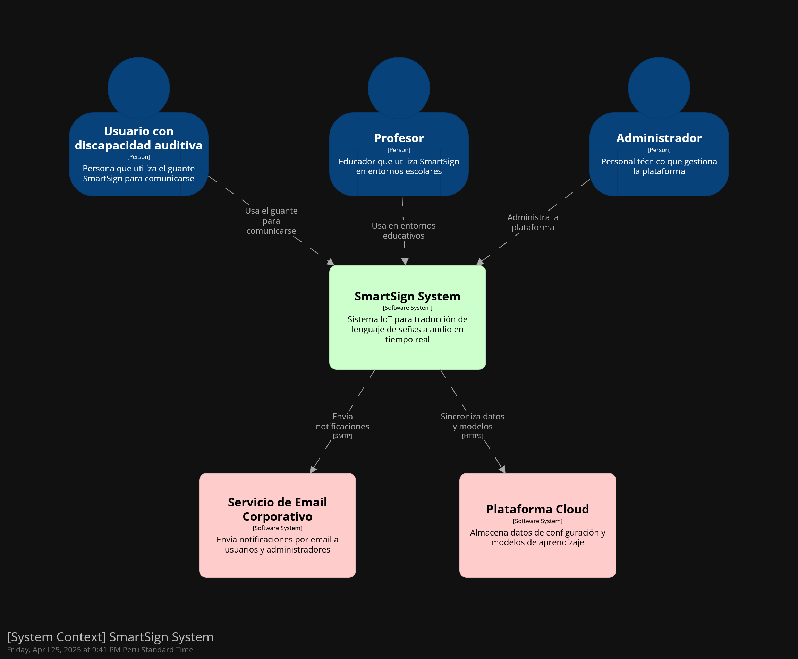

# Universidad Peruana de Ciencias Aplicadas
- Carrera de Ingeniería de Software - Septimo ciclo
- Curso: 1ASI0572 -  Desarrollo de Soluciones IOT
- NRC: 15185
- Profesor: Marco Antonio Leon Baca
# Informe del Trabajo Final
- Nombre Startup: IoTech
- Nombre Producto: SmartSign
## Relación de integrantes:

| Alumno                           | Código     |
|----------------------------------|------------|
| Alvaro Esteban Crispin Ccancce   | u202020328 |
| Jesús Andres Godoy Santillan     | u20251c350 |
| Jorge David Orrego Noriega       | u201921734 |
| Miguel Angel Huaman Cataño       | u202120615 |
| Frank Junior Salazar Saldarriaga | u20181h103 |

Mayo, 2025

# Registro de Versiones del Informe

| Versión | Fecha | Autor | Descripción de modificación |
|---------|-------|-------|----------------------------|
| 1.0 | 17/04/2025 | Grupo IoTech | Se creó el documento de desarrollo del informe |
| 2.0 | 26/04/2025 | Grupo IoTech | Se terminó el desarrollo de la TB1 |
| 3.0 | 15/05/2025 | Grupo IoTech | Se terminó el desarrollo del Trabajo Parcial |

# Project Report Collaboration Insights

**TB1:**

Todos los integrantes del equipo apoyaron en el desarrollo del informe. 


**TP:**


# Student Outcome

**ABET – EAC - Student Outcome 5:** Capacidad de funcionar efectivamente en un equipo cuyos miembros juntos proporcionan liderazgo, crean un entorno de colaboración e inclusivo, establecen objetivos, planifican tareas y cumplen objetivos.

| Criterio Especifico  | Acciones Realizadas | Conclusiones                                                                                                                                                                                                                                                                                                                                           |
|-------------------------------------------------------------------------------------------------|---------------------------------------------------------------------------------------------------------------------------------------------------------------------------------------------------------------------------------------------------------------------------------------------------------------------------------------------------------------------------------------------------------------------------------------------------------------------------------------------------------------------------------------------------------------------------------------------------------------------------------------------------------------------------------------------------------------------------------------------------------------------------------------------------------------------|--------------------------------------------------------------------------------------------------------------------------------------------------------------------------------------------------------------------------------------------------------------------------------------------------------------------------------------------------------|
| Trabaja en equipo para proporcionar liderazgo en forma conjunta.| **TB1:** <br> **Jorge Orrego:** <br> He trabajado con mis compañeros de manera cercana en el desarrollo del diseño de desarrollo de software, en el cual pudimos delegar equitativamente la carga de trabajo. <br> <br> **Frank Salazar:** <br> Se trabajó con el equipo la estructura del proyecto para poder delegar funciones en el desarrollo del proyecto y mejorar el trabajo en equipo <br> <br> **Alvaro Crispin:** <br> Coordiné con el equipo la definición y redacción de las User Stories y del Product Backlog, asegurando una visión compartida de los requerimientos, Propuse y validé la estructura del modelo C4 general, guiando a mis compañeros durante su elaboración. Finalmente, asistí en la creación del Bounded Context de Translation, fomentando la participación activa de todos. <br> <br> **Jesús Godoy:** <br> He trabajado de forma activa con mis compañeros en la planificación de actividades claves para el desarrollo de los puntos 3 y 4 además de ayudar a mis compañeros a distribuir las tareas equitativamente. <br> <br> **Miguel Huamán:** <br>  Trabajamos en equipo en la realización del proyecto, cada miembro colaboro realizando algo, por ejemplo yo realice la sección de Requirements Elicitation & Analysis dentro del documento, ello me permitió mostrar liderazgo al tomar la iniciativa para desarrollar dicha parte. <br> <br> **TP:** <br> **Jorge Orrego:** <br> Pude coordinar con mis compañeros para lograr que el usuario pueda navegar desde la landing page a la aplicación web.   <br> <br> **Frank Salazar:** <br> Realicé el diseño, mejora y desarrollo del frontEnd de la web page <br> <br> **Alvaro Crispin:** <br> Realicé  el desarrollo del web page en el FrontEnd utilizando las heurísticas y aplicando la DDD definidas anteriormente <br> <br> **Jesús Godoy:** <br> Junto al equipo hice las correciones primarias del TB1 y el avande del punto 5 y 6 <br> <br> **Miguel Huamán:** <br>  Trabaje en equipo para realizar las correcciones y las partes que se me asignaron del informe. | **TB1:** <br> Se logró implementar drinámicas para que todos en el equipo tuvieran la oportunidad de liderar y aportar con lo que más sepan. <br> <br> **TP:** <br> Se crearon dinámicas para que todos los integrantes puedan colaborar a su manera con el desarrollo de la landing page y la aplicación web|
| Crea un entorno colaborativo e inclusivo, establece metas, planifica tareas y cumple objetivos. | **TB1:** <br> **Jorge Orrego:** <br> Junto a mis compañeros pude definir objetivos y fechas límite de entrega de las partes que les tocaba a cada uno, con el objetivo de poder revisar con más detenimiento lo que hemos avanzado antes de la entrega oficial.  <br> <br> **Frank Salazar:** <br> En trabajo con mis compañeros, pudimos establecer funciones, plazos y reuniones a realizar para el desarrollo del proyecto. <br>  <br> **Alvaro Crispin:** <br> Fui responsable de cada artefacto (User Stories, Backlog, C4, Bounded Context), Implementé sprints cortos con entregables parciales y seguimiento del avance. Finalmente, realicé demos internas del Bounded Context de Translation, recogiendo feedback y ajustando el plan de trabajo. <br> <br> **Jesus Godoy:** Junto al equipo, establecimos metas claras y realistas para cada sprint, definimos responsables para cada deliverable.<br> <br> **Miguel Huamán:** <br>  Se realizaron reuniones y dinamicas, que nos mostraron el buen camino que tomaba nuestro proyecto y me ayudo a tener más claro como realizar correctamente la parte que se me delego. <br> <br> **TP:** <br> **Jorge Orrego:** <br> Definí junto a mi equipo los elementos que iban a conformar la landing page y la apliación web.  <br> <br> **Frank Salazar:** <br> Realicé el diseño, mejora y desarrollo del frontEnd de la web page <br> <br> **Alvaro Crispin:** <br> Realicé  el desarrollo del web page en el FrontEnd utilizando las heurísticas y aplicando la DDD definidas anteriormente <br> <br> **Jesús Godoy:** <br> Gestione con mi compañeros las mejoras y la implementación de los restante. <br> <br> **Miguel Huamán:** <br>  Logre realizar las tareas que se me asignaron y mejore mis conocimientos sobre el propósito de nuestra startup. | **TB1:** <br> Se logró implementar drinámicas para que todos en el equipo tuvieran la oportunidad de liderar y aportar con lo que más sepan. <br> <br> **TP:** <br> Se planificaron los puntos a desarrollar tanto para la landing page como para la aplicación web y se distribuyó la carga de trabajo equitativamente entre los integrantes. |


# Contenido

## Tabla de Contenidos

## [Capítulo I: Introducción](#capitulo-i-introduccion)
- [1.1. Startup Profile](#11-startup-profile)
    - [1.1.1. Descripción de la Startup](#1.1.1.descripcion-de-la-startup)
    - [1.1.2. Perfiles de integrantes del equipo](#1.1.2.perfiles-de-integrantes-del-equipo)
- [1.2. Solution Profile](#12-solution-profile)
    - [1.2.1. Antecedentes y problemática](#121-antecedentes-y-problematica)
    - [1.2.2. Lean UX Process](#122-lean-ux-process)
        - [1.2.2.1. Lean UX Problem Statements](#1221-lean-ux-problem-statements)
        - [1.2.2.2. Lean UX Assumptions](#1222-lean-ux-problem-assumptions)
        - [1.2.2.3. Lean UX Hypothesis Statements](#1223-lean-ux-problem-hypothesis-statements)
        - [1.2.2.4. Lean UX Canvas](#1224-lean-ux-problem-canvas)
- [1.3. Segmentos objetivo](#13-segmento-objetivo)
## [Capítulo II: Requirements Elicitation & Analysis](#capitulo-ii-requirements-elicitation--analysis)
- [2.1. Competidores](#21-competidores)
    - [2.1.1. Análisis competivio](#211-análisis-competivio)
    - [2.1.2. Estrategias y tácticas frente a competidores](#212-estrategias-y-tácticas-frente-a-competidores)
- [2.2. Entrevistas](#22-entrevistas)
    - [2.2.1. Diseño de entrevistas](#221-diseño-de-entrevistas)
    - [2.2.2. Registro de entrevistas](#222-registro-de-entrevistas)
    - [2.2.3. Análisis de entrevistas](#223-análisis-de-entrevistas)
- [2.3. Needfinding](#23-needfinding)
    - [2.3.1. User Personas](#231-user-personas)
    - [2.3.2. User Task Matrix](#232-user-task-matrix)
    - [2.3.3. User Journey Mapping](#233-user-journey-mapping)
    - [2.3.4. Empathy Mapping](#234-empathy-mapping)
    - [2.3.5. As-is Scenario Mapping](#235-as-is-scenario-mapping)
- [2.4. Ubiquitous Language](#24-ubiquitous-language)

## [Capítulo III: Requirements Specification](#capitulo-iii-requirements-specification)
- [3.1. To-Be Scenario Mapping](#31-to-be-scenario-mapping)
- [3.2. User Stories](#32-user-stories)
- [3.3. Impact Mapping](#33-impact-mapping)
- [3.4. Product Backlog](#34-product-backlog)

## [Capítulo IV: Solution Software Design](#capitulo-iv-solution-software-design)
- [4.1. Strategic-Level Domain-Diven Design](#41-strategic-level-domain-diven-design)
    - [4.1.1. Event Storming](#411-event-storming-) 
        - [4.1.1.1. Candidate Context Discovery](#4111-candidate-context-discovery)
        - [4.1.1.2. Domain Message Flows Modeling](#4112-domain-message-flows-modeling)
        - [4.1.1.3. Bounded Context Canvases](#4113-bounded-context-canvases)
    - [4.1.2. Context Mapping](#412-context-mapping)
    - [4.1.3. Software Achitecture](#413-software-achitecture)
        - [4.1.3.1. Software Architecture System Landscape Diagram](#4131-software-architecture-system-landscape-diagram)
        - [4.1.3.2. Software Architecture Context Level Diagrams](#4132-software-architecture-context-level-diagrams)
        - [4.1.3.3. Software Architecture Container Level Diagrams](#4133-software-architecture-container-level-diagrams)
        - [4.1.3.4. Software Architecture Deployment Diagrams](#4134-software-architecture-deployment-diagrams)
- [4.2. Tactical-Level Domain-Driven Design](#42-tactical-level-domain-driven-design-cuatro-bounded-contexts-)
    - [4.2.1. Bounded Context: Authentication](#421-bounded-context-authorization-) 
        - [4.2.1.1. Domain Layer.](#4211-domain-layer)
        - [4.2.1.2. Interface Layer](#4212-interface-layer)
        - [4.2.1.3. Application Layer](#4213-application-layer)
        - [4.2.1.4. Infrastructure Layer](#4214-infrastructure-layer)
        - [4.2.1.5. Bounded Context Software Architecture Component Level Diagrams](#4215-bounded-context-software-architecture-component-level-diagrams)
        - [4.2.1.6. Bounded Context Software Architecture Code Level Diagrams](#4216-bounded-context-software-architecture-code-level-diagrams)
            - [4.2.1.6.1 Bounded Context Domain Layer Class Diagrams](#42161-bounded-context-domain-layer-class-diagrams)
            - [4.2.1.6.2 Bounded Context Database Design Diagram](#42162-bounded-context-database-design-diagram)
    - [4.2.2. Bounded Context: Learning](#422-bounded-context-learning-) 
        - [4.2.2.1. Domain Layer.](#4221-domain-layer)
        - [4.2.2.2. Interface Layer](#4222-interface-layer)
        - [4.2.2.3. Application Layer](#4223-application-layer)
        - [4.2.2.4. Infrastructure Layer](#4224-infrastructure-layer)
        - [4.2.2.5. Bounded Context Software Architecture Component Level Diagrams](#4225-bounded-context-software-architecture-component-level-diagrams)
        - [4.2.2.6. Bounded Context Software Architecture Code Level Diagrams](#4226-bounded-context-software-architecture-code-level-diagrams)
            - [4.2.2.6.1 Bounded Context Domain Layer Class Diagrams](#42261-bounded-context-domain-layer-class-diagrams)
            - [4.2.2.6.2 Bounded Context Database Design Diagram](#42262-bounded-context-database-design-diagram)
    - [4.2.3. Bounded Context: Translation](#423-bounded-context-translation) 
        - [4.2.3.1. Domain Layer.](#4231-domain-layer)
        - [4.2.3.2. Interface Layer](#4232-interface-layer)
        - [4.2.3.3. Application Layer](#4233-application-layer)
        - [4.2.3.4. Infrastructure Layer](#4234-infrastructure-layer)
        - [4.2.3.5. Bounded Context Software Architecture Component Level Diagrams](#4235-bounded-context-software-architecture-component-level-diagrams)
        - [4.2.3.6. Bounded Context Software Architecture Code Level Diagrams](#4236-bounded-context-software-architecture-code-level-diagrams)
            - [4.2.3.6.1 Bounded Context Domain Layer Class Diagrams](#42361-bounded-context-domain-layer-class-diagrams)
            - [4.2.3.6.2 Bounded Context Database Design Diagram](#42362-bounded-context-database-design-diagram)
    - [4.2.4. Bounded Context: Record](#424-bounded-context-record) 
        - [4.2.4.1. Domain Layer.](#4241-domain-layer)
        - [4.2.4.2. Interface Layer](#4242-interface-layer)
        - [4.2.4.3. Application Layer](#4243-application-layer)
        - [4.2.4.4. Infrastructure Layer](#4244-infrastructure-layer)
        - [4.2.4.5. Bounded Context Software Architecture Component Level Diagrams](#4245-bounded-context-software-architecture-component-level-diagrams)
        - [4.2.4.6. Bounded Context Software Architecture Code Level Diagrams](#4246-bounded-context-software-architecture-code-level-diagrams)
            - [4.2.4.6.1 Bounded Context Domain Layer Class Diagrams](#42461-bounded-context-domain-layer-class-diagrams)
            - [4.2.4.6.2 Bounded Context Database Design Diagram](#42462-bounded-context-database-design-diagram)

## [Capítulo V: Solution UI/UX Design](#capitulo-v-solution-uiux-design)
- [5.1. Style Guidelines](#51-style-guidelines)
    - [5.1.1. General Style Guidelines](#511-general-style-guidelines) 
    - [5.1.2. Web, Mobile and IoT Style Guidelines](#512-web-mobile-iot-guidelines)
- [5.2. Information Architecture](#52-info-architecture)
    - [5.2.1. Organization Systems](#521-general-style-guidelines) 
    - [5.2.2. Labeling Systems](#522-web-mobile-iot-guidelines)
    - [5.2.3. SEO Tags and Meta Tags](#523-general-style-guidelines) 
    - [5.2.4. Searching Systems](#524-web-mobile-iot-guidelines)
    - [5.2.5. Navigation Systems](#525-general-style-guidelines) 
- [5.3. Landing Page UI Design](#53-style-guidelines)
    - [5.3.1. Landing Page Wireframe](#531-general-style-guidelines) 
    - [5.3.2. Landing Page Mockup](#532-web-mobile-iot-guidelines)
- [5.4. Applications UX/UI Design](#54-style-guidelines)
    - [5.4.1. Applications Wireframes](#541-general-style-guidelines) 
    - [5.4.2. Applications Wireflow Diagrams](#542-web-mobile-iot-guidelines)
    - [5.4.3. Applications Mock-ups](#543-general-style-guidelines) 
    - [5.4.4. Applications User Flow Diagrams](#544-web-mobile-iot-guidelines)
- [5.5. Applications Prototyping](#55-style-guidelines)

## [Capítulo VI: Product Implementation, Validation & Deployment ](#capitulo-vi)
- [6.1. Software Configuration Management](#61-software-config)
    - [6.1.1. Software Development Environment Configuration](#611-software-dev-env-config) 
    - [6.1.2. Source Code Management](#612-source-code)
    - [6.1.3. Source Code Style Guide & Conventions](#613-source-code-guidelines) 
    - [6.1.4. Software Deployment Configuration](#614-software-deployment)
- [6.2. Landing Page, Services & Applications Implementation](#62-iplementation)
    - [6.2.1. Sprint 1](#621-sprint-1) 
        - [6.2.1.1. Sprint Planning 1](#6211-sprint-planning-1)
        - [6.2.1.2. Aspect Leaders and Collaborators](#6212-leaders)
        - [6.2.1.3. Sprint Backlog 1](#6213-sprint-backlog-1)
        - [6.2.1.4. Development Evidence for Sprint Review](#6214-development)
        - [6.2.1.5. Testing Suite Evidence for Sprint Review](#6215-testing)
        - [6.2.1.6. Execution Evidence for Sprint Review](#6216-execution)
        - [6.2.1.7. Services Documentation Evidence for Sprint Review](#6217-services-doc)
        - [6.2.1.8. Software Deployment Evidence for Sprint Review](#6218-software-deployment)
        - [6.2.1.9. Team Collaboration Insights during Sprint](#6219-team-collab)

## Capítulo I: Introduccion
### 1.1. Startup Profile
#### 1.1.1 Descripcion de la Startup
SmartSign fue creada con el principal objetivo de facilitar la vida a aquellas personas las cuales cuentan con la discapacidad del habla o discapacidad auditiva, ya que se les dificulta un factor importante para poder vivir en sociedad, la comunicación. Buscamos solucionar este problema mediante la implementación de tecnologías de IoT para la creación de un guante con sensores que pueda traducir el lenguaje de señas en forma de audio y así poder facilitar su comunicación. La solución propuesta por SmartSign permitirá facilitar la comunicación y por la tanto sentirse incluidas socialmente a las personas con discapacidad auditiva, pero también facilitará la enseñanza a aquellas instituciones derivadas a brindar conocimientos a las personas con esta discapacidad.

Misión:
Facilitar la comunicación e inclusión social de las personas con discapacidad auditiva y del habla, desarrollando soluciones tecnológicas innovadoras basadas en IoT que transformen la lengua de señas en lenguaje audible, generando independencia, integración y calidad de vida.

Visión:
Ser reconocidos como líderes en innovación tecnológica en inclusión social en el Perú, convirtiéndonos en el referente nacional en soluciones accesibles e inteligentes que derriban barreras de comunicación para personas con discapacidad auditiva y del habla, promoviendo una sociedad más equitativa y conectada.

#### 1.1.1 Perfiles de integrantes del equipo

<table>
  <tr>
    <td rowspan="3"></td>
    <td>Frank Junior Salazar Saldarriaga (u20181h103)</td>
  </tr>
  <tr>
        <td>Ingenieria de Software</td>
  </tr>
    <tr>
    <td>Soy Frank Salazar, tengo 24 años y tengo una gran devoción por la programación, desde los 8 años me gustó programar, iniciando por algoritmos sencillos, hasta la recreación de videojuegos. Hace unos años decidí centrarme mucho en el desarrollo Backend y frontend, pero también le he agarrado mucho gusto a la data science. Actualmente soy programador en Yape, BCP. Soy asistente desde el año pasado, pero comencé como practicando desde agosto del 2023.</td>
  </tr>
  <tr>
    <td rowspan="3"></td>
    <td>Alvaro Esteban Crispin Ccancce (u202020328)</td>
  </tr>
  <tr>
        <td>Ingenieria de Software</td>
  </tr>
    <tr>
    <td>Soy Alvaro Crispin, tengo 22 años y me encanta ser innovador, buscar nuevas ideas, crear soluciones y asumir retos. Desde pequeño me interesó mucho lo que son las computadoras a nivel hardware y sobre la ciberseguridad. Actualmente me encanta todo lo relacionado a soldar, crear, programar y manipular artefactos electrónicos como chips, sensores, redes, etc.</td>
  </tr>
<tr>
    <td rowspan="3"></td>
    <td>Orrego Noriega, Jorge David (u201921734)</td>
  </tr>
  <tr>
        <td>Ingenieria de Software</td>
  </tr>
    <tr>
    <td>Estudio actualmente la carrera de Ingeniería de Software en la Universidad Peruana de Ciencias Aplicadas y la razón por la cual me encuentro estudiando esta carrera es porque siempre he tenido un interés particular por la tecnología, con un mayor énfasis en el software.</td>
  </tr>
<tr>
    <td rowspan="3"></td>


</td>
    <td>Jesús Andres Godoy Santillan (u20251c350)</td>
  </tr>
  <tr>
        <td>Ingenieria de Software</td>
  </tr>
    <tr>
    <td> Soy Jesús, tengo 22 años, me gusta mucho programar desde pequeño haciendo pequeños proyectos en videojuegos hasta lo último que hice que fue un gran proyecto  en un evento online con creadores de contenido, patrocinadores y premios. Actualmente no trabajo formalmente pero ayudo a mi padre y junto a mi hermano haciendo sistemas y programas de una empresa que tiene junto a su amigo relacionado con la agroindustria y con el conocimiento que tengo de tecnología y solución de problemas también asesoró o ayudó a amigos de mi padre que tienen problemas técnicos relacionados con la tecnología ya sea personales o de trabajo.  
</td>
  </tr>
<tr>
    <td rowspan="3"></td>
    <td>Miguel Angel Huaman Cataño (u202120615)</td>
  </tr>
  <tr>
        <td>Ingenieria de Software</td>
  </tr>
    <tr>
    <td>Soy Miguel Ángel Huamán Cataño, tengo 21 años y soy estudiante de ingeniería de software. Disfruto trabajar con empeño para alcanzar mis objetivos y nunca me rindo a pesar de los momentos difíciles. Haré todo lo posible para seguir mejorando en este largo camino de ser un buen profesional. </td>
  </tr>
</table>


### 1.2. Solution Profile
Nuestra propuesta es la creación de una solución IOT, la cual tiene como objetivo principal facilitar la comunicación de las personas con discapacidad auditiva con el resto de personas, aplicando tecnologías de IOT y Deep Learning.

#### 1.2.1 Antecedentes y problematica
What?

Según datos del Instituto Nacional de Estadística e Informática (INEI, 2017), en el Perú existen alrededor de 232,000 personas con discapacidad auditiva, de las cuales muchas enfrentan limitaciones importantes en su interacción cotidiana debido a barreras de comunicación. El principal problema que enfrentan estas personas es la dificultad para comunicarse de forma efectiva con quienes no dominan la lengua de señas, afectando significativamente su integración social, educativa y laboral.

When?

La problemática surge continuamente durante las interacciones sociales cotidianas, situaciones educativas y laborales, donde las personas con discapacidad auditiva o del habla requieren comunicarse con otras personas que desconocen la lengua de señas.

Where?

El problema está presente en todo el Perú, particularmente en instituciones educativas, centros laborales, hospitales y entornos públicos donde las personas con discapacidad auditiva o del habla necesitan interactuar constantemente y encuentran barreras para una comunicación efectiva.

Who?

Los usuarios afectados principalmente son personas con discapacidad auditiva y del habla, así como también sus familias, docentes y profesionales de la salud. Los beneficiarios directos serán las instituciones educativas especializadas y centros de rehabilitación que requieren herramientas tecnológicas efectivas para mejorar la inclusión y educación de personas con discapacidad auditiva y del habla.

Why?

Las principales causas del problema radican en la falta de soluciones tecnológicas accesibles que faciliten la comunicación entre personas que usan la lengua de señas y aquellas que no la dominan. Esto genera exclusión social, limitaciones educativas y barreras laborales significativas.

How?

La solución propuesta consiste en la implementación de un dispositivo inteligente basado en tecnología IoT, específicamente un guante equipado con sensores que traducen movimientos y posiciones de la lengua de señas peruana en audio. Este dispositivo facilitará la comunicación directa y clara en tiempo real, mejorando significativamente la interacción social, educativa y laboral.

How much?

¿Cuánto afecta este problema?:
La falta de comunicación efectiva afecta al 100% de las personas con discapacidad auditiva o del habla, reduciendo sus oportunidades educativas, laborales y de inclusión social, según la Defensoría del Pueblo del Perú (2024).

¿Cuánto costará resolver este problema?

El costo dependerá principalmente del desarrollo de la tecnología, la adquisición de sensores especializados y componentes IoT, así como los costos asociados al mantenimiento del software y hardware involucrados.

¿Cuántas personas se beneficiarán?

Se estima que inicialmente se beneficiarían alrededor del 50% de las personas con discapacidad auditiva y del habla en las principales ciudades del Perú, además de docentes y profesionales en centros especializados que trabajen directamente con estas poblaciones.

Conclusiones de 5w y 2h:

En conclusión, mediante el análisis con las 5W's y 2H's, se ha identificado claramente la problemática principal que afecta a personas con discapacidad auditiva y del habla en Perú. SmartSign implementará una solución tecnológica innovadora, accesible y efectiva, que facilitará la inclusión y comunicación, beneficiando directamente a personas con discapacidad auditiva y del habla, así como a instituciones educativas y de rehabilitación.

#### 1.2.2 Lean UX Process
##### 1.2.2.1 Lean UX Problem Statements
**Problem Statement:**
En SmartSign, reconocemos que en el Perú existe una importante población con discapacidad auditiva y del habla, para quienes la comunicación representa una barrera significativa en su vida diaria, limitando su integración social, educativa y laboral.

**Problema:** Muchas personas con discapacidad auditiva o del habla enfrentan dificultades en su comunicación diaria debido a que el entorno social generalmente no domina la lengua de señas, lo que ocasiona exclusión social, aislamiento y dificultades en el aprendizaje.

**Impacto:** Esta solución genera un impacto social altamente positivo al facilitar la inclusión social, educativa y laboral, permitiendo que las personas con discapacidad auditiva y del habla puedan comunicarse de manera efectiva y autónoma en diversos contextos.

##### 1.2.2.2 Lean UX Problem Assumptions
###### Business Outcomes:
- Incremento del 40% en la efectividad de comunicación de los usuarios durante interacciones cotidianas.
- Reducción del 50% en el tiempo requerido para establecer comunicación efectiva en entornos laborales y educativos.
- Aumento del 30% en la inclusión laboral de personas con discapacidad auditiva y del habla en organizaciones que adopten SmartSign.
- Disminución del 40% en la dependencia de intérpretes especializados durante situaciones cotidianas.
- Aumento del 60% en la satisfacción percibida en las interacciones sociales por parte de los usuarios.

###### Users:
- Personas con discapacidad auditiva y del habla.
- Familiares y cuidadores.
- Instituciones educativas especializadas.
- Centros de rehabilitación y salud.

###### User Outcomes & Benefits:
- Usuarios con discapacidad auditiva y del habla: Mayor autonomía e independencia comunicativa, integración social efectiva y acceso mejorado a oportunidades educativas y laborales.
- Instituciones educativas y centros de rehabilitación: Acceso a una herramienta tecnológica efectiva para mejorar los procesos educativos, comunicativos y terapéuticos. 
###### Feature Assumptions:
- Traducción en tiempo real del lenguaje de señas a audio.
- Interfaz de usuario intuitiva y accesible.
- Funcionalidades adicionales como almacenamiento y análisis de datos para monitorear el progreso comunicativo.
- Alertas personalizadas que indican claridad en la traducción y precisión de movimientos.
###### Business Assumptions:
- Creemos que los usuarios necesitan una solución tecnológica innovadora que les permita comunicarse de forma autónoma y efectiva en situaciones cotidianas, educativas y laborales.
- Nuestros clientes serán personas con discapacidad auditiva y del habla, sus familias y centros especializados que busquen facilitar la inclusión social.
- El valor más importante para nuestros usuarios es la independencia en la comunicación y la reducción de barreras sociales.
- Obtendremos a nuestros clientes mediante campañas en redes sociales, convenios con instituciones educativas y de rehabilitación, y participación en eventos enfocados en inclusión social.
- Generaremos ingresos mediante la venta directa del dispositivo y suscripciones mensuales al servicio de soporte técnico y mantenimiento.
- Nuestra ventaja frente a la competencia es la precisión y rapidez en la traducción del lenguaje de señas, combinada con una interfaz amigable y soporte continuo.
- El mayor riesgo del servicio es la resistencia inicial en la adopción tecnológica por parte de usuarios o instituciones. Esto lo resolveremos mediante demostraciones prácticas, testimonios y soporte personalizado constante.
###### User Assumptions:
- **¿Quién es el usuario?**

Los usuarios principales son personas con discapacidad auditiva y del habla, además de instituciones especializadas en educación y rehabilitación.

- **¿Qué problemas resuelve nuestro producto?**

El producto resuelve la barrera comunicativa entre usuarios que utilizan lenguaje de señas y aquellos que no lo dominan.

- **¿Qué características son importantes?**

Las características clave son la traducción precisa en tiempo real, facilidad de uso, portabilidad, alertas de precisión en el movimiento y soporte constante para los usuarios.

- **¿Dónde encaja nuestro producto en su vida diaria?**

Encaja en cualquier situación cotidiana, laboral o educativa que requiera comunicación inmediata y efectiva.

- **¿Cuándo y cómo es usado nuestro producto?**

El producto será utilizado constantemente en entornos sociales, laborales y educativos durante cualquier interacción comunicativa necesaria.

- **¿Cómo debe verse nuestro producto y cómo debe comportarse?**

Debe tener una interfaz visual sencilla, accesible, intuitiva, precisa en su traducción y con tiempos de respuesta rápidos, siendo práctico y portátil.

##### 1.2.2.3 Lean UX Problem Hypothesis Statements

***Hypothesis Statement 1***

**Creemos** que las personas con discapacidad auditiva necesitan una funcionalidad que traduzca rápidamente el lenguaje de señas en audio para comunicarse efectivamente.

**Sabremos** que hemos tenido éxito:

**Cuando** el 90% de los usuarios reporten mayor independencia comunicativa y una mejora significativa en interacciones sociales.

***Hypothesis Statement 2***

**Creemos** que las instituciones educativas y centros de rehabilitación necesitan una herramienta tecnológica que facilite la enseñanza y terapia del lenguaje de señas.

**Sabremos** que hemos tenido éxito:

**Cuando** las instituciones reporten un aumento del 40% en la eficiencia y efectividad en sus programas educativos y terapéuticos.

***Hypothesis Statement 3***

**Creemos** que los usuarios requieren alertas y guías visuales sobre la precisión en sus movimientos para mejorar la exactitud de la traducción.

**Sabremos** que hemos tenido éxito:

**Cuando** el 85% de los usuarios logren perfeccionar significativamente su comunicación con el uso continuo del dispositivo.

***Hypothesis Statement 4***

**Creemos** que la interfaz amigable y accesible será crucial para la adopción masiva de nuestra solución.

**Sabremos** que hemos tenido éxito:

**Cuando** el 95% de los usuarios realicen tareas básicas sin asistencia adicional y manifiesten comodidad y satisfacción con el uso del producto.

##### 1.2.2.4 Lean UX Problem Canvas


### 1.3. Segmento Objetivo
Según datos del Instituto Nacional de Estadística e Informática (INEI, 2017), en el Perú existen alrededor de 232,000 personas con discapacidad auditiva, enfrentando diariamente desafíos significativos en su comunicación e integración social debido a la falta de herramientas adecuadas para facilitar la interacción efectiva.

Nuestros principales segmentos objetivo son:

**Personas con discapacidad auditiva y del habla:**

Este segmento es clave para nuestra solución, ya que representa a los usuarios directos del dispositivo SmartSign. Estas personas requieren soluciones innovadoras y accesibles que les permitan comunicarse de forma clara y efectiva en cualquier contexto, facilitando su inclusión social, educativa y laboral.

**Instituciones educativas especializadas y centros de rehabilitación:**

Las instituciones educativas especializadas y los centros de rehabilitación constituyen otro segmento objetivo esencial, dado que necesitan herramientas tecnológicas eficientes para mejorar sus procesos educativos y terapéuticos. La implementación del dispositivo SmartSign permitirá realizar evaluaciones en tiempo real, facilitar el aprendizaje del lenguaje de señas y mejorar significativamente la comunicación en entornos educativos y de rehabilitación.
## Capítulo II: Requirements Elicitation & Analysis
### 2.1. Competidores
Luego de realizar una investigación del mercado peruano e internacional de soluciones tecnológicas para personas con discapacidad auditiva, hemos identificado los siguientes competidores potenciales para SmartSign:
<ul>
    <li>
        <b>SignAloud:  </b>Es un guante inteligente desarrollado por investigadores estadounidenses que traduce lenguaje de señas a texto y voz. Aunque no está específicamente adaptado al lenguaje de señas peruano, su tecnología basada en sensores de movimiento representa una competencia directa en el mercado global de dispositivos de traducción para personas con discapacidad auditiva. Su principal limitación en el contexto peruano es la falta de adaptación cultural y lingüística específica a las señas utilizadas en el país.
    </li>
    <li>
        <b>Hand Talk: </b> Aplicación móvil brasileña que utiliza un avatar 3D para traducir texto y voz al lenguaje de señas. Aunque se enfoca principalmente en el mercado brasileño y utiliza LIBRAS (Lengua Brasileña de Señas), su presencia creciente en Latinoamérica y su modelo de negocio basado en suscripciones institucionales la convierten en un competidor relevante en el segmento de soluciones de comunicación para personas con discapacidad auditiva.
    </li>
    <li>
        <b>IRIS Project: </b> Iniciativa peruana desarrollada por la Universidad Nacional de Ingeniería que consiste en un dispositivo wearable que traduce texto a lenguaje de señas peruano mediante un sistema de proyección holográfica. A diferencia de SmartSign, se enfoca en la dirección inversa de la comunicación (de oyentes a personas sordas), pero compite en el mismo espacio de mercado de tecnologías asistivas para la comunidad con discapacidad auditiva en Perú.
    </li>
</ul>

#### 2.1.1. Análisis competivio
<table><tr><th colspan="16" valign="top"><b>Competitive Analysis Landscape</b></th></tr>
<tr><td colspan="9" valign="top">¿Por qué llevar a cabo este análisis?  </td><td colspan="7" valign="top"> Este análisis se concretó teniendo como finalidad identificar a nuestros potenciales competidores en el mercado de soluciones para personas con discapacidad auditiva en Perú e idear estrategias y tácticas para diferenciarnos de ellos, aprovechando nuestras ventajas competitivas en el sector IoT. td></tr>
<tr><td colspan="6" valign="top"><p><b>Nombre</b></p><p></p></td><td colspan="3" valign="top"><b>SmartSign </b></td><td colspan="3" valign="top"><b>SignAloud</b></td><td colspan="3" valign="top"><b>HandTalk</b></td><td valign="top"><b> IRIS Project </b></td></tr>
<tr><td colspan="3" rowspan="4" valign="top"><b>Perfil</b></td><td colspan="3" rowspan="2" valign="top"><b>Overview</b></td><td colspan="3" rowspan="2" valign="top"> </b> SmartSign se destaca por su enfoque específico en mejorar la comunicación de personas con discapacidad auditiva en Perú mediante tecnologías IoT y Deep Learning. Ofrece un guante equipado con sensores que traduce movimientos y posiciones de la lengua de señas peruana en audio en tiempo real.
</td><td colspan="3" rowspan="2" valign="top">Es un guante inteligente desarrollado por investigadores estadounidenses que traduce lenguaje de señas a texto y voz. Utiliza sensores de movimiento avanzados y algoritmos de reconocimiento para identificar gestos y convertirlos en palabras. Aunque tiene reconocimiento internacional, no está adaptado específicamente a la lengua de señas peruana ni considera factores culturales locales.</td><td colspan="3" rowspan="2" valign="top">Hand Talk es una aplicación móvil brasileña que utiliza un avatar 3D para traducir texto y voz al lenguaje de señas. Con presencia creciente en Latinoamérica, se enfoca principalmente en LIBRAS (Lengua Brasileña de Señas) y opera mediante un modelo de suscripciones institucionales. A diferencia de SmartSign, traduce en dirección contraria (de voz/texto a señas).</td><td rowspan="2" valign="top">IRIS Project es una iniciativa peruana desarrollada por la Universidad Nacional de Ingeniería que consiste en un dispositivo wearable que traduce texto a lenguaje de señas peruano mediante un sistema de proyección holográfica. Se enfoca en la comunicación de oyentes hacia personas sordas, complementando pero no compitiendo directamente con la función de SmartSign.</td></tr>
<tr></tr>
<tr><td colspan="3" rowspan="2" valign="top"><b>Ventaja competitiva ¿Qué valor ofrece a los clientes?</b></td><td colspan="3" rowspan="2" valign="top">SmartSign se destaca por su enfoque localizado en el lenguaje de señas peruano, lo que permite una adaptación precisa a las necesidades de la comunidad con discapacidad auditiva nacional. Además, su integración con tecnologías IoT y Deep Learning ofrece una experiencia más confiable y personalizada, brindando traducción en tiempo real con alta precisión y capacidad de aprendizaje continuo
</td><td colspan="3" rowspan="2" valign="top">SignAloud sobresale por su tecnología de sensores altamente sensibles y su reconocimiento internacional como solución pionera en la traducción de lenguaje de señas. Su principal ventaja es la madurez del producto y el respaldo de instituciones de investigación estadounidenses.</td><td colspan="3" rowspan="2" valign="top">Hand Talk ofrece una ventaja competitiva a través de su avatar 3D visualmente atractivo y su enfoque en instituciones educativas. Su modelo de negocio basado en suscripciones y su facilidad de implementación en dispositivos existentes (smartphones) lo hacen accesible para entornos educativos.</td><td rowspan="2" valign="top">IRIS Project destaca por ser una iniciativa local peruana con comprensión del contexto cultural nacional y por su innovadora tecnología de proyección holográfica. Su relación con la Universidad Nacional de Ingeniería le proporciona respaldo académico y facilidad de pruebas con usuarios locales.</td></tr>
<tr></tr>
<tr><td colspan="3" rowspan="2" valign="top"><b>Perfil de Marketing</b></td><td colspan="3" valign="top"><b>Mercado objetivo</b></td><td colspan="3" valign="top">SmartSign tiene como mercado objetivo principal a las personas con discapacidad auditiva en Perú (aproximadamente 232,000 personas según INEI), sus familias y cuidadores, así como instituciones educativas especializadas, centros de rehabilitación y organizaciones dedicadas a la inclusión social. El enfoque está en usuarios que buscan autonomía comunicativa en entornos cotidianos, educativos y laborales. </td><td colspan="3" valign="top">SignAloud está dirigido principalmente al mercado estadounidense e internacional, enfocándose en personas con discapacidad auditiva y del habla, instituciones educativas y centros médicos especializados. Su orientación es más global y menos adaptada al contexto latinoamericano o peruano.</td><td colspan="3" valign="top">Hand Talk se dirige principalmente a instituciones educativas, empresas comprometidas con la inclusión y órganos gubernamentales en Brasil y otros países latinoamericanos. Su enfoque está en proveer soluciones institucionales más que dispositivos personales para usuarios finales.</td><td valign="top"> IRIS Project se orienta a personas oyentes que necesitan comunicarse con personas sordas en Perú, incluyendo familiares, docentes, personal médico e instituciones gubernamentales. El enfoque es complementario al de SmartSign, abordando el otro lado de la comunicación.</td></tr>
<tr><td colspan="3" valign="top"><b>Estrategias de Marketing</b></td><td colspan="3" valign="top"><p>SmartSign: Publicidad dirigida en redes sociales y plataformas especializadas en accesibilidad, colaboración con asociaciones peruanas de personas sordas, y demostraciones prácticas en instituciones educativas y eventos de tecnología inclusiva.</p></td><td colspan="3" valign="top"><p>SignAloud: Marketing digital internacional, participación en conferencias científicas y de tecnología asistiva, y colaboraciones con universidades e instituciones de investigación.</p></td><td colspan="3" valign="top">Hand Talk: Enfoque en marketing B2B dirigido a instituciones, creación de material educativo sobre accesibilidad, y programas de responsabilidad social corporativa.</td><td valign="top"><p>IRIS Project: Difusión académica a través de la universidad, participación en eventos de innovación social, y alianzas con entidades gubernamentales peruanas..</p><p></p></td></tr>
<tr><td colspan="3" rowspan="3" valign="top"><b>Perfil de producto</b></td><td colspan="3" valign="top"><b>Productos y Servicios</b></td><td colspan="3" valign="top">SmartSign ofrece un guante inteligente IoT equipado con sensores de movimiento, flexión y posición que traduce la lengua de señas peruana a audio en tiempo real. Incluye una plataforma de aprendizaje continuo basada en Deep Learning que mejora progresivamente la precisión de la traducción, además de soporte técnico especializado y capacitación para usuarios e instituciones.</td><td colspan="3" valign="top">SignAloud proporciona guantes con tecnología de sensores que reconocen gestos de lenguaje de señas americano (ASL) y los traduce a texto y voz. Su enfoque está en la precisión del reconocimiento mediante algoritmos avanzados, pero con menor adaptabilidad cultural a variantes regionales de lenguajes de señas.</td><td colspan="3" valign="top">Hand Talk ofrece una aplicación móvil con un avatar 3D llamado "Hugo" que traduce texto y voz a LIBRAS (lengua de señas brasileña) y parcialmente a otras variantes latinoamericanas. Proporciona planes de suscripción para instituciones y herramientas de integración web para sitios corporativos.</td><td valign="top">IRIS Project desarrolla un dispositivo wearable con sistema de proyección holográfica que traduce texto ingresado por usuarios oyentes al lenguaje de señas peruano. Incluye una biblioteca de gestos específicamente adaptada al contexto cultural nacional.</td></tr>
<tr><td colspan="3" valign="top"><b>Precios y Costos</b></td><td colspan="3" valign="top"> SmartSign ofrece un modelo mixto: venta del dispositivo hardware (guante inteligente) con precio Para instituciones educativas y centros de rehabilitación existen planes corporativos con descuentos por volumen. Los costos principales incluirían el desarrollo de hardware, investigación en Deep Learning, y adaptación cultural del sistema.</td><td colspan="3" valign="top">SignAloud tiene un modelo de venta directa del dispositivo con precios entre $1,800-$2,500 USD, significativamente más costoso que las alternativas locales. No ofrece planes de suscripción pero cobra por actualizaciones mayores de software.</td><td colspan="3" valign="top">Hand Talk utiliza un modelo de suscripción pura, con planes que van desde $300 a $1,200 USD anuales para instituciones según el número de usuarios. No requiere inversión en hardware específico al funcionar como aplicación móvil.</td><td valign="top"><p>IRIS Project se encuentra en fase piloto con un modelo tentativo de venta de dispositivo entre S/. 900-1,100, con énfasis en acuerdos institucionales y potencial financiamiento universitario para investigación adicional.</p></td></tr>
<tr><td colspan="3" valign="top"><b>Canales de distribución</b></td><td colspan="3" valign="top"><p>- SmartSign distribuye sus dispositivos a través de su sitio web oficial, alianzas con asociaciones de personas sordas, y acuerdos directos con instituciones educativas y rehabilitadoras. Ofrece demostraciones presenciales y posibilidad de prueba del dispositivo antes de la compra.</p><p></p></td><td colspan="3" valign="top"><p>- SignAloud se distribuye principalmente a través de su plataforma web internacional y distribuidores especializados en tecnología asistiva. Su presencia física en Perú es limitada.</p></td><td colspan="3" valign="top"><p>- Hand Talk se distribuye exclusivamente como aplicación móvil a través de tiendas de aplicaciones (Google Play y App Store) y mediante ventas corporativas directas para planes institucionales.</p></td><td valign="top"><p>- IRIS Project tiene distribución limitada a través de canales universitarios y proyectos piloto con instituciones seleccionadas, sin presencia comercial masiva todavía.</p></td></tr>
<tr><td colspan="3" rowspan="4" valign="top"><b>Análisis FODA</b></td><td colspan="3" valign="top"><b>Fortalezas</b></td><td colspan="3" valign="top"><p>- SmartSign: Enfoque localizado en lenguaje de señas peruano, tecnología IoT integrada con Deep Learning, colaboración con instituciones locales, y solución portable que no requiere instalaciones fijas.</p></td><td colspan="3" valign="top"><p>- SignAloud: Reconocimiento internacional, tecnología de sensores avanzada, respaldo de investigación académica, y mayor tiempo en el mercado.</p></td><td colspan="3" valign="top"><p>- Hand Talk: Facilidad de implementación al no requerir hardware adicional, avatar visual atractivo, y modelo de negocio escalable basado en suscripciones.</p></td><td valign="top"><p>- IRIS Project: Conocimiento específico del contexto peruano, tecnología innovadora de proyección holográfica, y respaldo académico de la Universidad Nacional de Ingeniería.</p></td></tr>
<tr><td colspan="3" valign="top"><b>Debilidades</b></td><td colspan="3" valign="top"><p>- Competencia feroz</p><p>- SmartSign: Costos iniciales de hardware relativamente altos, dependencia de actualizaciones de software para mejorar precisión, y necesidad de adaptación continua al evolucionar el lenguaje de señas peruano.</p></td><td colspan="3" valign="top"><p>- SignAloud: Falta de adaptación al contexto cultural peruano, precio elevado para el mercado local, y enfoque limitado a la traducción sin considerar aspectos educativos.</p><p>- Calidad de las reseñas</p><p>- Competencia</p></td><td colspan="3" valign="top"><p>- Hand Talk: Dependencia de dispositivos móviles con buena conectividad, enfoque en dirección contraria a la traducción (de texto a señas, no de señas a texto), y adaptación parcial al contexto latinoamericano fuera de Brasil.</p></td><td valign="top"><p>- IRIS Project: Producto en fase temprana de desarrollo, limitaciones en la portabilidad del sistema de proyección, y enfoque exclusivo en la comunicación de oyentes hacia personas sordas.</p></td></tr>
<tr><td colspan="3" valign="top"><b>Oportunidades</b></td><td colspan="3" valign="top"><p>- SmartSign: Crecimiento del mercado de tecnologías inclusivas en Perú, políticas gubernamentales favorables para la inclusión, posibilidad de expansión a otros países latinoamericanos con adaptaciones culturales, y alianzas con sistema de salud público/privado.</p></td><td colspan="3" valign="top"><p>- SignAloud: Potencial adaptación al mercado latinoamericano, desarrollo de versiones más económicas, y colaboraciones con universidades locales para investigación.</p></td><td colspan="3" valign="top"><p>- Hand Talk: Expansión de biblioteca de señas para incluir más variantes regionales latinoamericanas, desarrollo de funcionalidades offline, y alianzas con fabricantes de smartphones.</p></td><td valign="top"><p>- IRIS Project: Complementariedad con otras soluciones como SmartSign, potencial comercialización internacional de la tecnología de proyección, y oportunidades de financiamiento para investigación adicional.</p></td></tr>
<tr><td colspan="3" valign="top"><b>Amenazas</b></td><td colspan="3" valign="top"><p>- SmartSign: Entrada de competidores internacionales con mayor capital de inversión, cambios regulatorios en tecnologías IoT, y resistencia a la adopción tecnológica en comunidades tradicionales.</p></td><td colspan="3" valign="top"><p>- SignAloud: Soluciones locales mejor adaptadas culturalmente, barreras de entrada por precio elevado, y posibles restricciones de importación.</p></td><td colspan="3" valign="top"><p>- Hand Talk: Dependencia de políticas de tiendas de aplicaciones, competencia creciente de soluciones similares, y limitaciones en la precisión de la traducción inversa.</p></td><td valign="top"><p>- IRIS Project: Desafíos en la transición de proyecto académico a producto comercial, limitaciones de financiamiento para expansión, y competencia de soluciones más maduras.</p></td></tr>
</table>

#### 2.1.2. Estrategias y tácticas frente a competidores

**Diferenciación de Producto:**

Estrategia: SmartSign se enfocará en resaltar su adaptación específica al lenguaje de señas peruano y su implementación de tecnologías IoT y Deep Learning que permiten una traducción más precisa y contextualizada.
Tácticas: Para llevar a cabo esta estrategia, se desarrollará una biblioteca especializada de gestos específicos del lenguaje de señas peruano, se implementarán actualizaciones trimestrales del algoritmo de Deep Learning basadas en datos recopilados de usuarios reales peruanos, y se crearán materiales de marketing que destaquen casos de éxito locales y testimonios de usuarios.

**Desarrollo Continuo:**

Estrategia: El startup se comprometió a la mejora constante de la tecnología mediante la integración de avances en IoT y aprendizaje automático, manteniendo el enfoque en las necesidades específicas de la comunidad peruana con discapacidad auditiva.
Tácticas: Para implementar esta estrategia, se establecerá un programa de "beta testers" con miembros de la comunidad sorda peruana para probar nuevas funcionalidades, se implementará un sistema de retroalimentación directa donde los usuarios puedan reportar errores de traducción, y se desarrollará un plan de actualización trimestral del firmware del dispositivo.

**Colaboraciones Estratégicas:**

Estrategia: Se buscarán asociaciones con instituciones educativas especializadas, organizaciones de personas sordas y entidades gubernamentales para fortalecer la presencia en el mercado y mejorar continuamente la adaptación cultural del producto.
Tácticas: Para ejecutar esta estrategia, se establecerán convenios con instituciones educativas especializadas en Lima y provincias, se desarrollará un programa de embajadores dentro de la comunidad de personas sordas, y se colaborará con el CONADIS para alinear el desarrollo del producto con las políticas nacionales de inclusión.

**Enfoque en la Experiencia del Usuario:**

Estrategia: La prioridad será la satisfacción del usuario y la facilidad de uso del dispositivo, considerando las necesidades específicas de personas con discapacidad auditiva en el contexto peruano.
Tácticas: Para lograr esta estrategia, se realizarán pruebas de usabilidad trimestrales con grupos diversos de usuarios, se implementará un programa de capacitación personalizada para nuevos usuarios, y se desarrollarán materiales de soporte en formatos accesibles, incluyendo tutoriales en lengua de señas peruana.

**Accesibilidad y Modelo de Negocio Inclusivo:**

Estrategia: Se desarrollará un modelo de precios que permita el acceso a la tecnología por parte de diversos segmentos socioeconómicos, maximizando el impacto social sin comprometer la sostenibilidad del negocio.
Tácticas: Para implementar esta estrategia, se establecerá un programa de subsidio cruzado donde las ventas institucionales permitan ofrecer precios reducidos a usuarios individuales de bajos recursos, se desarrollará un modelo de leasing para instituciones educativas, y se creará un fondo de impacto social en colaboración con ONGs y empresas privadas.

**Análisis Competitivo Continuo:**

Estrategia: El startup se comprometió a monitorear continuamente el mercado de tecnologías asistivas tanto a nivel local como internacional, adaptando su estrategia según la evolución del ecosistema competitivo.
Tácticas: Para llevar a cabo esta estrategia, se realizarán informes trimestrales de benchmarking, se implementará un sistema de alertas para monitorear avances tecnológicos relevantes, y se participará activamente en conferencias y eventos internacionales sobre tecnologías asistivas para identificar tendencias emergentes.

### 2.2. Entrevistas
#### 2.2.1. Diseño de entrevistas

<h3>Preguntas Generales</h3>
<ol>
    <li>¿Cuál es su nombre?</li>
    <li>¿Cuántos años tiene?</li>
    <li>¿En qué ciudad y distrito reside?</li>
    <li>¿A qué se dedica actualmente?</li>
</ol>

<h3>Segmento 1: Personas con discapacidad auditiva y del habla (Cuidadores)</h3>
<ol>
    <li>¿Cuál es su relación con la persona con discapacidad auditiva o del habla que cuida?</li>
    <li>¿Qué estrategias o métodos utiliza actualmente para comunicarse con ella?</li>
    <li>¿En qué tipo de situaciones suele haber más dificultades de comunicación (visitas médicas, trámites, tiendas, transporte, etc.)?</li>
    <li>¿Con qué tipo de personas se presentan mayores barreras (familiares, profesores, personal de atención al cliente, desconocidos)?</li>
    <li>¿Utilizan actualmente algún tipo de tecnología o aplicación para facilitar la comunicación? ¿Cuál ha sido su experiencia?</li>
    <li>¿Qué limitaciones ha encontrado en las herramientas existentes para ayudar en la comunicación?</li>
    <li>¿Ha presenciado o vivido junto con la persona bajo su cuidado situaciones de exclusión o malentendidos debido a la barrera del lenguaje?</li>
    <li>¿Cómo se sienten usted y la persona que cuida cuando no pueden hacerse entender en ciertos contextos?</li>
    <li>¿Considera que la sociedad en general está preparada para interactuar adecuadamente con personas con discapacidad auditiva o del habla?</li>
    <li>¿Cree que esta situación afecta las oportunidades educativas, sociales o laborales de la persona que cuida?</li>
    <li>¿Qué tipo de funcionalidades esperaría de un dispositivo o aplicación para facilitar la comunicación?</li>
    <li>¿Qué tipo de mensajes o expresiones serían más útiles que se pudieran traducir automáticamente con la ayuda de un dispositivo?</li>
    <li>¿En qué espacios le gustaría que esta herramienta sea especialmente útil (hospitales, bancos, centros educativos, etc.)?</li>
<ol>
    <h3>Propósito de la entrevista del segmento 1:</h3>
<ol>
    <li>Comprender las principales dificultades que enfrentan para comunicarse con la persona a su cargo en distintos contextos (familiar, médico, social, laboral).</li>
    <li>Identificar las estrategias actuales que utilizan para superar las barreras comunicativas.</li>
    <li>Explorar sus experiencias con tecnologías o aplicaciones existentes y sus limitaciones.</li>
    <li>Detectar necesidades y expectativas específicas sobre un dispositivo o aplicación que facilite la comunicación en tiempo real.</li>
    <li>Evaluar la percepción y aceptación inicial del concepto SmartSign como solución potencial.</li>
</ol>
    
</ol>

<h3>Segmento 2: Instituciones educativas especializadas y centros de rehabilitación</h3>
<ol>
    <li>¿Cuál es su rol dentro de la institución?</li>
    <li>¿Cuántos estudiantes o pacientes con discapacidad auditiva o del habla atienden en promedio?</li>
    <li>¿Qué métodos utilizan actualmente para facilitar la enseñanza o terapia del lenguaje de señas?</li>
    <li>¿Han utilizado tecnología para mejorar la comunicación o el aprendizaje de sus estudiantes? ¿Cuál fue su experiencia?</li>
    <li>¿Qué dificultades enfrentan sus estudiantes o pacientes al interactuar con personas fuera del entorno institucional?</li>
    <li>¿Considera que el lenguaje de señas se enseña de forma adecuada en los niveles educativos actuales?</li>
    <li>¿Qué limitaciones tienen actualmente en cuanto a recursos tecnológicos para mejorar sus procesos de enseñanza?</li>
    <li>¿Qué tipo de dispositivo o aplicación cree que sería útil para reforzar la enseñanza del lenguaje de señas?</li>
    <li>¿Le gustaría contar con una herramienta que permita evaluar en tiempo real la expresión en señas de los estudiantes?</li>
<ol>
    <h3>Propósito de la entrevista del segmento 2:</h3>
<ol>
    <li>Entender los métodos y recursos utilizados para la enseñanza del lenguaje de señas y la integración de personas con discapacidad auditiva o del habla.</li>
    <li>Analizar las dificultades que enfrentan sus estudiantes o pacientes para comunicarse fuera del entorno institucional.</li>
    <li>Investigar el uso actual de tecnologías para apoyo en la educación y sus limitaciones.</li>
    <li>Identificar qué funcionalidades consideran más útiles y relevantes en una herramienta tecnológica como SmartSign.</li>
    <li>Validar la factibilidad y utilidad de la propuesta SmartSign en el contexto educativo y terapéutico.</li>
    
</ol>

<h3>Validación de la propuesta</h3>
<ol>
    <li>Se presenta al entrevistado la idea del proyecto SmartSign y sus principales funcionalidades (traducción en tiempo real de señas a texto o voz y viceversa, uso de IA para mejorar la precisión, compatibilidad con dispositivos móviles y wearables).</li>
    <li>¿Qué le parece la propuesta de SmartSign?</li>
    <li>¿Cree que podría ser útil en su vida diaria o en su entorno educativo/laboral?</li>
    <li>¿Alguna vez ha usado una tecnología similar?</li>
    <li>¿Cuál es el aspecto que más le llama la atención de esta propuesta?</li>
    <li>¿Qué sugerencias o mejoras le gustaría que tenga el dispositivo o la aplicación?</li>
    <li>¿En qué escenarios le gustaría poder utilizar esta solución?</li>
</ol>

#### 2.2.2. Registro de entrevistas

Entrevistado #1:
Isaac Burgos

● Sexo: Masculino

● Edad: 22 años

● Distrito en el que vive: Breña

● Ocupación: Comerciante

● Link: [Click para ver entrevista](https://youtu.be/oU4ckNnNtoU)


Resumen:

<p align="justify"> Isaac Burgos, comerciante de 22 años, compartió su experiencia sobre la vida de su hermano, quien tiene discapacidad del habla. Isaac destacó las dificultades que enfrenta su hermano tanto en la escuela como en su vida diaria debido a esta discapacidad. Sin embargo, en el entorno familiar han logrado adaptarse y comunicarse de forma más fluida. Isaac aprendió lenguaje de señas para mejorar la comunicación con su hermano. A pesar de los avances familiares, mencionó que la sociedad aún no está completamente preparada para fomentar la inclusión de personas con discapacidades del habla. Isaac subrayó que un dispositivo inteligente que facilite la vida de estas personas sería un gran avance para la inclusión social. </p>

Entrevistado #2:

Yasmin Díaz

● Sexo: Femenino

● Edad: 20 años

● Distrito en el que vive: San Martín de Porres

● Ocupación: Estudiante

● Link: [Click para ver entrevista](https://youtu.be/WRmBH8R3Po0)


Resumen:

<p align="justify"> Yasmin Díaz, estudiante de Publicidad, compartió su experiencia sobre su hermano, quien sufrió una enfermedad que le causó la discapacidad del habla. A pesar de que Yasmin aprendió lenguaje de señas, la comunicación en la familia no ha sido completamente fluida ya que no todos lograron aprenderlo adecuadamente. Por ello, la familia optó por usar aplicaciones de mensajería como WhatsApp, Facebook e Instagram para comunicarse. A pesar de la discapacidad, su hermano ha logrado conseguir trabajo en un almacén y desempeñar sus tareas de manera efectiva. Yasmin expresó el deseo de que existieran tecnologías o dispositivos que facilitaran la comunicación de personas con discapacidad del habla, especialmente en citas médicas o laborales. </p>

Entrevistado #3:

Emilio Alexander

● Sexo: Masculino

● Edad: 23 años

● Distrito en el que vive: Cercado de Lima

● Ocupación: Estudiante

● Link: [Click para ver entrevista](https://upcedupe-my.sharepoint.com/:v:/g/personal/u20181h103_upc_edu_pe/EUhrCY-bJoxBgf1cCl3CcBoBsoBB5oHdv9-r7w4upVl8Zg?e=FDXc1b&nav=eyJyZWZlcnJhbEluZm8iOnsicmVmZXJyYWxBcHAiOiJTdHJlYW1XZWJBcHAiLCJyZWZlcnJhbFZpZXciOiJTaGFyZURpYWxvZy1MaW5rIiwicmVmZXJyYWxBcHBQbGF0Zm9ybSI6IldlYiIsInJlZmVycmFsTW9kZSI6InZpZXcifX0%3D)


Resumen:

<p align="justify"> Emilio Alexander, estudiante de la UNMSM, nos habló sobre su sobrino, quien tiene discapacidad auditiva y del habla. Emilio mencionó que la familia ha podido comunicarse con cierta facilidad usando aplicaciones de mensajería como WhatsApp o Messenger, aunque reconoció que este tipo de comunicación no es ideal debido a la falta de inmediatez y espontaneidad. A pesar de no haber vivido situaciones de discriminación, Emilio apoya la idea de que se desarrollen tecnologías que permitan una comunicación instantánea y eficiente para personas con discapacidades, ya que esto contribuiría significativamente a la inclusión social. </p>

Entrevistado #4:

Luis Fernando Rivas

● Sexo: Masculino

● Edad: 25 años

● Distrito en el que vive: San Martín de Porres

● Ocupación: Estudiante Universitario

● Link: [Click para ver entrevista](https://upcedupe-my.sharepoint.com/:v:/g/personal/u202120615_upc_edu_pe/EdBS2d5cOS1CqWnHhxXhXNABy0G0QRaGoQFGigH4O-izhw?e=QbYcnf&nav=eyJyZWZlcnJhbEluZm8iOnsicmVmZXJyYWxBcHAiOiJTdHJlYW1XZWJBcHAiLCJyZWZlcnJhbFZpZXciOiJTaGFyZURpYWxvZy1MaW5rIiwicmVmZXJyYWxBcHBQbGF0Zm9ybSI6IldlYiIsInJlZmVycmFsTW9kZSI6InZpZXcifX0%3D)


Resumen:

<p align="justify"> Luis Fernando Rivas, estudiante universitario y voluntario en talleres para personas con discapacidad auditiva, comentó sobre las dificultades que enfrentan sus estudiantes para comunicarse fuera del entorno de los talleres, ya que el acceso a tecnologías adaptadas es limitado. Además, mencionó que el lenguaje de señas no se enseña adecuadamente en los colegios. Luis considera que una herramienta como SmartSign, que traduzca las señas a audio en tiempo real, sería muy útil, especialmente si fuera fácil de usar y económica. Luis expresó que le gustaría aplicar esta herramienta en talleres, en la universidad y en espacios públicos. </p>

Entrevistado #5:

Sebastián Ríos

● Sexo: Masculino

● Edad: 20 años

● Distrito en el que vive: Santiago de Surco

● Ocupación: Estudiante Universitario

● Link: [Click para ver entrevista](https://upcedupe-my.sharepoint.com/:v:/g/personal/u202120615_upc_edu_pe/EUPC6b4_4ehLpOeKO_wyZ3wBz-WQOWnvEljuSGk_OD1UrA?e=8YED8e&nav=eyJyZWZlcnJhbEluZm8iOnsicmVmZXJyYWxBcHAiOiJTdHJlYW1XZWJBcHAiLCJyZWZlcnJhbFZpZXciOiJTaGFyZURpYWxvZy1MaW5rIiwicmVmZXJyYWxBcHBQbGF0Zm9ybSI6IldlYiIsInJlZmVycmFsTW9kZSI6InZpZXcifX0%3D)


Resumen:

<p align="justify"> Sebastián Ríos, estudiante de Psicología y voluntario en talleres de apoyo a personas con discapacidad auditiva, compartió su experiencia trabajando con estudiantes que, fuera del entorno de los talleres, se sienten incomprendidos debido a la falta de acceso a tecnologías adaptadas. Sebastián destacó la importancia de que el lenguaje de señas se enseñe adecuadamente en las escuelas y expresó que una aplicación divertida o un dispositivo que traduzca las señas en tiempo real sería una excelente herramienta para mejorar la inclusión. También mencionó que la propuesta de SmartSign, con su capacidad de traducción instantánea, es una solución muy prometedora, especialmente si es personalizable y compatible con asistentes virtuales. </p>

#### 2.2.3. Análisis de entrevistas

Análisis de las Entrevistas: Familiares de Personas con Discapacidad Auditiva:

Los entrevistados han tenido que adaptarse a la situación, principalmente aprendiendo el lenguaje de señas o utilizando aplicaciones de mensajería como WhatsApp y Facebook para facilitar la comunicación. Sin embargo, destacan que estas soluciones no son óptimas debido a que no permiten una comunicación espontánea e inmediata. Los entrevistados señalan la falta de inclusión social como un problema persistente, aunque mencionan casos de integración laboral exitosa a pesar de las limitaciones. Coinciden en que la sociedad no está preparada para fomentar una inclusión completa de las personas con discapacidad auditiva, creando barreras comunicacionales en diversos contextos. Consideran que una herramienta como SmartSign representaría un avance significativo hacia la inclusión social al eliminar las barreras comunicacionales existentes.

Análisis de las Entrevistas: Educadores y Voluntarios que Trabajan con Personas con Discapacidad Auditiva:

Los entrevistados destacan las limitaciones de los métodos actuales, que se basan principalmente en recursos manuales como cartillas visuales, juegos y videos, con un acceso muy limitado a tecnologías adaptadas al contexto peruano. Los educadores coinciden en señalar deficiencias sistemáticas en la enseñanza del lenguaje de señas en las instituciones educativas regulares, lo que perpetúa las dificultades de comunicación e integración social. Observan que sus estudiantes experimentan aislamiento y frustración cuando intentan comunicarse fuera de los entornos controlados de los talleres. Respecto a SmartSign, ambos voluntarios evalúan positivamente la propuesta, especialmente la capacidad de traducción en tiempo real de señas a audio. Sugieren características importantes como facilidad de uso, accesibilidad económica


### 2.3. Needfinding
En esta sección presentamos los resultados de nuestro proceso de investigación y análisis de necesidades para el proyecto SmartSign. 
#### 2.3.1. User Personas
Basados en la información recopilada durante nuestras entrevistas y análisis competitivo, hemos desarrollado User Personas representativas de nuestros segmentos objetivo. 

Segmento 1: Personas con discapacidad auditiva y del habla:


Segmento 2: Instituciones educativas especializadas y centros de rehabilitación:


#### 2.3.2. User Task Matrix
En esta sección se describen las tareas realizadas por los distintos segmentos objetivos.

Segmento 1: Personas con discapacidad auditiva y del habla:

| Tarea                                                      | Frecuencia | Importancia |
|------------------------------------------------------------|------------|-------------|
| Comunicarse con compañeros de clase que no conocen lengua de señas | Alta       | Alta        |
| Participar en discusiones grupales en clase                 | Alta       | Alta        |
| Expresar preguntas o dudas durante las clases               | Alta       | Alta        |
| Comunicarse con profesores durante asesorías                | Media      | Alta        |
| Interactuar con personal administrativo de la universidad   | Media      | Alta        |
| Participar en actividades sociales universitarias           | Media      | Alta        |
| Comunicarse con personas en transporte público              | Alta       | Media       |
| Realizar trámites en instituciones públicas o privadas      | Baja       | Alta        |
| Comunicarse en situaciones de emergencia                    | Baja       | Crítica     |
| Participar en entrevistas laborales o prácticas             | Baja       | Alta        |
| Interactuar con dependientes en tiendas o restaurantes      | Alta       | Media       |
| Comunicarse con familiares que no dominan lengua de señas   | Alta       | Alta       |


Segmento 2: Instituciones educativas especializadas y centros de rehabilitación:

| Tarea                                                        | Frecuencia | Importancia |
|--------------------------------------------------------------|------------|-------------|
| Comunicarse efectivamente con estudiantes con discapacidad auditiva | Alta       | Crítica     |
| Explicar conceptos complejos a estudiantes con discapacidad auditiva | Alta       | Alta        |
| Evaluar la comprensión de estudiantes con discapacidad auditiva | Alta       | Alta        |
| Facilitar la interacción entre estudiantes con y sin discapacidad | Alta       | Alta        |
| Informar a padres sobre el progreso de estudiantes con discapacidad | Media      | Alta        |
| Adaptar material educativo para estudiantes con discapacidad auditiva | Alta       | Alta        |
| Coordinar con intérpretes de lengua de señas                 | Media      | Media       |
| Gestionar situaciones de emergencia con estudiantes con discapacidad | Baja       | Crítica     |
| Participar en reuniones con otros docentes sobre inclusión   | Media      | Media       |
| Capacitarse en nuevas metodologías de enseñanza inclusiva    | Media      | Alta        |
| Documentar necesidades específicas de comunicación de cada estudiante | Media      | Alta        |
| Mediar en conflictos derivados de barreras de comunicación   | Media      | Alta        |


#### 2.3.3. User Journey Mapping

En esta sección presentamos los User Journey Maps para nuestros segmentos objetivo. Estos mapas ilustran el recorrido end-to-end que experimentan actualmente nuestros usuarios.

Segmento 1: Personas con discapacidad auditiva y del habla:


Segmento 2: Instituciones educativas especializadas y centros de rehabilitación:


#### 2.3.4. Empathy Mapping
En esta sección presentamos los Empathy Maps desarrollados para cada uno de nuestros User Personas. 

Segmento 1: Personas con discapacidad auditiva y del habla:


Segmento 2: Instituciones educativas especializadas y centros de rehabilitación:


#### 2.3.5. As-is Scenario Mapping

Esta sección muestra los As-Is Scenario Maps elaborados para cada User Persona, proporcionando una representación visual de las experiencias actuales de nuestros usuarios. 

Segmento 1: Personas con discapacidad auditiva y del habla:


Segmento 2: Instituciones educativas especializadas y centros de rehabilitación:


### 2.4. Ubiquitous Language

En esta sección presentamos el glosario de términos y conceptos fundamentales del dominio de negocio relacionados con nuestra solución SmartSign. 

| Término                      | Definición |
|-------------------------------|------------|
| Sign Language (Lengua de Señas) | Sistema lingüístico visual-gestual utilizado por personas con discapacidad auditiva o del habla, que emplea configuraciones de manos, movimientos, orientaciones y expresiones faciales para transmitir significados. |
| Peruvian Sign Language (Lengua de Señas Peruana) | Variante específica de la lengua de señas utilizada en Perú, con características léxicas y gramaticales propias que la distinguen de otras lenguas de señas. |
| Hearing Impairment (Discapacidad Auditiva) | Disminución total o parcial de la capacidad de percibir sonidos, que puede variar en grados desde leve hasta profunda, afectando la comunicación verbal. |
| Inclusive Education (Educación Inclusiva) | Enfoque educativo que reconoce la diversidad de necesidades y capacidades de todos los estudiantes, adaptando metodologías y recursos para garantizar su participación efectiva. |
| Gesture Recognition (Reconocimiento de Gestos) | Tecnología que permite a dispositivos electrónicos identificar y clasificar movimientos específicos de las manos, brazos y cuerpo para su interpretación como comandos o lenguaje. |
| Haptic Feedback (Retroalimentación Háptica) | Sistema de respuesta que utiliza el sentido del tacto mediante vibraciones o fuerzas para comunicar información al usuario de un dispositivo. |
| Communication Barrier (Barrera de Comunicación) | Obstáculo que dificulta o impide la transmisión efectiva de información entre un emisor y un receptor, especialmente relevante en contextos de discapacidad sensorial. |
| Real-time Translation (Traducción en Tiempo Real) | Proceso de conversión inmediata de un sistema de comunicación a otro, sin retrasos significativos que afecten la fluidez de la interacción. |
| Social Inclusion (Inclusión Social) | Proceso que asegura que todas las personas, independientemente de sus capacidades, tengan las mismas oportunidades de participar plenamente en todos los aspectos de la sociedad. |
| Assistive Technology (Tecnología Asistiva) | Dispositivos, software o equipos diseñados para mantener, aumentar o mejorar las capacidades funcionales de personas con discapacidad. |
| Smart Glove (Guante Inteligente) | Dispositivo wearable equipado con sensores que detecta movimientos y posiciones de la mano y dedos para capturar e interpretar gestos específicos. |
| Sensor Calibration (Calibración de Sensores) | Proceso de ajuste de los sensores del dispositivo para adaptarse a las características específicas del usuario, mejorando la precisión en la detección de gestos. |
| Communication Autonomy (Autonomía Comunicativa) | Capacidad de una persona para expresarse e interactuar independientemente con otros, sin necesidad de intermediarios o asistencia constante. |


## Capítulo III: Requirements Specification
### 3.1. To-Be Scenario Mapping

En esta sección, se visualiza el rendimiento esperado del sistema SmartSign después de su implementación. Se describirán los flujos de trabajo, las interacciones y las mejoras respecto al estado actual, destacando cómo la solución propuesta resolverá problemas y optimizará los procesos de comunicación de personas con discapacidad auditiva o del habla.


#### Segmento 1: Personas con discapacidad auditiva o del habla:


#### Segmento 2: Profesores, instituciones educativas y organizaciones inclusiva:


### 3.2. User Stories
| Story ID | Título                               | Descripción                                                                                                                                           | Criterios de Aceptación                                                                 | Relacionado con (Epic ID)                        |
|:--------:|:--------------------------------------|-------------------------------------------------------------------------------------------------------------------------------------------------------|-----------------------------------------------------------------------------------------|--------------------------------------------------|
|   US01   | Comunicación en conversaciones cotidianas | Como persona con discapacidad auditiva, quiero poder comunicarme fácilmente con personas que no conocen lengua de señas, para sentirme incluida.      | **Criterio 1**: Se identifica la barrera de comunicación en interacciones sociales básicas.  <br>**Criterio 2:** <br> La aplicación facilita comunicación efectiva con personas que no conocen lengua de señas.           | EPIC-01            |
|   US02   | Expresión en entornos públicos       | Como persona con discapacidad del habla, quiero poder expresar mis ideas de forma clara en entornos públicos, para no sentirme ignorado.             | **Criterio 1**: Se manifiesta la necesidad de expresar ideas sin restricciones en lugares comunes. <br>**Criterio 2:** <br> La herramienta permite expresar ideas claramente en entornos públicos.     | EPIC-01            |
|   US03   | Socialización con nuevas personas    | Como persona con discapacidad auditiva, quiero poder conocer nuevas personas y socializar sin barreras, para desarrollar una vida social activa.      | **Criterio 1**: Se evidencia el aislamiento social por falta de comunicación. <br>**Criterio 2:** <br> La función de traducción habilita socialización sin intermediarios.                          | EPIC-01            |
|   US04   | Autonomía en trámites administrativos | Como persona con discapacidad auditiva, quiero tener más autonomía en trámites administrativos, para evitar depender de familiares o intérpretes.     | **Criterio 1**: Se enfatiza la necesidad de independencia en gestiones formales. <br>**Criterio 2:** <br> La plataforma permite completar trámites sin ayuda externa.                       | EPIC-01            |
|   US05   | Comprensión por parte del entorno    | Como persona con discapacidad auditiva, quiero que las personas sin experiencia en lengua de señas puedan entenderme fácilmente, para evitar malentendidos. | **Criterio 1**: Se refleja la necesidad de una comprensión generalizada en el entorno. <br>**Criterio 2:** <br> La app traduce mensajes para que personas sin lengua de señas entiendan correctamente.              | EPIC-01            |
|   US06   | Comunicación en emergencias          | Como persona con discapacidad auditiva, quiero poder pedir ayuda en situaciones de emergencia, para sentirme seguro y protegido.                      | **Criterio 1**: Se indica la importancia de la comunicación rápida en emergencias. <br>**Criterio 2:** <br> La app envía alertas inmediatas en situaciones de emergencia.                     | EPIC-02           |
|   US07   | Comunicación en centros de salud     | Como persona con discapacidad auditiva, necesito comunicar síntomas o dolencias en centros de salud, para recibir atención médica adecuada.           | **Criterio 1**: Se identifica la barrera crítica en el acceso a servicios de salud. <br>**Criterio 2:** <br> La herramienta facilita la comunicación clara de síntomas al personal médico.                    | EPIC-02           |
|   US08   | Participación en actividades recreativas | Como persona con discapacidad auditiva, deseo participar plenamente en actividades recreativas y culturales, para disfrutar de una vida plena.         | **Criterio 1**: Se destaca la exclusión de actividades culturales y de ocio. <br>**Criterio 2:** <br> La app permite participación plena en actividades recreativas.                           | EPIC-02           |
|   US09   | Interacción en espacios educativos   | Como persona con discapacidad auditiva, deseo interactuar en espacios educativos donde no todos conocen lengua de señas.                             | **Criterio 1**: Se muestra la desigualdad en contextos educativos comunes. <br>**Criterio 2:** <br> La aplicación facilita la interacción en espacios educativos.                             | EPIC-03                     |
|   US10   | Comprensión rápida de estudiantes    | Como docente, quiero entender rápidamente lo que un estudiante con discapacidad auditiva necesita comunicar.                                          | **Criterio 1**: Se visualiza la necesidad de respuesta inmediata ante la comunicación estudiantil. <br>**Criterio 2:** <br> La app permite al docente entender mensajes de estudiantes rápidamente.     | EPIC-03                     |
|   US11   | Participación en clases regulares    | Como profesor, deseo facilitar la participación de estudiantes con discapacidad auditiva.                                                             | **Criterio 1**: Se muestra el desafío de integrar a estudiantes con discapacidades en clases comunes. <br>**Criterio 2:** <br> La plataforma facilita la participación activa de estudiantes con discapacidad auditiva.  | EPIC-03                     |
|   US12   | Interacción entre estudiantes        | Como institución educativa, queremos mejorar la interacción entre estudiantes con y sin discapacidad auditiva.                                       | **Criterio 1**: Se manifiesta la brecha en comunicación entre estudiantes diversos. <br>**Criterio 2:** <br> La app mejora la comunicación entre estudiantes con y sin discapacidad.                    | EPIC-03                     |
|   US13   | Prevención de frustraciones en clase | Como profesor, deseo recibir información inmediata sobre lo que intenta comunicar un estudiante.                                                      | **Criterio 1**: Se identifica la necesidad de comprensión rápida en contextos educativos. <br>**Criterio 2:** <br> La herramienta ofrece interpretación inmediata de ideas estudiantiles.              | EPIC-03                     |
|   US14   | Identificación de dudas en clase     | Como docente, quiero identificar rápidamente si un estudiante con discapacidad auditiva presenta dudas o dificultades.                               | **Criterio 1**: Se refleja la necesidad de atención inmediata y adaptada. <br>**Criterio 2:** <br> La app ayuda a docentes a identificar dudas estudiantiles con rapidez.                              | EPIC-03                     |
|   US15   | Validación de aprendizaje            | Como profesor, quiero disponer de métodos para validar el contenido enseñado a estudiantes con discapacidad auditiva.                                | **Criterio 1**: Se necesita retroalimentación efectiva en el proceso educativo. <br>**Criterio 2:** <br> La plataforma provee métodos claros para validar el aprendizaje.                        | EPIC-03                     |
|   US16   | Participación en reuniones laborales | Como persona con discapacidad auditiva, necesito participar activamente en reuniones laborales.                                                       | **Criterio 1**: Se reconoce la falta de inclusión laboral por barreras comunicativas. <br>**Criterio 2:** <br> La herramienta facilita la comunicación en reuniones laborales.                  | EPIC-04         |
|   US17   | Entrevistas laborales inclusivas     | Como organización inclusiva, quiero facilitar entrevistas laborales a personas con discapacidad auditiva.                                            | **Criterio 1**: Se reconoce la importancia de inclusión desde el proceso de contratación. <br>**Criterio 2:** <br> La solución apoya entrevistas inclusivas para personas con discapacidad auditiva.              | EPIC-04         |
|   US18   | Evaluación de habilidades comunicativas | Como centro de rehabilitación, necesitamos herramientas para evaluar habilidades comunicativas.                                                      | **Criterio 1**: Se identifica la necesidad de monitoreo continuo y específico. <br>**Criterio 2:** <br> La plataforma entrega reportes detallados sobre habilidades comunicativas.                         | EPIC-05       |
|   US19   | Reducción de dependencia de intérpretes | Como institución, queremos reducir la dependencia de intérpretes externos.                                                                           | **Criterio 1**: Se subraya la búsqueda de soluciones sostenibles e internas. <br>**Criterio 2:** <br> La institución reduce la dependencia de intérpretes externos mediante la solución.                           | EPIC-05       |
|   US20   | Inclusión en eventos y talleres      | Como organización, necesitamos mejorar la comunicación en eventos con público diverso.                                                               | **Criterio 1**: Se menciona la exclusión de usuarios en eventos masivos. <br>**Criterio 2:** <br> La aplicación mejora la comunicación inclusiva en eventos y talleres.                               | EPIC-05       |


### 3.3. Impact Mapping

En esta sección, se evidencia cómo el sistema se alinea perfectamente con los objetivos estratégicos del proyecto. Asimismo, se muestra cómo cada función del sistema contribuirá a lograr los resultados esperados.

#### Segmento 1: Personas con discapacidad auditiva o del habla:


#### Segmento 2: Profesores, instituciones educativas y organizaciones inclusiva:


### 3.4. Product Backlog
| # Orden | User Story Id | Título                                 | Descripción                                                                                                                                                                                                                             | Story Points |
|---------|----------------|----------------------------------------|-----------------------------------------------------------------------------------------------------------------------------------------------------------------------------------------------------------------------------------------|--------------|
| 1       | US01           | Comunicación en conversaciones cotidianas | Como persona con discapacidad auditiva, quiero poder comunicarme fácilmente con personas que no conocen lengua de señas, para sentirme incluida en conversaciones cotidianas.                     | 3            |
| 2       | US02           | Expresión en entornos públicos         | Como persona con discapacidad del habla, quiero poder expresar mis ideas de forma clara en entornos públicos, para no sentirme ignorado o incomprendido.                                         | 3            |
| 3       | US06           | Comunicación en emergencias            | Como persona con discapacidad auditiva, quiero poder pedir ayuda en situaciones de emergencia, para sentirme seguro y protegido.                                                                  | 5            |
| 4       | US07           | Comunicación en centros de salud       | Como persona con discapacidad auditiva, necesito comunicar síntomas o dolencias en centros de salud, para recibir atención médica adecuada y oportuna.                                           | 5            |
| 5       | US10           | Comprensión rápida de estudiantes      | Como docente en una institución inclusiva, quiero entender rápidamente lo que un estudiante con discapacidad auditiva necesita comunicar, para apoyarlo en su aprendizaje.                        | 3            |
| 6       | US11           | Participación en clases regulares      | Como profesor, deseo facilitar la participación de estudiantes con discapacidad auditiva en clases regulares, para promover un entorno educativo inclusivo.                                       | 3            |
| 7       | US14           | Identificación de dudas en clase       | Como docente, quiero identificar rápidamente si un estudiante con discapacidad auditiva presenta dudas o dificultades, para poder apoyarlo de manera oportuna.                                   | 2            |
| 8       | US13           | Prevención de frustraciones en clase   | Como profesor de educación especial, deseo recibir información inmediata sobre lo que intenta comunicar un estudiante, para evitar frustraciones o malentendidos durante la clase.                | 2            |
| 9       | US03           | Socialización con nuevas personas      | Como persona con discapacidad auditiva, quiero poder conocer nuevas personas y socializar sin barreras, para desarrollar una vida social activa.                                                 | 3            |
| 10      | US04           | Autonomía en trámites administrativos  | Como persona con discapacidad auditiva, quiero tener más autonomía en trámites administrativos, para evitar depender de familiares o intérpretes.                                                | 3            |
| 11      | US18           | Evaluación de habilidades comunicativas| Como centro de rehabilitación, necesitamos herramientas que ayuden a evaluar las habilidades comunicativas de nuestros pacientes, para diseñar mejores programas de intervención.                 | 5            |
| 12      | US09           | Interacción en espacios educativos     | Como persona con discapacidad auditiva, deseo interactuar en espacios educativos donde no todos conocen lengua de señas, para acceder a las mismas oportunidades de aprendizaje.                  | 2            |
| 13      | US08           | Participación en actividades recreativas| Como persona con discapacidad auditiva, deseo participar plenamente en actividades recreativas y culturales, para disfrutar de una vida plena.                                                   | 2            |
| 14      | US05           | Comprensión por parte del entorno      | Como persona con discapacidad auditiva, quiero que las personas sin experiencia en lengua de señas puedan entenderme fácilmente, para evitar malentendidos en mi vida diaria.                     | 2            |
| 15      | US15           | Validación de aprendizaje              | Como profesor, quiero disponer de métodos para validar que el contenido enseñado ha sido entendido por estudiantes con discapacidad auditiva, para asegurar su aprendizaje.                        | 3            |
| 16      | US12           | Interacción entre estudiantes          | Como institución educativa, queremos mejorar la interacción entre estudiantes con y sin discapacidad auditiva, para fomentar la integración social en el aula.                                    | 2            |
| 17      | US16           | Participación en reuniones laborales   | Como persona con discapacidad auditiva, necesito participar activamente en reuniones laborales, para no perder oportunidades profesionales debido a la falta de comunicación.                     | 3            |
| 18      | US17           | Entrevistas laborales inclusivas       | Como organización inclusiva, quiero facilitar entrevistas laborales a personas con discapacidad auditiva, para promover la equidad en los procesos de selección.                                  | 3            |
| 19      | US19           | Reducción de dependencia de intérpretes| Como institución, queremos reducir la dependencia de intérpretes externos en actividades diarias, para hacer nuestros servicios más accesibles de manera autónoma.                               | 2            |
| 20      | US20           | Inclusión en eventos y talleres        | Como organización, necesitamos mejorar la comunicación en talleres, charlas y eventos con público diverso, para incluir activamente a personas con discapacidad auditiva.                          | 2            |

## Capítulo IV: Solution Software Design
### 4.1. Strategic-Level Domain-Diven Design

#### 4.1.1. Event Storming 

La herramienta Event Storming nos permite descubrir y describir el comportamiento del negoció evaluado, con la que se recopila información acerca de los procesos, actores y necesidades más importantes. Para realizar esta actividad se tuvo que realizar entrevistas a los sectores objetivo que nuestra aplicación atenderá, por lo cual es de suma importancia haber recopilado las necesidades expresadas por los usuarios. 

Se realizaron en total nueve pasos para elaborar correctamente el Event Storming, la cual se desarrolló con la herramienta LucidSpark: 

[Enlace al diagrama en LucidSpark](https://lucid.app/lucidspark/96218482-eb0b-4133-bbab-5d65836f3c77/edit?viewport_loc=-6667%2C-1729%2C21589%2C7733%2C0_0&invitationId=inv_5aa15ac8-83a1-4a10-a458-319a7ef0772a)

**Paso 1: Unstructured Exploration**

En este paso se insertaron en desorden los eventos del dominio que pueden suceder dentro de la aplicación, con el objetivo de delimitar luego estas ideas en estructuras más organizadas. 


**Paso 2: Timelines** 

En este paso se agruparon los eventos en subgrupos, los cuales tienen un evento principal como parte de su jerarquía. Se empieza a describir el flujo de eventos de las funcionalidades de la aplicación. 


**Paso 3: Pain Points**

Se identifican los puntos de los flujos de eventos en los que el usuario final pueda tener dificultad interactuando y se indaga el cómo se podría solucionar ese problema. 

 

**Paso 4: Pivotal Points**

Se identificaron los eventos que son claves para el desarrollo del negocio para luego priorizarlas durante el desarrollo de la solución. 


**Paso 5: Commands** 

En este paso se identificaron los comandos o acciones que los actores del sistema (en este caso los usuario) pueden ejecutar. 


**Paso 6: Policies** 

Se identificaron las reglas de negocio con las que ciertos flujos de eventos deberán que cumplir obligatoriamente para funcionar acorde con lo esperado. 


**Paso 7: Read Models** 

Se definen los Read Models o vistas del sistema con las que los usuarios interactuarán en la aplicación. 


**Paso 8: External Systems** 

Se definen los servicios externos de los cuales varios eventos dependerán para su funcionalidad. 


**Paso 9: Aggregates**

Al final, se identificaron agregados que agruparán a todos los comandos y eventos que restén relacionados. 


##### 4.1.1.1. Candidate Context Discovery

En base del Event Storming anterior, se identificó 4 Boundend Context: 

* Authentication 
* Translation
* Learning 
* Record

**Bounded Context: Authentication**


**Bounded Context: Translation**


**Bounded Context: Learning**


**Bounded Context: Record**


**Vista general de los Bounded Contexts**


##### 4.1.1.2. Domain Message Flows Modeling

En esta sección se describe cómo los bounded context interactúan entre sí para resolver una necesidad del negocio. Se utilizó la técnica de Domain Storytelling para representar gráficamente la interacción entre bounded contexts entre los demás componentes y actores del sistema. 

**Escenario 1: Crear una cuenta**


**Escenario 2: Iniciar Sesión** 


**Escenario 3: Traducir Gestos**


**Escenario 4: Traducir texto a gestos**


**Escenario 5: Obtener material de aprendizaje**


**Escenario 6: Consultar Historial de Traducciones**


##### 4.1.1.3. Bounded Context Canvases

En este segmento se crearán los Bounded Context Canvases, los cuales detallan cómo estos funcionan dentro del proyecto, los elementos que interactúan con ellos y cómo interactúan entre sí. 


**Bounded Context Canvas: Authentication**


**Bounded Context Canvas: Translation**


**Bounded Context Canvas: Learning**


**Bounded Context Canvas: Record**


#### 4.1.2. Context Mapping
En esta sección, se analizan las relaciones entre los bounded contexts identificados en el sistema SmartSign y se asignan los patrones de context mapping adecuados para cada uno, asegurando una arquitectura bien delimitada, desacoplada y flexible frente a cambios tecnológicos o funcionales.
Customer/Supplier
Descripción: En esta relación, un contexto actúa como Cliente (Customer) y otro como Proveedor (Supplier). El contexto Cliente necesita servicios o datos del contexto Proveedor. Esta relación establece una dependencia directa donde el proveedor suministra información o servicios necesarios para el correcto funcionamiento del cliente.
Mobile App es Cliente de Wearable Context. El guante inteligente proporciona los datos sensoriales en tiempo real para su posterior procesamiento.


Mobile App es Cliente de Translation Context. Este último traduce los movimientos en lenguaje de señas a texto o audio.


Monitoring Context es Cliente de Translation Context, ya que se alimenta de los resultados traducidos para generar reportes y métricas de uso.


Open/Host Service (OHS)
Descripción: En este patrón, un contexto expone un servicio bien definido que otros contextos pueden consumir sin tener que interactuar con su lógica interna. Es ideal para servicios compartidos como autenticación, permisos o envío de notificaciones.
El contexto Authentication Context actúa como Host, ofreciendo servicios de autenticación y autorización para los usuarios del sistema.


El contexto Notification Context también actúa como Host, permitiendo que otros módulos generen retroalimentación auditiva o visual al usuario final.


Anticorruption Layer (ACL)
Descripción: Este patrón se utiliza cuando un contexto necesita proteger su propio modelo de dominio frente a la influencia de otro contexto externo. Se emplea una capa de traducción o adaptación para evitar un acoplamiento directo con la lógica del contexto externo.
Mobile App Context implementa un ACL para interactuar con el Wearable Context, aislando posibles cambios en el protocolo de comunicación del guante sin afectar su lógica interna.


Monitoring Context utiliza un ACL frente a los datos generados por el Translation Context, garantizando que su modelo de dominio estadístico se mantenga independiente de los cambios en el sistema de reconocimiento basado en IA.


#### 4.1.3. Software Achitecture

##### 4.1.3.1. Software Architecture System Landscape Diagram
En este nivel de diseño podemos ver el panorama general del sistema SmartSign y su relación con otros sistemas externos. Aquí podemos identificar la plataforma central (SmartSign) que traduce el lenguaje de señas a audio en tiempo real y está está conectada con sistemas externos que ayudan a la interacción de los usuarios. Tenemos los sistemas de servicio de Email y el sistema de servicio de plataforma cloud. Ambos trabajan de manera independiente, el primero envía notificaciones a usuarios y administradores. El último gestiona los modelos de aprendizaje y datos de configuración.

##### 4.1.3.2. Software Architecture Context Level Diagrams
Este diagrama descompone SmartSign en las partes técnicas principales que realizan diferentes procesos dentro de la solución. Primero, tenemos el dispositivo IoT (Guante Inteligente) que captura todos los movimientos de señas. Luego, encontramos la aplicación móvil que tiene una interfaz visual para los usuarios y administradores. Adicionalmente, tenemos el backend en donde tenemos el API Gateway que centraliza todas las solicitudes y servicios adicionales como autenticación, traducción (IA), monitoreo y notificaciones que ayudan a tener una mejor integración en todos los procesos. Finalmente, encontramos las bases de datos que almacenan la información de los usuarios y métricas.

##### 4.1.3.3. Software Architecture Container Level Diagrams
Este diagrama sirve para incrementar el sistema del software mostrando los contenedores (aplicaciones, microservicios, base de datos, entre otros) de los cuales está compuesto el sistema del software. Además, se puede visualizar todas las relaciones de las entidades externas con las entidades propias del software.


##### 4.1.3.4. Software Architecture Deployment Diagrams

En esta sección se definen los diagramas del despliegue de la aplicación, en los que se ilustra cómo las instancias de los sistemas de software (bases de datos, aplicaciones web y móviles, etc.) se desplegarán en entornos físicos y/o en la nube. 


### 4.2. Tactical-Level Domain-Driven Design (Cuatro Bounded Contexts) 

#### 4.2.1. Bounded Context: Authorization 
#### 4.2.1.1. Domain Layer.
Se identificó en la capa del dominio tres entidades/aggregates necesarias para el control de acceso a información confidencial y autenticación de los usuarios: User, Permission y Role. 

#### Aggregate User: 

| Nombre | Tipo | Propósito |
|-|-|-|
| User | Aggregate/Entity | Define los datos esenciales del usuario dentro de la plataforma | 

**Atributos de User:**

| Nombre | Tipo de dato | Visibilidad |  Propósito |
|-|-|-|-|
| id | UUID | Private | Identificador único del usuario dentro de la plataforma.  |
| name | String | Private | Nombre del usuario |
| lastName | String | Private | Apellido del usuario |
| email | String | Private | Correo electrónico del usuario| 
| password | String | Private | Contraseña del usuario |
| createdAt | LocalDateTime | Private | Fecha de creación del usuario |

**Métodos de User:** 

| Nombre | Tipo de retorno | Visibilidad |  Propósito |
|-|-|-|- |
| User | Void | Public | Constructor de la clase User.  |
| authenticateUser | Boolean | Public | Autentica al usuario utilizando su correo y contraseña |

#### Aggregate Permission: 

| Nombre | Tipo | Propósito |
|-|-|-|
| Permission | Aggregate/Entity | Define los permisos que puede tener un usuario dentro del sistema. |

**Atributos de Permission:**

| Nombre | Tipo de dato | Visibilidad |  Propósito |
|-|-|-|-|
| id | UUID | Private | Identificador único del permiso asignado.  |
| permissionName | String | Private | Nombre del permiso a asignar (ej. Ver Historial de Traducciones, Crear Nueva Traducción) |

**Métodos de Permission:**

 Nombre | Tipo de retorno | Visibilidad |  Propósito |
|-|-|-|-|
| Permission | Void | Public | Constructor de la clase Permission.  |
| definePermission | Void | Public | Define los permisos que se pueden otorgar a los usuarios. |

#### Aggregate Role: 

| Nombre | Tipo | Propósito |
|-|-|-|
| Role | Aggregate/Entity | Define los roles que los usuarios pueden tener dentro de la aplicación. |

**Atributos de Permission:**

| Nombre | Tipo de dato | Visibilidad |  Propósito |
|-|-|-|-|
| id | UUID | Private | Identificador único del rol asignado.  |
| roleName | String | Private | Nombre del rol del usuario a asignar (usuario común, administrador, etc.) |

**Métodos de Permission:**

| Nombre | Tipo de retorno | Visibilidad |  Propósito |
|-|-|-|-|
| Role | Void | Public | Constructor de la clase Role.  |
| defineRole | Void | Public | Se define el rol que toma un usuario en el sistema. |

##### 4.2.1.2. Interface Layer.

En la capa de interfaces se definen los controladores que se comunicarán con la interfaz de usuario con el objetivo de manejar los permisos y la autenticación del usuario. 

**Controller UserController:**

| Nombre | Tipo | Propósito |
|-|-|-|
| UserController | Controller | Controlador de los métodos CRUD de la clase User. |

**Atributos de UserController:**

| Nombre | Tipo de dato | Visibilidad |  Propósito |
|-|-|-|-|
| userService | UserService | Private | Servicio encargado de manejar la lógica de la autenticación.  |

**Métodos de UserController:**

| Nombre | Tipo de retorno | Visibilidad |  Propósito |
|-|-|-|-|
| authUser | ResponseEntity | Public | Método para autenticar al usuario (inicio de sesión) dentro de la aplicación.  |
| registerUser | ResponseEntity | Public | Método para la creación de un usuario en la aplicación. |
| getUser | ResponseEntity | Public | Método para obtener un usuario en específico según su id. |
| updateUser | ResponseEntity | Public | Método para modificar datos de un usuario en específico. |
| deleteUser | ResponseEntity | Public | Método para borrar un usuario del registro. |

**Controller PermissionController:**

| Nombre | Tipo | Propósito |
|-|-|-|
| PermissionController | Controller | Controlador para el manejo de los permisos de usuario dentro de la aplicación. |

**Atributos de PermissionController:**

| Nombre | Tipo de dato | Visibilidad |  Propósito |
|-|-|-|-|
| permissionService | PermissionService | Private | Servicio encargado de manejar la lógica del manejo de permisos.  |

**Métodos de PermissionController:**

| Nombre | Tipo de retorno | Visibilidad |  Propósito |
|-|-|-|-|
| assignPermissionToUser | ResponseEntity | Public | Método para asignar un permiso a un usuario en específico.  |
| removePermissionToUser | ResponseEntity | Public | Método para quitarle un permiso a un usuario en específico.  |
| getAllPermissions | ResponseEntity | Public | Método para obtener todos los permisos válidos en la aplicación. |

**Controller RoleController:**

| Nombre | Tipo | Propósito |
|-|-|-|
| RoleController | Controller | Controlador para el manejo de los roles de usuario dentro de la aplicación. |

**Atributos de RoleController:**

| Nombre | Tipo de dato | Visibilidad |  Propósito |
|-|-|-|-|
| roleService | RoleService | Private | Servicio encargado de manejar la lógica del manejo de roles.  |

**Métodos de RoleController:**

| Nombre | Tipo de retorno | Visibilidad |  Propósito |
|-|-|-|-|
| assignRoleToUser | ResponseEntity | Public | Método para asignar un rol a un usuario en específico.  |
| removeRoleToUser | ResponseEntity | Public | Método para quitarle un rol a un usuario en específico.  |
| getAllRoles | ResponseEntity | Public | Método para obtener todos los roles válidos en la aplicación. |

##### 4.2.1.3. Application Layer.

En la capa de aplicación se definirán las clases que manejarán los flujos de procesos de la funcionalidad de Autenticación. 

**Service UserService:**

| Nombre | Tipo | Propósito |
|-|-|-|
| UserService | Service | Servicio para el manejo de la gestión de usuarios |

**Atributos de UserService:**

| Nombre | Tipo de dato | Visibilidad |  Propósito |
|-|-|-|-|
| userRepository | UserRepository | Private | Repositorio encargado de las operaciones CRUD de los usuarios.  |

**Métodos de UserService:**

| Nombre | Tipo de retorno | Visibilidad |  Propósito |
|-|-|-|-|
| authUser | ResponseEntity | Public | Método para autenticar al usuario (inicio de sesión) dentro de la aplicación.  |
| registerUser | ResponseEntity | Public | Método para la creación de un usuario en la aplicación. |
| getUser | ResponseEntity | Public | Método para obtener un usuario en específico según su id. |
| updateUser | User | Public | Método para modificar datos de un usuario en específico. |
| deleteUser | ResponseEntity | Public | Método para borrar un usuario del registro. |

**Service PermissionService:**

| Nombre | Tipo | Propósito |
|-|-|-|
| PermissionService | Service | Servicio para el manejo de los permisos de usuario dentro de la aplicación. |

**Atributos de PermissionService:**

| Nombre | Tipo de dato | Visibilidad |  Propósito |
|-|-|-|-|
| permissionRepository | PermissionRepository | Private | Repositorio encargado de las operaciones CRUD de los permisos.  |

**Métodos de PermissionService:**

| Nombre | Tipo de retorno | Visibilidad |  Propósito |
|-|-|-|-|
| assignPermissionToUser | ResponseEntity | Public | Método para asignar un permiso a un usuario en específico.  |
| removePermissionToUser | ResponseEntity | Public | Método para quitarle un permiso a un usuario en específico.  |
| getAllPermissions | List | Public | Método para obtener todos los permisos válidos en la aplicación. |


**Service RoleService:**

| Nombre | Tipo | Propósito |
|-|-|-|
| RoleService | Service | Servicio para el manejo de los roles de usuario dentro de la aplicación. |

**Atributos de RoleService:**

| Nombre | Tipo de dato | Visibilidad |  Propósito |
|-|-|-|-|
| roleRepository | RoleRepository | Private | Repositorio encargado de las operaciones CRUD de los roles.  |

**Métodos de RoleService:**

| Nombre | Tipo de retorno | Visibilidad |  Propósito |
|-|-|-|-|
| assignRoleToUser | ResponseEntity | Public | Método para asignar un rol a un usuario en específico.  |
| removeRoleToUser | ResponseEntity | Public | Método para quitarle un rol a un usuario en específico.  |
| getAllRoles | List | Public | Método para obtener todos los roles válidos en la aplicación. |

##### 4.2.1.4. Infrastructure Layer.

En la capa de infraestructura se manejarán las clases que accedan a servicios externos de la aplicación como la base de datos, con el objetivo de validad las credenciales y permisos del usuario. 

**Repository UserRepository:**

| Nombre | Tipo | Propósito |
|-|-|-|
| UserRepository | Service | Repositorio que maneja la persistencia y recuperación de datos de la enitidad User de la base de datos.|

**Métodos de UserRepository:**

| Nombre | Tipo de retorno | Visibilidad |  Propósito |
|-|-|-|-|
| findById | Optional | Public | Método para encontrar a un usuario según su Id.  |
| existsById | Boolean | Public | Método para verificar la existencia de un usuario según su Id. |
| findByEmail | Optional | Public | Método para encontrar a un usuario según su correo  |
| existsByEmail | Boolean | Public | Método para verificar la existencia de un usuario según su correo.  |
| save | User | Public | Método para guardar los datos de un nuevo usuario. |
| deleteById | Void | Public | Método para borrar un usuario según su Id. |

**Repository PermissionRepository:**

| Nombre | Tipo | Propósito |
|-|-|-|
| PermissionRepository | Repository | Repositorio que maneja la persistencia y recuperación de datos de la enitidad Permission de la base de datos. |

**Métodos de PermissionRepository:**

| Nombre | Tipo de retorno | Visibilidad |  Propósito |
|-|-|-|-|
| findByPermissionName | Optional | Public | Método para encontrar a un servicio según su nombre.  |
| existsByPermissionName | Boolean | Public | Método para verificar la existencia de un permiso según su Id. |
| findById | Optional | Public | Método para encontrar a un servicio según su Id.  |
| existsById | Boolean | Public | Método para verificar la existencia de un permiso según su Id. |
| save | Permission | Public | Método para guardar los datos de un nuevo permiso. |
| deleteById | Void | Public | Método para borrar un permiso según su Id. |


**Repository RoleRepository:**

| Nombre | Tipo | Propósito |
|-|-|-|
| RoleRepository | Repository | Repositorio que maneja la persistencia y recuperación de datos de la enitidad Role de la base de datos. |

**Métodos de RoleRepository:**

| Nombre | Tipo de retorno | Visibilidad |  Propósito |
|-|-|-|-|
| findByRoleName | Optional | Public | Método para encontrar a un rol según su nombre.  |
| existsByRoleName | Boolean | Public | Método para verificar la existencia de un rol según su Id. |
| findById | Optional | Public | Método para encontrar a un rol según su Id.  |
| existsById | Boolean | Public | Método para verificar la existencia de un rol según su Id. |
| save | Role | Public | Método para guardar los datos de un nuevo rol. |
| deleteById | Void | Public | Método para borrar un rol según su Id. |

##### 4.2.1.5. Bounded Context Software Architecture Component Level Diagrams.


##### 4.2.1.6. Bounded Context Software Architecture Code Level Diagrams.

##### 4.2.1.6.1. Bounded Context Domain Layer Class Diagrams.


##### 4.2.1.6.2. Bounded Context Database Design Diagram.


#### 4.2.2. Bounded Context: Learning 
##### 4.2.2.1. Domain Layer.

En la capa del dominio del bounded context Learning se ha identificado tres entidades/aggregates: Resource, Teacher y Course.

**Aggregate Resources**

| Nombre | Tipo de dato | Visibilidad | Propósito |
|-|-|-|-|
| id | UUID | Private | Identificador único del recurso. |
| title | String | Private | Título o nombre del recurso educativo. |
| description | String | Private | Breve descripción del contenido del recurso. |
| resourceType | String | Private | Tipo de recurso (video, documento, audio, etc.). |
| url | String | Private | Enlace al contenido del recurso. |

**Métodos de Resource:**

| Nombre | Tipo de retorno | Visibilidad | Propósito |
|-|-|-|-|
| Resource | Void | Public | Constructor de la clase Resource. |
| updateResourceInfo | Void | Public | Permite actualizar los datos del recurso. |

**Aggregate Teacher**
|Nombre | Tipo | Propósito |
|-|-|-|
|Teacher | Aggregate/Entity | Representa a un docente o tutor encargado de impartir cursos de lengua de señas. |

**Atributos de Teacher:**

| Nombre | Tipo de dato | Visibilidad | Propósito |
|-|-|-|-|
| id | UUID | Private | Identificador único del docente. |
| name | String | Private | Nombre completo del docente. |
| email | String | Private | Correo electrónico del docente. |
| specialization | String | Private | Área de especialización o experiencia en lengua de señas. |

**Métodos de Teacher:**

| Nombre | Tipo de retorno | Visibilidad | Propósito |
|-|-|-|-|
| Teacher | Void | Public | Constructor de la clase Teacher. |
| updateProfile | Void | Public | Permite actualizar el perfil del docente. |

**Aggregate Course**
| Nombre | Tipo | Propósito |
|-|-|-|
| Course | Aggregate/Entity | Representa un curso o programa de enseñanza de lengua de señas. |

**Atributos de Course:**

| Nombre | Tipo de dato | Visibilidad | Propósito |
|-|-|-|-|
| id | UUID | Private | Identificador único del curso. |
| courseName | String | Private | Nombre del curso. |
| description | String | Private | Breve resumen del contenido del curso. |
| teacherId | UUID | Private | ID del docente que dicta el curso. |

**Métodos de Course:**

| Nombre | Tipo de retorno | Visibilidad | Propósito |
|-|-|-|-|
| Course | Void | Public | Constructor de la clase Course. |
| assignTeacher | Void | Public | Asigna un docente responsable al curso. |

##### 4.2.2.2. Interface Layer.

En la capa de interfaces se definen los controladores que se comunicarán con la interfaz de usuario para manejar cursos, docentes y recursos.

**Controller ResourceController:**

| Nombre | Tipo | Propósito |
|-|-|-|
| ResourceController | Controller | Controlador para la gestión de recursos educativos. |

**Métodos de ResourceController:**

| Nombre | Tipo de retorno | Visibilidad | Propósito |
|-|-|-|-|
| createResource | ResponseEntity | Public | Crear un nuevo recurso educativo. |
| getResourceById | ResponseEntity | Public | Consultar un recurso por su ID. |
| updateResource | ResponseEntity | Public | Actualizar la información de un recurso. |
| deleteResource | ResponseEntity | Public | Eliminar un recurso existente. |

**Controller TeacherController:**

| Nombre | Tipo | Propósito |
|-|-|-|
| TeacherController | Controller | Controlador para la gestión de docentes. |

**Métodos de TeacherController:**

| Nombre | Tipo de retorno | Visibilidad | Propósito |
|-|-|-|-|
| registerTeacher | ResponseEntity | Public | Registrar un nuevo docente. |
| getTeacherById | ResponseEntity | Public | Consultar un docente por su ID. |
| updateTeacherProfile | ResponseEntity | Public | Actualizar los datos de un docente. |
| deleteTeacher | ResponseEntity | Public | Eliminar un docente registrado. |

**Controller CourseController:**

| Nombre | Tipo | Propósito |
|-|-|-|
| CourseController | Controller | Controlador para la gestión de cursos de lengua de señas. |

**Métodos de CourseController:**

| Nombre | Tipo de retorno | Visibilidad | Propósito |
|-|-|-|-|
| createCourse | ResponseEntity | Public | Crear un nuevo curso. |
| getCourseById | ResponseEntity | Public | Consultar un curso por su ID. |
| assignTeacherToCourse | ResponseEntity | Public | Asignar un docente a un curso. |
| deleteCourse | ResponseEntity | Public | Eliminar un curso existente. |

##### 4.2.2.3. Application Layer.

Se definen los servicios de aplicación que manejan la lógica de negocio.

**Service ResourceService:**

| Nombre | Tipo | Propósito |
|-|-|-|
| ResourceService | Service | Servicio que gestiona los recursos educativos. |

**Service TeacherService:**

| Nombre | Tipo | Propósito |
|-|-|-|
| TeacherService | Service | Servicio que gestiona el registro y administración de docentes. |

**Service CourseService:**

| Nombre | Tipo | Propósito |
|-|-|-|
| CourseService | Service | Servicio que gestiona la creación y organización de cursos. |

##### 4.2.2.4. Infrastructure Layer.

Se definen los repositorios que permiten la persistencia de datos.

**Repository ResourceRepository:**

| Nombre | Tipo | Propósito |
|-|-|-|
| ResourceRepository | Repository | Acceso a los datos de recursos educativos. |

**Repository TeacherRepository:**

| Nombre | Tipo | Propósito |
|-|-|-|
| TeacherRepository | Repository | Acceso a los datos de docentes. |

**Repository CourseRepository:**

| Nombre | Tipo | Propósito |
|-|-|-|
| CourseRepository | Repository | Acceso a los datos de cursos. |


##### 4.2.2.5. Bounded Context Software Architecture Component Level Diagrams.


##### 4.2.2.6. Bounded Context Software Architecture Code Level Diagrams.

##### 4.2.2.6.1. Bounded Context Domain Layer Class Diagrams.


##### 4.2.2.6.2. Bounded Context Database Design Diagram.


#### 4.2.3. Bounded Context: Translation
##### 4.2.3.1. Domain Layer.
##### Aggregate: TranslationRequest
| Nombre             | Tipo             | Propósito                                                                 |
|--------------------|------------------|---------------------------------------------------------------------------|
| TranslationRequest | Aggregate/Entity | Representa una solicitud de traducción de lenduaje de señas a texto/audio |

###### Atributos:

| Nombre              | Tipo de dato                   | Visibilidad  | Propósito                                                 |
|---------------------|--------------------------------|--------------|-----------------------------------------------------------|
| id                  | UUID                           | Private      | Identificador único de la solicitud de traducción         |
| userId              | UUID                           | Private      | Identificador único del usuario que realiza la solicitud  |
| inputType           | Enum(GESTURE,TEXT)             | Private      | Tipo de entrada de la solicitud (gesto o texto)           |
| inputData           | String                         | Private      | Datos de entrada(JSON de gestos o texto)                  |
| outputType          | Enum(TEXT,AUDIO)               | Private      | Tipo de salida de la solicitud (texto o audio)            |
| status              | Enum(PENDING,COMPLETED,FAILED) | Private      | Estado de la solicitud (pendiente, completada o fallida)  |
| createdAt           | LocalDateTime                  | Private      | Fecha de creación de la solicitud                         |
| completedAt         | LocalDateTime                  | Private      | Fecha de finalización de la solicitud                     |

###### Métodos:

| Nombre               | Tipo de retorno   | Visibilidad   | Propósito                                   |
|----------------------|-------------------|---------------|---------------------------------------------|
| TranslationRequest   | Void              | Public        | Constructor de la clase TranslationRequest  |
| startProcessing      | Void              | Public        | Marca el estado a PROCESSING                |
| completeTranslation  | Void              | Public        | Marca el estado a COMPLETED                 |
| failTranslation      | Void              | Public        | Marca el estado a FAILED                    |

##### Aggregate: TranslationResulT

| Nombre             | Tipo             | Propósito                                                                 |
|--------------------|------------------|---------------------------------------------------------------------------|
| TranslationResult | Aggregate/Entity | Representa el resultado de la traducción de lenduaje de señas a texto/audio |

###### Atributos:
| Nombre               | Tipo de dato                    | Visibilidad   | Propósito                                                  |
|----------------------|---------------------------------|---------------|------------------------------------------------------------|
| id                   | UUID                            | Private       | Identificador único del resultado de la traducción         |
| requestId            | UUID                            | Private       | Identificador único de la solicitud de traducción          |
| outputData           | String                          | Private       | Datos traducidos                                           |
| accuracyScore        | Float                           | Private       | Puntuación de precisión de la traducción (0-1)             |
| processingTimeMs     | Long                            | Private       | Tiempo de procesamiento de la traducción (en milisegundos) |

##### Value Object: GestureData

| Nombre             | Tipo             | Propósito                                 |
|--------------------|------------------|-------------------------------------------|
| GestureData       | Value Object      | Representa los datos de gestos capturados |

###### Atributos:

| Nombre         | Tipo de dato                  | Visibilidad  | Propósito            |
|----------------|-------------------------------|--------------|----------------------|
| handPosition   | String                        | Public       | Posición de la mano  |
| fingerAngles   | List<Float>                   | Public       | Ángulos de los dedos |
| movementVector | String                        | Public       | Vector de movimiento |

##### Domain Service: TranslationService
| Nombre             | Tipo           | Propósito                         |
|--------------------|----------------|-----------------------------------|
| TranslationService | Domain Service | Coordina el proceso de traducción |

###### Métodos:
| Nombre                  | Tipo de retorno    | Visibilidad    | Propósito                                   |
|-------------------------|--------------------|----------------|---------------------------------------------|
| translateGesture        | TranslationResult  | Public         | Traduce un gesto a texto/audio              |
| translateTextToGestures | TranslationResult  | Public         | Traduce un texto a representación de gestos |
| validateGesture         | Boolean            | Public         | Valida si los gestos son reconocibles       |

##### 4.2.3.2. Interface Layer.
###### Controller: TranslationController
| Nombre                | Tipo            | Propósito                                  |
|-----------------------|-----------------|--------------------------------------------|
| TranslationController | Controller      | Maneja las solicitudes HTTP de traducción  |

###### Atributos:
| Nombre                | Tipo de dato          | Visibilidad  | Propósito                                                 |
|-----------------------|-----------------------|--------------|-----------------------------------------------------------|
| translationAppService | TranslationAppService | Private      | Servicio encargado de la lógica de traducción             |

###### Métodos:
| Nombre                   | Tipo de retorno    | Visibilidad     | Propósito                              |
|--------------------------|--------------------|-----------------|----------------------------------------|
| translateGesture         | ResponseEntity     | Public          | Endpoint para traducir gestos          |
| translateText            | ResponseEntity     | Public          | Endpoint para traducir texto a gestos  |
| getTranslationStatus     | ResponseEntity     | Public          | Obteniene el estado de la traducción   |
| getTranslationResult     | ResponseEntity     | Public          | Obteniene el historial de traducciones |
##### 4.2.3.3. Application Layer.
###### App Service: TranslationAppService

| Nombre                | Tipo            | Propósito                                 |
|-----------------------|-----------------|-------------------------------------------|
| TranslationAppService | App Service     | Maneja la lógica de traducción            |

###### Atributos:
| Nombre                 | Tipo de dato           | Visibilidad   | Propósito                                                  |
|------------------------|------------------------|---------------|------------------------------------------------------------|
| translationRepository  | TranslationRepository  | Private       | Repositorio para acceder a los datos de traducción         |
| translationService     | TranslationService     | Private       | Servicio de dominio                                        |
| eventPublisher         | DomeinEventPublisher   | Private       | Publicador de eventos de dominio                           |

###### Métodos:
| Nombre                    | Tipo de retorno          | Visibilidad      | Propósito                                    |
|---------------------------|--------------------------|------------------|----------------------------------------------|
| processGestureTranslation | TranslationResult        | Public           | Procesa la traducción de un gesto            |
| processTextTranslation    | TranslationResult        | Public           | Procesa la traducción de un texto            |
| getTranslationStatus      | TranslationRequest       | Public           | Obtiene el estado de la traducción           |
| getTranslationHistory     | List<TranslationRequest> | Public           | Obtiene el historial de traducciones         |

###### Event Handlers:
| Nombre                           | Tipo         | Propósito                                     |
|----------------------------------|--------------|-----------------------------------------------|
| TranslationCompletedEventHandler | EventHandler | Maneja el evento de traducción completada     |
| TranslationFailedEventHandler    | EventHandler | Maneja el evento de traducción fallida        |

##### 4.2.3.4. Infrastructure Layer.

###### Repository: TranslationRepository
| Nombre                | Tipo            | Propósito                                |
|-----------------------|-----------------|------------------------------------------|
| TranslationRepository | Repository      | Persistencia de solicitudes y resultados |

###### Métodos:
| Nombre                    | Tipo de retorno              | Visibilidad     | Propósito                                    |
|---------------------------|------------------------------|-----------------|----------------------------------------------|
| saveRequest               | TranslationRequest           | Public          | Guarda una solicitud de traducción           |
| findRequestById           | Optional<TranslationRequest> | Public          | Encuentra una solicitud por su ID            |
| saveResult                | TranslationResult            | Public          | Guarda el resultado de la traducción         |
| findResulsByUserId        | List<TranslationResult>      | Public          | Encuentra resultados por ID de usuario       |
| findRecentRequests        | List<TranslationRequest>     | Public          | Encuentra solicitudes recientes              |

###### External Service: AIIntegrationService
| Nombre                | Tipo            | Propósito                                |
|-----------------------|-----------------|------------------------------------------|
| AIIntegrationService  | External Service| Interactúa con el servicio de IA         |

###### Métodos:
| Nombre                 | Tipo de retorno  | Visibilidad   | Propósito                                     |
|------------------------|------------------|---------------|-----------------------------------------------|
| sendForTranslation     | String           | Public        | Envía datos para traducción a IA              |
| getModelStatus         | String           | Public        | Obtiene el estado del modelo de IA             |

##### 4.2.3.5. Bounded Context Software Architecture Component Level Diagrams.

##### 4.2.3.6. Bounded Context Software Architecture Code Level Diagrams.

##### 4.2.3.6.1. Bounded Context Domain Layer Class Diagrams.

##### 4.2.3.6.2. Bounded Context Database Design Diagram.


#### 4.2.4. Bounded Context: Record

##### 4.2.4.1. Domain Layer

En la capa del dominio del bounded context Record se han identificado tres entidades/aggregates principales: **History**, **Search**, y **Visualization**.

**Aggregate History**

| Nombre | Tipo de dato | Visibilidad | Propósito |
|-|-|-|-|
| id | UUID | Private | Identificador único del historial de traducciones. |
| userId | UUID | Private | Identificador del usuario dueño del historial. |
| translations | List<TranslationRecord> | Private | Lista de traducciones realizadas y almacenadas. |

**Métodos de History:**

| Nombre | Tipo de retorno | Visibilidad | Propósito |
|-|-|-|-|
| History | Void | Public | Constructor de la clase History. |
| addTranslation | Void | Public | Agrega una nueva traducción al historial. |
| getTranslations | List | Public | Recupera todas las traducciones almacenadas. |

**Aggregate Search**

| Nombre | Tipo de dato | Visibilidad | Propósito |
|-|-|-|-|
| searchId | UUID | Private | Identificador único de la búsqueda realizada. |
| userId | UUID | Private | Usuario que realiza la búsqueda. |
| keyword | String | Private | Palabra o gesto buscado. |
| searchDate | LocalDateTime | Private | Fecha y hora en que se realizó la búsqueda. |
| success | Boolean | Private | Resultado de la búsqueda (éxito/fallo). |

**Métodos de Search:**

| Nombre | Tipo de retorno | Visibilidad | Propósito |
|-|-|-|-|
| Search | Void | Public | Constructor de la clase Search. |
| performSearch | List<TranslationRecord> | Public | Realiza una búsqueda en el historial del usuario. |

**Aggregate Visualization**

| Nombre | Tipo de dato | Visibilidad | Propósito |
|-|-|-|-|
| visualizationId | UUID | Private | Identificador único del gráfico generado. |
| userId | UUID | Private | Usuario que solicita la visualización. |
| topGestures | Map<String, Integer> | Private | Gráfico de los gestos más usados. |
| generationDate | LocalDateTime | Private | Fecha y hora de generación del reporte. |

**Métodos de Visualization:**

| Nombre | Tipo de retorno | Visibilidad | Propósito |
|-|-|-|-|
| Visualization | Void | Public | Constructor de la clase Visualization. |
| generateReport | Map | Public | Genera un reporte con los gestos más frecuentes. |

##### 4.2.4.2. Interface Layer

**Controller HistoryController:**

| Nombre | Tipo | Propósito |
|-|-|-|
| HistoryController | Controller | Gestiona el acceso al historial de traducciones del usuario. |

**Métodos de HistoryController:**

| Nombre | Tipo de retorno | Visibilidad | Propósito |
|-|-|-|-|
| viewTranslationHistory | ResponseEntity | Public | Mostrar el historial completo de traducciones. |
| registerTranslation | ResponseEntity | Public | Registrar una nueva traducción en el historial. |

**Controller SearchController:**

| Nombre | Tipo | Propósito |
|-|-|-|
| SearchController | Controller | Gestiona la búsqueda de traducciones anteriores. |

**Métodos de SearchController:**

| Nombre | Tipo de retorno | Visibilidad | Propósito |
|-|-|-|-|
| searchInHistory | ResponseEntity | Public | Buscar palabras o gestos en el historial. |
| searchFailedAttempts | ResponseEntity | Public | Listar búsquedas sin resultados. |

**Controller VisualizationController:**

| Nombre | Tipo | Propósito |
|-|-|-|
| VisualizationController | Controller | Gestiona la generación de reportes de gestos más usados. |

**Métodos de VisualizationController:**

| Nombre | Tipo de retorno | Visibilidad | Propósito |
|-|-|-|-|
| generateUsageReport | ResponseEntity | Public | Mostrar gráficos de gestos más utilizados. |

##### 4.2.4.3. Application Layer

**Service HistoryService:**

| Nombre | Tipo | Propósito |
|-|-|-|
| HistoryService | Service | Servicio para manejar registros de traducciones. |

**Service SearchService:**

| Nombre | Tipo | Propósito |
|-|-|-|
| SearchService | Service | Servicio para búsquedas y consultas en historiales. |

**Service VisualizationService:**

| Nombre | Tipo | Propósito |
|-|-|-|
| VisualizationService | Service | Servicio para construir y mostrar reportes estadísticos del historial. |

##### 4.2.4.4. Infrastructure Layer

**Repository HistoryRepository:**

| Nombre | Tipo | Propósito |
|-|-|-|
| HistoryRepository | Repository | Persistencia de los historiales de traducción de usuarios. |

**Repository SearchRepository:**

| Nombre | Tipo | Propósito |
|-|-|-|
| SearchRepository | Repository | Persistencia de las búsquedas realizadas por los usuarios. |

**Repository VisualizationRepository:**

| Nombre | Tipo | Propósito |
|-|-|-|
| VisualizationRepository | Repository | Persistencia de los reportes de visualización generados. |

##### 4.2.4.5. Bounded Context Software Architecture Component Level Diagrams
Esta sección incluye diagramas de componentes del nivel de arquitectura de software, mostrando cómo cada contenedor está compuesto por diferentes componentes, sus responsabilidades y las interacciones entre ellos.
Estos diagramas ayudan a entender la estructura interna del sistema de gestión de historial de traducciones en SmartSign.


##### 4.2.4.6. Bounded Context Software Architecture Code Level Diagrams
En esta sección, se presentan los diagramas que detallan la implementación de los componentes dentro del Bounded Context Record.


##### 4.2.4.6.1. Bounded Context Domain Layer Class Diagrams


##### 4.2.4.6.2. Bounded Context Database Design Diagram
El diagrama de base de datos define cómo se almacena la información del historial de traducciones y el uso de gestos.


## Capítulo V: Solution UI/UX Design

##### 5.1. Style Guidelines
##### 5.1.1. General Style Guidelines
En esta sección estableceremos las directrices generales de estilo para SmartSign. La aplicación busca proyectar inclusión, innovación y accesibilidad para personas con discapacidad auditiva y del habla. El objetivo es crear una plataforma intuitiva y efectiva que facilite la comunicación y promueva la inclusión social de este grupo.

---

**Branding**

La identidad de marca refleja los valores de inclusión, innovación y accesibilidad. Esto se logra mediante una paleta de colores contrastantes, tipografía clara y elementos visuales que representan la comunicación mediante lenguaje de señas.

**Nombre de la marca:** SmartSign  
**Tagline:** "Comunícate con gestos, con facilidad"  
**Elementos visuales:** Uso de iconos de manos realizando señas y elementos tecnológicos para representar la unión de tecnología y comunicación inclusiva.

---

**Comunicación Visual**

El tono de comunicación debe ser cercano y empático, con un enfoque en proporcionar instrucciones claras para usuarios con distintos niveles de familiaridad tecnológica. Debe sentirse accesible y confiable, usando un lenguaje inclusivo y directo.

**Formalidad:** Cercano pero respetuoso, adaptado a usuarios de diversos contextos culturales y educativos.  
**Estilo de Mensajes:** Conciso, claro y positivo, evitando tecnicismos innecesarios.  
**Entusiasmo:** Motivador y optimista, especialmente al destacar los logros en la comunicación.

---

**Paleta de Colores**

La paleta de colores de SmartSign está diseñada para maximizar la legibilidad y crear una experiencia visual agradable:

**Colores Primarios:**  
- Turquesa brillante `#00E5E5`: Color principal de la marca, representa innovación y tecnología.  
- Negro intenso `#000000`: Proporciona alto contraste para fondos y contenido principal.  
- Blanco puro `#FFFFFF`: Para texto sobre fondos oscuros y elementos de interfaz claros.

**Colores Secundarios:**  
- Gris claro `#F0F0F0`: Para fondos secundarios y áreas de descanso visual.  
- Azul oscuro `#1E293B`: Para áreas que requieren foco o concentración.

**Colores de Acento:**  
- Verde éxito `#4CAF50`: Para confirmaciones y acciones completadas.  
- Rojo alerta `#FF4B4B`: Para notificaciones importantes y errores.  
- Amarillo advertencia `#FFEB3B`: Para mensajes de precaución.

---

**Tipografía**

Se utilizará una tipografía sans-serif moderna y de alta legibilidad para asegurar la accesibilidad.

**Fuente Principal:** Roboto o San Francisco  
- Títulos: Bold, 24–32px  
- Subtítulos: Medium, 18–22px  
- Cuerpo de texto: Regular, 16–18px  
- Información secundaria: Light, 14–16px

**Características:**  
- Alto contraste entre texto y fondo  
- Espaciado adecuado entre caracteres y líneas  
- Tamaño mínimo de 14px para toda la información textual

##### 5.1.2. Web, Mobile and IoT Style Guidelines
Esta sección detalla los estándares visuales y de interacción específicos para la interfaz en dispositivos web, móviles y el dispositivo IoT (guante inteligente) de SmartSign. La experiencia del usuario debe ser coherente en todas las plataformas, optimizando la usabilidad según el tipo de dispositivo y las necesidades específicas de las personas con discapacidad auditiva.

---

**Web Responsive Design**

La interfaz web debe ser totalmente responsive, adaptándose a diferentes tamaños de pantalla. El diseño prioriza la visualización clara de traducciones y opciones de configuración accesibles.

**Grid System:**  
Se utilizará un sistema de 12 columnas para el diseño responsivo.

**Breakpoints:**  
- Móviles: 320px - 480px  
- Tablets: 481px - 768px  
- Escritorio: 769px en adelante

**Navegación:**  
- Barra superior de navegación con opciones principales: Inicio, Conoce más, Acerca de Nosotros, Iniciar sesión y Registrarse.  
- Menú desplegable para dispositivos móviles.  
- Selector de idioma visible en todo momento (ES/EN).

**Elementos:**  
- Fondos oscuros con texto claro para mayor legibilidad.  
- Iconografía de lenguaje de señas coherente y reconocible.  
- Botones de llamada a la acción en color turquesa `#00E5E5` destacados y de tamaño generoso.

---

**Mobile Application Interface**

En la aplicación móvil, la experiencia debe ser simple y optimizada para usuarios con discapacidad auditiva, con especial atención a alertas visuales y feedback táctil.

**Navegación:**  
- Barra inferior de navegación para acceder a las opciones principales (Traducir, Biblioteca de Señas, Perfil, Configuraciones).  
- Gestos simplificados y consistentes para navegación.

**Interacción:**  
- Botones amplios (mínimo de 48x48px) para facilitar la interacción táctil.  
- Feedback visual por código de colores y vibraciones para confirmar acciones.  
- Modo oscuro predeterminado para reducir fatiga visual.

**Elementos específicos:**  
- Visualización de traducciones en tiempo real con opción de ajuste de tamaño de texto.  
- Biblioteca de señas con categorías claramente diferenciadas por iconos y colores.  
- Sistema de notificaciones basado en indicadores visuales y vibraciones.

---

**IoT Application Interface (Guante Inteligente)**

Para la interfaz del guante inteligente y su conexión con la aplicación, se priorizará la simplicidad y la retroalimentación inmediata.

**Panel de Control:**  
- Dashboard simple que muestra el estado de conexión del guante.  
- Indicadores visuales de batería, intensidad de señal y estado de funcionamiento.  
- Gráficos sencillos que muestran la precisión de reconocimiento de señas.

**Configuración del Dispositivo:**  
- Calibración del guante con instrucciones paso a paso ilustradas.  
- Personalización de sensibilidad de sensores con controles deslizantes intuitivos.  
- Biblioteca de señas personalizadas con opción de grabación de nuevos gestos.

**Alertas y Feedback:**  
- Código de colores consistente:  
  - Verde `#4CAF50` para funcionamiento normal  
  - Amarillo `#FFEB3B` para advertencias  
  - Rojo `#FF4B4B` para problemas críticos  
- Notificaciones sobre el estado de la batería del guante con representación visual clara.  
- Retroalimentación sobre la calidad de la interpretación de señas mediante gráficos sencillos.

**Sincronización:**  
- Visualización en tiempo real de la comunicación entre el guante y el dispositivo móvil/web.  
- Historial de traducciones accesible y organizado cronológicamente.  
- Ajustes de voz (tono, velocidad, género) presentados con controles intuitivos y previsualizaciones auditivas.
- 
##### 5.2. Information Architecture
##### 5.2.1. Organization Systems
En SmartSign, hemos diseñado cuidadosamente sistemas de organización de la información que responden a las necesidades específicas de las personas con discapacidad auditiva y del habla, facilitando una navegación intuitiva y un acceso eficiente a todas las funcionalidades de traducción de lenguaje de señas.

---

**Organización Visual del Contenido**

**Jerárquica (Visual Hierarchy):**  
Implementamos una organización visual jerárquica donde los elementos se estructuran según su importancia para el usuario. En la aplicación web y móvil, la función principal de traducción ocupa la posición más prominente, seguida por herramientas de personalización y configuración. Esta jerarquía permite que los usuarios accedan inmediatamente a la funcionalidad más crítica: la comunicación mediante señas.

**Modular:**  
Las funcionalidades de SmartSign están organizadas en módulos claramente definidos, permitiendo que los usuarios enfoquen su atención en tareas específicas sin distracciones. Los módulos principales incluyen:  
- Traductor de Señas (función principal)  
- Biblioteca de Señas (recurso educativo)  
- Configuración del Dispositivo (ajustes del guante)  
- Perfil Personal (preferencias de usuario)  
- Comunidad (intercambio de experiencias)

**Contextual:**  
La información se organiza de manera contextual, presentando opciones relevantes según la actividad que el usuario está realizando. Por ejemplo, cuando se utiliza el traductor, aparecen opciones relacionadas como guardar frases frecuentes o ajustar la velocidad de la voz sintetizada.

---

**Esquemas de Categorización**

**Por funcionalidad:**  
Las herramientas están agrupadas según su función principal, como "Traducción", "Aprendizaje" y "Personalización", facilitando que el usuario encuentre rápidamente la herramienta adecuada para su necesidad inmediata.

**Por situaciones de uso:**  
En la biblioteca de señas y frases predefinidas, organizamos el contenido según situaciones cotidianas como "Conversaciones diarias", "Entorno laboral", "Emergencias" o "Educación", permitiendo al usuario prepararse para diferentes contextos comunicativos.

**Por nivel de complejidad:**  
Las opciones de configuración del guante se presentan en orden progresivo de complejidad, comenzando con ajustes básicos (como encendido/apagado, nivel de volumen) hasta configuraciones avanzadas (como calibración de sensores o programación de señas personalizadas).

---

Esta estructura organizativa asegura que SmartSign sea accesible para usuarios con diferentes niveles de familiaridad tecnológica, priorizando siempre la facilidad de uso y la eficiencia en la comunicación.

##### 5.2.2. Labeling Systems
El sistema de etiquetado de SmartSign ha sido diseñado pensando en la claridad y la inclusión, utilizando términos sencillos que evitan ambigüedades y facilitan la navegación para todos los usuarios, independientemente de su nivel de familiaridad con la tecnología o el lenguaje de señas.

---

**Etiquetas Generales**

- Traductor: Función principal para convertir señas a audio y texto.  
- Biblioteca de Señas: Colección de señas categorizadas para aprendizaje y práctica.  
- Mi Dispositivo: Gestión y configuración del guante inteligente.  
- Perfil: Información personal y preferencias del usuario.  
- Comunidad: Espacio para interactuar con otros usuarios de SmartSign.  
- Ayuda: Centro de soporte y tutoriales sobre el uso de la plataforma.

---

**Etiquetas en la Landing Page**

- Inicio: Presentación general de SmartSign y sus beneficios.  
- Conoce más: Información detallada sobre la tecnología y funcionalidades.  
- Acerca de Nosotros: Historia y misión de SmartSign.  
- Iniciar sesión: Acceso para usuarios registrados.  
- Registrarse: Formulario para nuevos usuarios.  
- Comienza Ahora: Botón principal de llamada a la acción.

---

**Etiquetas en la Versión Web**

- Traductor en Vivo: Herramienta principal para traducción en tiempo real.  
- Mis Frases: Frases guardadas y personalizadas por el usuario.  
- Estado del Dispositivo: Muestra la conexión y batería del guante.  
- Ajustes de Voz: Personalización de la voz sintetizada (género, velocidad, tono).  
- Historial: Registro de traducciones recientes.  
- Calibración: Herramienta para optimizar el reconocimiento de señas.  
- Tutorial: Guías paso a paso para utilizar el sistema.  
- Soporte Técnico: Asistencia para problemas con el dispositivo.

---

**Etiquetas en la App Móvil**

- Traducir: Función principal de traducción de señas a voz.  
- Biblioteca: Acceso a la colección de señas organizadas por categorías.  
- Mi Guante: Configuración y estado del dispositivo IoT.  
- Aprendizaje: Tutoriales y ejercicios para mejorar el uso del sistema.  
- Perfil: Información personal y configuraciones de usuario.

---

**Etiquetas en Notificaciones**

- Conexión: Alertas sobre el estado de conexión del guante.  
- Batería: Avisos sobre el nivel de batería del dispositivo.  
- Calibración: Recordatorios para calibrar el guante.  
- Actualización: Información sobre nuevas características o mejoras.  
- Comunidad: Notificaciones de interacciones con otros usuarios.

---

Todas las etiquetas han sido seleccionadas por su claridad semántica, consistencia a través de las plataformas y relevancia para el usuario, asegurando una experiencia de navegación fluida e intuitiva.

##### 5.2.3. SEO Tags and Meta Tags

En esta sección se detallan las etiquetas SEO y meta tags implementadas en SmartSign para optimizar la visibilidad en motores de búsqueda y mejorar la experiencia de usuario en redes sociales.

1. **SEO Tags and Meta Tags for Landing Page**
```html
<!-- Title -->
<title>SmartSign | Traducción de Lenguaje de Señas mediante Tecnología IoT</title>

<!-- Meta Tags -->
<meta name="description" content="SmartSign transforma el lenguaje de señas en audio mediante un guante inteligente, facilitando la comunicación e inclusión social de personas con discapacidad auditiva y del habla.">
<meta name="keywords" content="lenguaje de señas, traducción de señas, guante inteligente, discapacidad auditiva, inclusión social, tecnología asistiva, IoT para discapacidad">
<meta name="author" content="Equipo SmartSign">
<meta name="viewport" content="width=device-width, initial-scale=1.0">
<meta property="og:title" content="SmartSign | Comunicación sin Barreras">
<meta property="og:description" content="Tecnología innovadora que traduce el lenguaje de señas a voz, facilitando la comunicación e inclusión de personas con discapacidad auditiva y del habla.">
<meta property="og:url" content="https://www.smartsign.com">
<meta property="og:type" content="website">
<meta property="og:image" content="https://www.smartsign.com/images/smartsign-social-preview.jpg">
<meta name="twitter:card" content="summary_large_image">
<meta name="twitter:title" content="SmartSign | Traducción de Lenguaje de Señas">
<meta name="twitter:description" content="Facilitamos la comunicación para personas con discapacidad auditiva mediante tecnología IoT innovadora.">
<meta name="twitter:image" content="https://www.smartsign.com/images/smartsign-twitter-card.jpg">
<meta name="robots" content="index, follow">
<link rel="canonical" href="https://www.smartsign.com">
```

2. **SEO Tags and Meta Tags for Web Application**
```html
<!-- Title -->
<title>SmartSign | Plataforma de Traducción de Señas</title>

<!-- Meta Tags -->
<meta name="description" content="Accede a tu plataforma SmartSign para gestionar tu dispositivo de traducción, personalizar ajustes y mejorar tu experiencia de comunicación mediante lenguaje de señas.">
<meta name="keywords" content="traductor de señas, plataforma SmartSign, configuración guante traductor, tecnología asistiva">
<meta name="author" content="Equipo SmartSign">
<meta name="viewport" content="width=device-width, initial-scale=1.0">
<meta property="og:title" content="SmartSign | Tu Plataforma Personal de Traducción">
<meta property="og:description" content="Gestiona tu dispositivo SmartSign, personaliza la traducción de lenguaje de señas y accede a todas las herramientas de comunicación.">
<meta property="og:url" content="https://app.smartsign.com">
<meta property="og:type" content="application">
<meta property="og:image" content="https://www.smartsign.com/images/app-preview.jpg">
<meta name="robots" content="noindex, nofollow">
```
3. **SEO Tags and Meta Tags for Mobile App Landing**
```html
<!-- Title -->
<title>App SmartSign | Traducción de Señas en tu Bolsillo</title>

<!-- Meta Tags -->
<meta name="description" content="Descarga la aplicación SmartSign y conecta tu guante inteligente para traducir lenguaje de señas a voz donde sea que vayas. Comunicación sin barreras al alcance de tu mano.">
<meta name="keywords" content="app traducción señas, aplicación SmartSign, guante traductor móvil, app para sordomudos">
<meta name="author" content="Equipo SmartSign">
<meta name="viewport" content="width=device-width, initial-scale=1.0">
<meta property="og:title" content="Aplicación SmartSign | Traducción de Señas Móvil">
<meta property="og:description" content="Lleva contigo la capacidad de traducir lenguaje de señas a voz con nuestra aplicación móvil y guante inteligente. Comunicación inclusiva donde sea que vayas.">
<meta property="og:url" content="https://www.smartsign.com/app">
<meta property="og:type" content="website">
<meta property="og:image" content="https://www.smartsign.com/images/mobile-app-preview.jpg">
<meta name="robots" content="index, follow">
```

##### 5.2.4. Searching Systems
#### Los sistemas de búsqueda de SmartSign están diseñados para que los usuarios puedan encontrar rápidamente señas específicas, configuraciones y recursos de aprendizaje, optimizando la eficiencia en la comunicación y el uso de la plataforma.

**Opciones de Búsqueda**

- **Búsqueda Global:** Un campo de búsqueda unificado que permite a los usuarios encontrar cualquier tipo de contenido dentro de la plataforma: señas específicas, frases preestablecidas, ajustes del dispositivo o recursos de aprendizaje.
- **Búsqueda por Voz:** Opción especialmente útil para personas que necesitan asistencia pero pueden hablar. Los usuarios pueden dictar la palabra o frase que desean encontrar en la biblioteca de señas.
- **Búsqueda por Texto Predictivo:** A medida que el usuario escribe, el sistema sugiere términos relacionados, facilitando y agilizando la búsqueda, especialmente útil para dispositivos móviles.
- **Búsqueda por Categorías:** Permite navegar jerárquicamente a través de categorías predefinidas de señas (como saludos, emergencias, familia, trabajo, etc.).

**Filtros Disponibles**

*Filtros en la Biblioteca de Señas:*
- Filtro por categoría (comunicación básica, médica, educativa, laboral)
- Filtro por complejidad de la seña (básica, intermedia, avanzada)
- Filtro por región/variante del lenguaje de señas

*Filtros en Historial de Traducciones:*
- Filtro por fecha (hoy, esta semana, este mes, personalizado)
- Filtro por contexto (conversaciones guardadas, situaciones de emergencia)
- Filtro por frecuencia de uso (más usadas, favoritas)

*Filtros en Configuración del Dispositivo:*
- Filtro por tipo de ajuste (calibración, personalización, técnico)
- Filtro por parte del guante (sensores individuales, sistema completo)
- Filtro por estado (configuraciones pendientes, actualizaciones disponibles)

*Filtros en Comunidad:*
- Filtro por tipo de contenido (tutoriales, experiencias, preguntas)
- Filtro por popularidad (más comentados, mejor valorados)
- Filtro por temática (educación, tecnología, inclusión social)

**Visualización de Resultados**

*Presentación de Resultados en Biblioteca de Señas:*
- Los resultados se muestran en un formato de cuadrícula con imágenes o animaciones que representan visualmente cada seña, acompañadas de su texto correspondiente.
- Al seleccionar una seña, se expande mostrando una animación detallada, descripción textual y opción de audio.

*Presentación de Resultados en Configuraciones:*
- Se muestran como una lista organizada con íconos representativos, breve descripción y estado actual de cada configuración, permitiendo acceso directo a su modificación.

*Organización de Resultados:*
- Ordenación por relevancia predeterminada
- Opción de ordenar alfabéticamente
- Opción de ordenar por fecha (más reciente/más antiguo)
- Opción de ordenar por frecuencia de uso

**Sistema de Ayuda de Búsqueda**

*Sugerencias Inteligentes:*
- Corrección automática de errores ortográficos
- Sugerencias basadas en búsquedas previas del usuario
- Recomendaciones contextuales según el módulo en uso

##### 5.2.5. Navigation Systems
Los sistemas de navegación de SmartSign están diseñados considerando las necesidades específicas de personas con discapacidad auditiva, priorizando la claridad visual, la intuitividad y el acceso rápido a las funciones de traducción.

### Sistema de Navegación en la Landing Page

**Navegación Principal:**
- **Menú Superior:** Ubicado en la parte superior de la página, con etiquetas claras y concisas:
  - Inicio
  - Conoce más
  - Acerca de Nosotros
  - Iniciar sesión
  - Registrarse
  - Selector de idioma (ES/EN)

### Sistema de Navegación en la Aplicación Web

**Estructura Principal:**
- **Barra Superior:**
  - Logo de SmartSign (vinculado al dashboard)
  - Estado de conexión del guante
  - Indicador de batería del dispositivo
  - Notificaciones
  - Perfil de usuario (con menú desplegable para configuración y cerrar sesión)

- **Menú Principal:**
  - Traductor: Centro de traducción en tiempo real
  - Biblioteca de Señas: Catálogo organizado de señas por categorías
  - Mi Dispositivo: Configuración y estado del guante
  - Aprendizaje: Tutoriales y recursos educativos
  - Comunidad: Foro y compartición de experiencias
  - Ayuda: Soporte técnico y preguntas frecuentes

- **Área de Trabajo Principal:**
  - Cambia dinámicamente según la sección seleccionada
  - Mantiene una estructura coherente con encabezado, contenido principal y acciones relacionadas

- **Navegación Contextual:**
  - Pestañas contextuales dentro de cada sección principal
  - Botones "Atrás" y "Siguiente" cuando se realizan procesos secuenciales

### Sistema de Navegación en la Aplicación Móvil

**Estructura Móvil:**
- **Barra Inferior de Navegación:**
  - Cinco iconos principales para acceso rápido:
    - Traductor (ícono de manos)
    - Biblioteca (ícono de libro)
    - Mi Guante (ícono de dispositivo)
    - Perfil (ícono de usuario)
    - Más (menú expandible para opciones adicionales)

- **Navegación por Gestos:**
  - Deslizar hacia izquierda/derecha para alternar entre vistas relacionadas
  - Deslizar hacia abajo para actualizar datos
  - Deslizar hacia arriba para acceder a detalles adicionales

- **Botón Flotante de Acción:**
  - Botón circular destacado para iniciar traducción rápidamente desde cualquier pantalla
  - Cambia contextualmente según la sección (ej: en Biblioteca activa búsqueda por voz)

- **Navegación Jerárquica:**
  - Estructura de navegación con máximo dos niveles de profundidad para mantener la simplicidad
  - Botón "Atrás" consistente en la esquina superior izquierda

### Sistema de Navegación en el Dispositivo IoT (Guante)

- **Navegación Táctil:**
  - Pequeña superficie táctil en el dorso del guante para navegación básica:
    - Toque simple: Activar/Pausar traducción
    - Doble toque: Cambiar modo (traducción/aprendizaje)
    - Deslizamiento: Ajustar volumen

- **Feedback de Navegación:**
  - Indicadores LED de color para mostrar estado y modo activo
  - Vibraciones leves que confirman acciones realizadas
  - Señales auditivas discretas para confirmar cambios de modo

- **Sincronización con App:**
  - La navegación principal se realiza a través de la app móvil
  - El dispositivo proporciona retroalimentación física para acciones clave
##### 5.3. Landing Page UI Design
##### 5.3.1. Landing Page Wireframe


##### 5.3.2. Landing Page Mock-up


##### 5.4. Applications UX/UI Design

##### 5.4.1. Applications Wireframes


##### 5.4.2. Applications Wireflow Diagrams


##### 5.4.2. Applications Mock-ups


##### 5.4.3. Applications User Flow Diagrams


##### 5.5. Applications Prototyping


## Capítulo VI: Product Implementation, Validation & Deployment

### 6.1. Software Configuration Management

#### 6.1.1. Software Development Environment Configuration

| Herramienta | Descripción |
|-------------|-------------|
| **Discord** | Servicio de mensajería instantánea y comunicación por voz que utilizamos como plataforma principal para las reuniones virtuales del equipo. Organizamos canales específicos para cada componente del proyecto, facilitando la distribución de tareas durante los sprints y manteniendo una comunicación fluida entre todos los miembros del equipo. |
| **Trello** | Software de administración de proyectos que implementamos para organizar nuestras historias de usuario y seguimiento de tareas. Estructuramos nuestros tableros según la metodología Scrum, con columnas que representan el flujo de trabajo (Por hacer, En proceso, Revisión, Completado) y etiquetas para identificar la prioridad y complejidad de cada tarea. |
| **UXPressia** | Plataforma utilizada para la creación de User Personas y Mapas de Empatía. Esta herramienta nos permitió definir claramente los perfiles de nuestros usuarios objetivo, comprender sus necesidades y expectativas, y diseñar una experiencia adaptada a sus requerimientos específicos. |
| **Miro** | Plataforma de colaboración digital que utilizamos para desarrollar los escenarios As-Is y To-Be de nuestra solución. Esta herramienta nos permitió visualizar el recorrido del usuario antes y después de implementar nuestra propuesta, identificando puntos de mejora y oportunidades de innovación. |
| **LucidChart** | Herramienta de diagramación empleada para la creación de diagramas de flujo, mapas de procesos y representaciones visuales de la arquitectura del sistema. Facilitó la comunicación de conceptos técnicos complejos entre los miembros del equipo y stakeholders. |
| **Structurizr** | Herramienta especializada que empleamos para crear diagramas de arquitectura siguiendo el modelo C4. Con ella generamos representaciones visuales de nuestro sistema a diferentes niveles (contexto, contenedor y componentes), facilitando la comprensión de la estructura y relaciones dentro de nuestra solución. |
| **Figma** | Editor de gráficos vectoriales y herramienta de prototipado que utilizamos para el diseño de la interfaz de usuario. Desarrollamos wireframes iniciales, mockups detallados y prototipos interactivos que nos permitieron iterar rápidamente sobre el diseño y validarlo con usuarios potenciales antes de la implementación. |
| **Visual Studio Code** | Entorno de desarrollo integrado que empleamos para la programación del frontend con Angular. Sus extensiones y capacidades de integración con sistemas de control de versiones optimizaron nuestro flujo de trabajo de desarrollo. |
| **IntelliJ IDEA** | Entorno de desarrollo integrado utilizado para la programación del backend con Java y Spring Boot, aprovechando sus capacidades avanzadas de depuración y análisis de código. |
| **Git** | Sistema de control de versiones que implementamos para gestionar el código fuente, facilitando el trabajo colaborativo y manteniendo un historial completo de cambios en el proyecto. |
| **Vercel** | Plataforma de computación en la nube que utilizamos para el despliegue de nuestra aplicación web desarrollada en Angular, proporcionando un entorno optimizado para frontend con actualizaciones automatizadas desde nuestro repositorio. |
| **GitHub** | Plataforma de desarrollo colaborativo que utilizamos para alojar nuestros repositorios de código y documentar los diferentes componentes del sistema mediante archivos README estructurados y wikis detalladas. |
| **Swagger** | Conjunto de herramientas que implementamos para diseñar, documentar y consumir nuestra API REST, generando automáticamente una interfaz interactiva que facilita las pruebas y comprensión de los endpoints disponibles. |

---

#### 6.1.2. Source Code Management

Para la administración y gestión de las múltiples modificaciones del código fuente, nuestro equipo estableció una organización en GitHub donde se crearon repositorios independientes para cada componente principal del sistema:

- Frontend Angular  
- Backend Spring Boot  
- Documentación técnica

Adoptamos la metodología GitFlow para estructurar nuestro flujo de trabajo, estableciendo las siguientes convenciones para las ramas de desarrollo:

| Rama    | Propósito                                                                                                      |
|---------|----------------------------------------------------------------------------------------------------------------|
| **main**    | Contiene la versión estable y productiva de la aplicación. Es la rama que se despliega en producción y con la que interactúan los usuarios finales. |
| **develop** | Rama de integración donde se consolidan las funcionalidades desarrolladas durante el sprint actual. Sirve como base para las pruebas de integración continua. |
| **release** | Rama preparatoria para la integración con main. En esta versión, las funcionalidades se han completado y pasado pruebas iniciales, pero aún requieren validación exhaustiva antes de su promoción a producción. |
| **feature** | Ramas temporales creadas para desarrollar nuevas funcionalidades específicas. Se nombran siguiendo el patrón `feature/nombre-descriptivo`. |
| **hotfix**  | Ramas dedicadas a la corrección urgente de errores detectados en producción. Se crean directamente desde main y se fusionan tanto en main como en develop una vez completadas. |

---

##### Stack tecnológico

| Componente | Tecnología            |
|------------|----------------------|
| Frontend   | Angular con TypeScript |
| Backend    | Java con Spring Boot   |
| Base de datos | PostgreSQL          |

---

##### Convenciones de idioma

- El inglés es el idioma estándar para todo el código fuente, nombres de variables, comentarios, nombres de ramas y mensajes de commit.  
- El español se utiliza exclusivamente para la documentación del proyecto dirigida a stakeholders locales y para los manuales de usuario final.

---

##### Convenciones de versionamiento

Seguimos el estándar de Versionado Semántico (SemVer) con la estructura X.Y.Z donde:

| Componente | Significado                                                  |
|------------|--------------------------------------------------------------|
| X          | Cambios mayores incompatibles con versiones anteriores       |
| Y          | Nuevas funcionalidades compatibles con versiones anteriores  |
| Z          | Correcciones de errores compatibles con versiones anteriores |

Iniciamos el proyecto con la versión 0.1.0 e incrementamos los números según las convenciones establecidas.

---

##### Convenciones de Commits

Adoptamos el formato **Conventional Commits** para estandarizar los mensajes de commit y facilitar la generación automática de changelogs. La estructura básica es: <tipo>[ámbito opcional]: <descripción>

Donde:

- **tipo:** Categoría del cambio (`feat`, `fix`, `docs`, `style`, `refactor`, `test`, `chore`)  
- **ámbito:** Componente o módulo afectado (opcional)  
- **descripción:** Resumen conciso del cambio en tiempo presente

---

#### Revisión de Código

Para un mejor seguimiento del proyecto, implementamos revisiones de código (*pull requests*) obligatorias antes de fusionar cualquier rama con `develop`, asegurando que al menos un miembro del equipo revise y apruebe los cambios propuestos.

#### 6.1.3. Source Code Style Guide & Conventions

#### Angular

#### Convenciones para nombres de archivos

| Tipo de archivo | Convención de nombre                          |
|-----------------|----------------------------------------------|
| HTML            | `<nombre>-component.html`                     |
| CSS             | `<nombre>-component.css`                      |
| TypeScript      | `<nombre>-component.ts`                       |

#### Estructura de archivos por componente

Cada componente Angular contiene un conjunto de archivos relacionados agrupados en una carpeta. Por ejemplo, para el componente `translator`:
```
translator/
 ├── translator.component.ts
 ├── translator.component.html
 ├── translator.component.css
 ├── translator.component.spec.ts
```


#### Convenciones en HTML

- Usar nombres de etiquetas y atributos en minúsculas.
- Cerrar correctamente todos los elementos HTML.
- Especificar siempre los atributos `alt`, `width` y `height` en imágenes para mejorar la accesibilidad.
- No dejar espacios extras alrededor de los signos de igualdad en los atributos.

Ejemplo correcto:

```html

```
#### Convenciones CSS
-Usar nombres de clases e IDs descriptivos y cortos, usando guiones para separar palabras (`device-status`, `btn-primary`).
-Utilizar propiedades abreviadas cuando sea posible para mayor legibilidad.
-No especificar unidades en valores 0 (ejemplo: `margin: 0; `).

#### Convenciones TypeScript
-No usar explícitamente el modificador `public` para atributos o métodos públicos.
-Siempre usar paréntesis al instanciar clases, incluso sin parámetros.
-Inicializar arrays preferentemente con corchetes ` []` o `Array.from()`.
-Declarar variables con `const` o `let`, evitar `var`.
-Declarar funciones con la palabra clave `function` en lugar de asignarlas a variables anónimas.

#### Java 
#### Nomenclatura
-Los nombres de interfaces terminan en `Interface` y usan CamelCase (ej. `TranslationServiceInterface`).
-Clases con nombres descriptivos en CamelCase, evitando abreviaciones confusas.
-Paquetes en minúsculas sin guiones bajos (ej. `com.smartsign.translation`).
#### Variables y constantes
-Variables descriptivas, evitando abreviaciones salvo en iteradores (`i`,` j`,`k`).
-Constantes en mayúsculas con guiones bajos, declaradas como `public static final`.
#### Llaves {}
-Usar siempre llaves en estructuras `if`, `else`, `for`, `while`, aunque el cuerpo sea de una sola línea.

#### Package names
-Los nombres de paquetes usan solo letras minúsculas y dígitos, sin guiones bajos ni caracteres especiales.
-Las palabras consecutivas se concatenan sin espacios ni separadores.
-Ejemplos correctos: `com.smartsign.translation`, `pe.edu.upc.smartsign`.
-Ejemplos incorrectos: `com.smartsign.Translation`, `com.smart_sign, com.smart-sign`.
###Gherking

|      Sintaxis      |                                                                                                                                                 Propósito                                                                                                                                                  |
|:------------------:|:----------------------------------------------------------------------------------------------------------------------------------------------------------------------------------------------------------------------------------------------------------------------------------------------------------:|
|      FEATURE       | Describe una función principal o característica del sistema SmartSign. Agrupa varios SCENARIOs relacionados que ejemplifican diferentes casos de uso o comportamientos esperados dentro de esa función.                                      |
| SCENARIO O EXAMPLE | Representa un caso específico y concreto dentro de una FEATURE, describiendo una regla de negocio o comportamiento esperado. Se estructura siguiendo el patrón Given-When-Then para clarificar la interacción y resultado esperado.          |
|       GIVEN        | Define el estado inicial o contexto del sistema antes de que el usuario o algún evento externo interactúe con SmartSign. Sirve para establecer condiciones previas sin describir la acción en sí.                                            |
|        WHEN        | Indica la acción o evento que desencadena una interacción con SmartSign. Puede ser una acción realizada por el usuario (por ejemplo, realizar un gesto) o un evento generado por el sistema u otro componente externo.                       |
|        THEN        | Expresa el resultado esperado tras la acción indicada en WHEN. Incluye una afirmación que compara el comportamiento real del sistema con el resultado deseado, asegurando que SmartSign cumpla con los objetivos funcionales planteados.      |
|        AND         | Se utiliza para añadir condiciones o pasos adicionales dentro de cualquiera de las fases (GIVEN, WHEN o THEN) para ampliar o detallar el escenario sin crear un nuevo bloque separado.                                                   |
|        BUT         | Introduce una condición excepcional o una restricción que puede afectar el flujo normal del escenario, usada para describir casos donde la acción no sucede como se esperaba o se presentan limitaciones.                                    |
|     BACKGROUND     | Permite agrupar condiciones comunes que se repiten en varios escenarios dentro de una misma FEATURE, evitando la repetición y clarificando que son detalles generales que anteceden a cada escenario individual.                            |


#### 6.1.4. Software Deployment Configuration

**Despliegue de la Landing Page**

La Landing Page del proyecto SmartSign se encuentra desplegada en Firebase Hosting, una plataforma de Google Cloud diseñada para alojar aplicaciones web estáticas y dinámicas con alta disponibilidad, seguridad y facilidad de configuración.

El proceso general para el despliegue en Firebase Hosting es:
1. Configurar el proyecto en Firebase Console, creando un nuevo proyecto o utilizando uno existente.
2. Instalar y configurar la CLI de Firebase en el entorno de desarrollo local.
3. Construir la Landing Page en el entorno local, generando los archivos estáticos (HTML, CSS, JS).
4. Inicializar Firebase Hosting en el proyecto mediante el comando firebase init hosting, seleccionando la carpeta de salida (generalmente public o dist).
5. Desplegar la Landing Page al hosting de Firebase utilizando el comando firebase deploy.
6. Firebase asigna una URL pública (del tipo https://<proyecto>.web.app) desde donde se puede acceder al sitio.
La siguiente URL corresponde a la Landing Page actual desplegada mediante Firebase Hosting:
https://smartsignlanding.web.app


**Despliegue del Frontend de la Aplicación Web**

El frontend de la aplicación SmartSign está desplegado en Vercel, plataforma especializada en hosting de aplicaciones web modernas con integración continua. El flujo de despliegue se realiza con los siguientes pasos:
1. **Crear una cuenta en Vercel** si aún no se tiene una.
2. **Conectar el repositorio de GitHub** donde se encuentra el código del frontend. Vercel permite integración directa y automática con GitHub.
3. **Seleccionar el repositorio** correspondiente al proyecto SmartSign y configurar las opciones de despliegue según las necesidades.
4. **Configurar las variables de entorno** necesarias para la aplicación, si es que la aplicación requiere configuraciones específicas.
5. **Desplegar la aplicación** iniciando el despliegue desde la plataforma Vercel. Vercel se encargará de construir, optimizar y alojar la aplicación automáticamente.
6. **Acceder a la URL proporcionada por Vercel**, que usualmente tiene el formato https://<nombre-proyecto>.vercel.app, para visualizar la aplicación web en producción.
La URL pública actual del frontend desplegado es:
https://front-end-phi-liart-90.vercel.app


### 6.2. Landing Page, Services & Applications Implementation
#### 6.2.1. Sprint 1
#### 6.2.1.1. Sprint Planning 1
| Sprint # | Sprint 1 |
|---------------------|-------------------------------------------|
| Date                | 2025/05/15                                |
| Time                | 04:00 PM                                  |
| Location            | Videoconferencia Discord                  |
| Prepared By         | Jorge David Orrego Noriega                |
| Attendees (to planning meeting) | Alvaro Esteban Crispin Ccancce |
|                      | Jesús Andres Godoy Santillan|
|                      | Jorge David Orrego Noriega |
|                      | Miguel Ángel Huaman Cataño  |
|                      | Frank Junior Salazar Saldarriaga |
| Sprint 0 Review Summary | Siendo el primer Sprint, no hay revisión previa. |
| Sprint 0 Retrospective Summary | Siendo el primer Sprint, no hay retrospectiva previa. |
| **Sprint Goal & User Stories** | |
| Sprint 1 Goal        | El objetivo primordial para este sprint es implementar las funcionalidades base del guante SmartSign que permitan la comunicación básica en entornos cotidianos y de emergencia para personas con discapacidad auditiva. Nos enfocaremos en desarrollar el sistema de reconocimiento de señas esenciales, su traducción a texto/audio y garantizar su funcionamiento en situaciones críticas, estableciendo así los cimientos tecnológicos del producto. |
| Sprint 1 Velocity    | 13 Story Points                           |
| Sum of Story Points  | 13 Story Points                           |

#### 6.2.1.2. Aspect Leaders and Collaborators
En esta sección se detalla la elaboración del artefacto Leadership-and-Collaboration Matrix (LACX), que indica por cada aspecto dentro del alcance del Sprint, quién es el líder y quién o quiénes son colaboradores en dicho aspecto.

| Team Member | GitHub Username | Desarrollo de Hardware | Reconocimiento de Señas | Procesamiento de Audio | Integración de Sistemas |
|-------------|----------------|------------------------|-------------------------|------------------------|-------------------------|
| Orrego Noriega, Jorge David | JorgeOrrego1201 | L | C | - | C |
| Crispin Ccancce, Alvaro Esteban | acrispin06 | C | L | - | - |
| Godoy Santillan, Jesús Andres | JesusGodoyS | - | C | C | L |
| Huaman Cataño, Miguel Ángel | Huaman-Miguel | - | C | L | C |
| Salazar Saldarriaga, Frank Junior | Ank222001 | C | - | C | C |


#### 6.2.1.3. Sprint Backlog 1


| Sprint # | Sprint 1 | | | | | | |
|----------|----------|---|------------------------|-------------------------------------------|--------------|-------------------|--------|
| **User Story ID** | **Title** | **Work-Item / Task ID** | **Title** | **Description** | **Estimation (Hours)** | **Assigned To** | **Status** |
| US01 | Comunicación en conversaciones cotidianas | T01 | Desarrollo del sensor de movimiento de dedos | Implementar la detección de posición y movimiento de los dedos mediante sensores flexibles | 8 horas | Alvaro Crispin | To-do |
| US01 | Comunicación en conversaciones cotidianas | T02 | Desarrollo del algoritmo de reconocimiento de señas básicas | Crear el algoritmo que identifique los patrones de las señas más comunes en conversaciones cotidianas | 12 horas | Jorge Orrego | To-do |
| US01 | Comunicación en conversaciones cotidianas | T03 | Implementación de convertidor de señas a texto | Desarrollar el módulo que traduce las señas reconocidas a texto legible | 10 horas | Miguel Huaman | To-do |
| US01 | Comunicación en conversaciones cotidianas | T04 | Desarrollo del módulo de salida de audio | Crear la funcionalidad que convierte el texto a voz para reproducir el mensaje | 6 horas | Frank Salazar | To-do |
| US02 | Expresión en entornos públicos | T05 | Optimización de los sensores para uso en espacios públicos | Ajustar la sensibilidad de los sensores para funcionar en entornos con mayor ruido y movimiento | 6 horas | Alvaro Crispin | To-do |
| US02 | Expresión en entornos públicos | T06 | Desarrollo de vocabulario extendido para entornos públicos | Ampliar la base de señas reconocidas para incluir expresiones comunes en tiendas, transporte, etc. | 8 horas | Jorge Orrego | To-do |
| US02 | Expresión en entornos públicos | T07 | Implementación de aumento de volumen adaptativo | Desarrollar funcionalidad que ajuste el volumen de salida según el ruido ambiental | 5 horas | Jesús Godoy | To-do |
| US06 | Comunicación en emergencias | T08 | Implementación de gestos de emergencia | Desarrollar reconocimiento de señas específicas para situaciones de emergencia | 8 horas | Miguel Huaman | To-do |
| US06 | Comunicación en emergencias | T09 | Desarrollo de notificaciones prioritarias | Crear sistema que priorice y amplifique mensajes identificados como emergencias | 6 horas | Frank Salazar | To-do |
| US06 | Comunicación en emergencias | T10 | Integración con sistema de alerta de emergencia | Implementar la funcionalidad que permite enviar alertas a contactos predefinidos | 10 horas | Jesús Godoy | To-do |
| US05 | Comprensión por parte del entorno | T11 | Desarrollo de interfaz visual auxiliar | Crear pantalla complementaria que muestre el texto traducido para reforzar la comunicación | 8 horas | Alvaro Crispin | To-do |
| US05 | Comprensión por parte del entorno | T12 | Implementación de feedback visual para el usuario | Desarrollar sistema de luces o vibraciones que indiquen al usuario si su mensaje fue procesado correctamente | 5 horas | Jorge Orrego | To-do |
| US05 | Comprensión por parte del entorno | T13 | Pruebas de usabilidad con usuarios sin conocimiento de señas | Realizar pruebas con personas sin experiencia en lengua de señas para validar la claridad de la comunicación | 4 horas |  Frank Salazar | To-do |

#### 6.2.1.4. Development Evidence for Sprint Review
El equipo de SmartSign ha realizado avances significativos en la implementación del prototipo inicial del guante traductor de señas. Hemos logrado establecer las bases del hardware y el software de reconocimiento.

**Enlace del repositorio Landing Page:** https://github.com/Soluciones-IoT-15185-Grupo2/LandingPage 

**Enlace del repositorio Frontend:** https://github.com/Soluciones-IoT-15185-Grupo2/FrontEnd 

**Enlace del prototipo en Wokwi:** https://wokwi.com/projects/427995228736380929 

#### 6.2.1.5. Testing Suite Evidence for Sprint Review
Durante el Sprint 1 se han desarrollado pruebas unitarias para los componentes básicos del sistema de reconocimiento de señas y procesamiento de audio. Adicionalmente, se han creado pruebas de integración para validar el flujo completo de trabajo. Los tests unitarios se enfocan principalmente en verificar la precisión del algoritmo de reconocimiento de patrones y la correcta conversión de texto a voz.


#### 6.2.1.6. Execution Evidence for Sprint Review

Se desarrolló la landing page y el frontend usando Angular en el IDE WebStorm de JetBrains. 

**Vista del desarrollo de la Landing Page:** 


**Vista del desarrollo del Frontend:** 


#### 6.2.1.7. Services Documentation Evidence for Sprint Review

No aplica para esta entrega. 

#### 6.2.1.8. Software Deployment Evidence for Sprint Review

Se desplegó la landing page con Google Firebase 


**Enlace de la landing page:**  https://smartsignlanding.web.app/ 

Se desplegó el frontend con Vercel 


**Enlace del frontend:** https://front-end-phi-liart-90.vercel.app/

#### 6.2.1.9. Team Collaboration Insights during Sprint

| Alumno | Actividad |
|--------|-----------|
| Alvaro Crispin | Desarrollo y despliegue del frontend  |
| Frank Salazar | Desarrollo y despliegue del frontend |
| Jesus Godoy | Edición informe Capítulo 6 |
| Miguel Huaman | Edición informe Capítulo 5 |
| Jorge David Orrego Noriega | Desarrollo y despliegue de la landing page |

# Conclusiones 

## Conclusiones TB1

* Durante el desarrollo del TB1 pudimos analizar e investigar acerca de cómo la solución que estamos proponiendo puede adecuarse a las demandas de nuestros usuarios objetivos. Además, hemos desarrollado las bases del diseño estructural de nuestra solución, las cuales nos van a servir cuando entremos a la fase de desarrollo.

## Conclusiones TP

* Durante el desarrollo del TP pudimos desarrollar tanto los prototipos de nuestra aplicación como sus implementaciones parciales sin dispositivos IoT. Esto nos sirve para tener una base sólida sobre la que vamos a desarrollar nuestra aplicación con dispositivos IoT en los siguientes entregables. 

# Bibliografía 

# Anexos

* **Enlace de la landing page:**  https://smartsignlanding.web.app/ 
* **Enlace del frontend:** https://front-end-phi-liart-90.vercel.app/ 
* **Enlace del repositorio Landing Page:** https://github.com/Soluciones-IoT-15185-Grupo2/LandingPage 
* **Enlace del repositorio Frontend:** https://github.com/Soluciones-IoT-15185-Grupo2/FrontEnd 
* **Enlace del prototipo en Wokwi:** https://wokwi.com/projects/427995228736380929 
