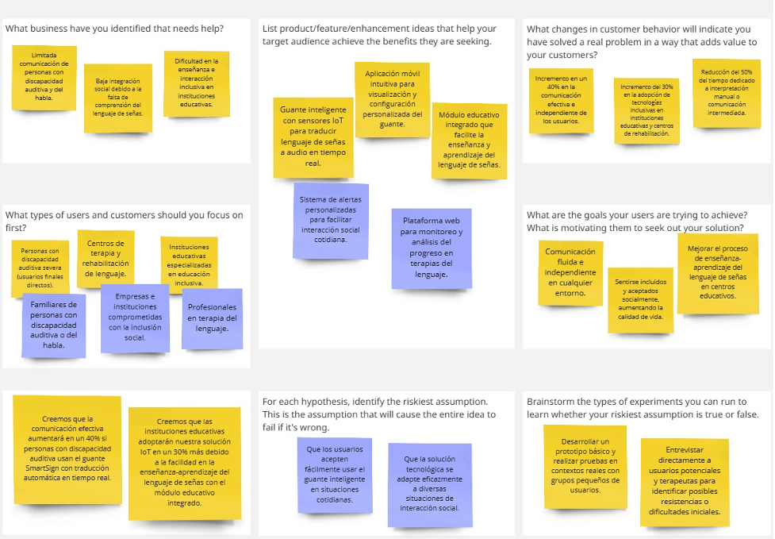

# Universidad Peruana de Ciencias Aplicadas
- Carrera de Ingeniería de Software - Septimo ciclo
- Curso: 1ASI0572 -  Desarrollo de Soluciones IOT
- NRC: 15185
- Profesor: Marco Antonio Leon Baca
# Informe del Trabajo Final
- Nombre Startup: IoTech
- Nombre Producto: SmartSign
## Relación de integrantes:

| Alumno                           | Código     |
|----------------------------------|------------|
| Alvaro Esteban Crispin Ccancce   | u202020328 |
| Jesús Andres Godoy Santillan     | u20251c350 |
| Jorge David Orrego Noriega       | u201921734 |
| Miguel Angel Huaman Cataño       | u202120615 |
| Frank Junior Salazar Saldarriaga | u20181h103 |

Abril, 2025

# Registro de Versiones del Informe

| Versión | Fecha | Autor | Descripción de modificación |
|---------|-------|-------|----------------------------|
| 1.0 | 17/04/2025 | Grupo IoTech | Se creó el documento de desarrollo del informe |
| 2.0 | 26/04/2025 | Grupo IoTech | Se terminó el desarrollo de la TB1 |

# Project Report Collaboration Insights

**TB1:**

**Colocar al final capturas de los commits**

# Student Outcome

**ABET – EAC - Student Outcome 5:** Capacidad de funcionar efectivamente en un equipo cuyos miembros juntos proporcionan liderazgo, crean un entorno de colaboración e inclusivo, establecen objetivos, planifican tareas y cumplen objetivos.

|Criterio Especifico|Acciones Realizadas|Conclusiones|
|-|-|-|
| Trabaja en equipo para proporcionar liderazgo en forma conjunta. | **TB1:**   Jorge Orrego:   He trabajado con mis compañeros de manera cercana en el desarrollo del diseño de desarrollo de software, en el cual pudimos delegar equitativamente la carga de trabajo. | **TB1:**   Se logró implementar drinámicas para que todos en el equipo tuvieran la oportunidad de liderar y aportar con lo que más sepan. |
| Crea un entorno colaborativo e inclusivo, establece metas, planifica tareas y cumple objetivos.| **TB1:**   Jorge Orrego:   Junto a mis compañeros pude definir objetivos y fechas límite de entrega de las partes que les tocaba a cada uno, con el objetivo de poder revisar con más detenimiento lo que hemos avanzado antes de la entrega oficial.  | **TB1:**   Se pudo realizar dinámicas entre el equipo (reuniones en discord) para planificar y mostrar nuestro progreso en lo que cada uno esté avanzando. |

# Contenido

## Tabla de Contenidos

## [Capítulo I: Introducción](#capitulo-i-introduccion)
- [1.1. Startup Profile](#11-startup-profile)
    - [1.1.1. Descripción de la Startup]()
    - [1.1.2. Perfiles de integrantes del equipo]()
- [1.2. Solution Profile]()
    - [1.2.1. Antecedentes y problemática]()
    - [1.2.2. Lean UX Process]()
        - [1.2.2.1. Lean UX Problem Statements]()
        - [1.2.2.2. Lean UX Assumptions]()
        - [1.2.2.3. Lean UX Hypothesis Statements]()
        - [1.2.2.4. Lean UX Canvas]()
- [1.3. Segmentos objetivo]()
## [Capítulo II: Requirements Elicitation & Analysis]()
- [2.1. Competidores]()
    - [2.1.1. Análisis competivio]()
    - [2.1.2. Estrategias y tácticas frente a competidores]()
- [2.2. Entrevistas]()
    - [2.2.1. Diseño de entrevistas]()
    - [2.2.2. Registro de entrevistas]()
    - [2.2.3. Análisis de entrevistas]()
- [2.3. Needfinding]()
    - [2.3.1. User Personas]()
    - [2.3.2. User Task Matrix]()
    - [2.3.3. User Journey Mapping]()
    - [2.3.4. Empathy Mapping]()
    - [2.3.5. As-is Scenario Mapping]()
- [2.4. Ubiquitous Language]()

## [Capítulo III: Requirements Specification](#capitulo-iii-requirements-specification)
- [3.1. To-Be Scenario Mapping](#31-to-be-scenario-mapping)
- [3.2. User Stories](#32-user-stories)
- [3.3. Impact Mapping](#33-impact-mapping)
- [3.4. Product Backlog](#34-product-backlog)

## [Capítulo IV: Solution Software Design]()
- [4.1. Strategic-Level Domain-Diven Design]()
    - [4.1.1. Event Storming]() 
        - [4.1.1.1. Candidate Context Discovery]()
        - [4.1.1.2. Domain Message Flows Modeling]()
        - [4.1.1.3. Bounded Context Canvases]()
    - [4.1.2. Context Mapping]()
    - [4.1.3. Software Achitecture]()
        - [4.1.3.1. Software Architecture System Landscape Diagram]()
        - [4.1.3.2. Software Architecture Context Level Diagrams]()
        - [4.1.3.3. Software Architecture Container Level Diagrams]()
        - [4.1.3.4. Software Architecture Deployment Diagrams]()

## Capítulo I: Introduccion
### 1.1. Startup Profile
#### 1.1.1 Descripcion de la Startup
SmartSign fue creada con el principal objetivo de facilitar la vida a aquellas personas las cuales cuentan con la discapacidad del habla o discapacidad auditiva, ya que se les dificulta un factor importante para poder vivir en sociedad, la comunicación. Buscamos solucionar este problema mediante la implementación de tecnologías de IoT para la creación de un guante con sensores que pueda traducir el lenguaje de señas en forma de audio y así poder facilitar su comunicación. La solución propuesta por SmartSign permitirá facilitar la comunicación y por la tanto sentirse incluidas socialmente a las personas con discapacidad auditiva, pero también facilitará la enseñanza a aquellas instituciones derivadas a brindar conocimientos a las personas con esta discapacidad.

Misión:
Facilitar la comunicación e inclusión social de las personas con discapacidad auditiva y del habla, desarrollando soluciones tecnológicas innovadoras basadas en IoT que transformen la lengua de señas en lenguaje audible, generando independencia, integración y calidad de vida.

Visión:
Ser reconocidos como líderes en innovación tecnológica en inclusión social en el Perú, convirtiéndonos en el referente nacional en soluciones accesibles e inteligentes que derriban barreras de comunicación para personas con discapacidad auditiva y del habla, promoviendo una sociedad más equitativa y conectada.

#### 1.1.1 Perfiles de integrantes del equipo

<table>
  <tr>
    <td rowspan="3"></td>
    <td>Frank Junior Salazar Saldarriaga (u20181h103)</td>
  </tr>
  <tr>
        <td>Ingenieria de Software</td>
  </tr>
    <tr>
    <td>Soy Frank Salazar, tengo 24 años y tengo una gran devoción por la programación, desde los 8 años me gustó programar, iniciando por algoritmos sencillos, hasta la recreación de videojuegos. Hace unos años decidí centrarme mucho en el desarrollo Backend y frontend, pero también le he agarrado mucho gusto a la data science. Actualmente soy programador en Yape, BCP. Soy asistente desde el año pasado, pero comencé como practicando desde agosto del 2023.</td>
  </tr>
  <tr>
    <td rowspan="3"></td>
    <td>Alvaro Esteban Crispin Ccancce</td>
  </tr>
  <tr>
        <td>Ingenieria de Software</td>
  </tr>
    <tr>
    <td>Soy Alvaro Crispin, tengo 22 años y me encanta ser innovador, buscar nuevas ideas, crear soluciones y asumir retos. Desde pequeño me interesó mucho lo que son las computadoras a nivel hardware y sobre la ciberseguridad. Actualmente me encanta todo lo relacionado a soldar, crear, programar y manipular artefactos electrónicos como chips, sensores, redes, etc.</td>
  </tr>
<tr>
    <td rowspan="3"></td>
    <td>Orrego Noriega, Jorge David</td>
  </tr>
  <tr>
        <td>Ingenieria de Software</td>
  </tr>
    <tr>
    <td>Estudio actualmente la carrera de Ingeniería de Software en la Universidad Peruana de Ciencias Aplicadas y la razón por la cual me encuentro estudiando esta carrera es porque siempre he tenido un interés particular por la tecnología, con un mayor énfasis en el software.</td>
  </tr>
<tr>
    <td rowspan="3">Foto</td>
    <td>nombre</td>
  </tr>
  <tr>
        <td>Ingenieria de Software</td>
  </tr>
    <tr>
    <td>Dato 3</td>
  </tr>
<tr>
    <td rowspan="3">Foto</td>
    <td>nombre</td>
  </tr>
  <tr>
        <td>Ingenieria de Software</td>
  </tr>
    <tr>
    <td>Dato 3</td>
  </tr>
</table>

### 1.2. Solution Profile
Nuestra propuesta es la creación de una solución IOT, la cual tiene como objetivo principal facilitar la comunicación de las personas con discapacidad auditiva con el resto de personas, aplicando tecnologías de IOT y Deep Learning.

#### 1.2.1 Antecedentes y problematica
What?

Según datos del Instituto Nacional de Estadística e Informática (INEI, 2017), en el Perú existen alrededor de 232,000 personas con discapacidad auditiva, de las cuales muchas enfrentan limitaciones importantes en su interacción cotidiana debido a barreras de comunicación. El principal problema que enfrentan estas personas es la dificultad para comunicarse de forma efectiva con quienes no dominan la lengua de señas, afectando significativamente su integración social, educativa y laboral.

When?

La problemática surge continuamente durante las interacciones sociales cotidianas, situaciones educativas y laborales, donde las personas con discapacidad auditiva o del habla requieren comunicarse con otras personas que desconocen la lengua de señas.

Where?

El problema está presente en todo el Perú, particularmente en instituciones educativas, centros laborales, hospitales y entornos públicos donde las personas con discapacidad auditiva o del habla necesitan interactuar constantemente y encuentran barreras para una comunicación efectiva.

Who?

Los usuarios afectados principalmente son personas con discapacidad auditiva y del habla, así como también sus familias, docentes y profesionales de la salud. Los beneficiarios directos serán las instituciones educativas especializadas y centros de rehabilitación que requieren herramientas tecnológicas efectivas para mejorar la inclusión y educación de personas con discapacidad auditiva y del habla.

Why?

Las principales causas del problema radican en la falta de soluciones tecnológicas accesibles que faciliten la comunicación entre personas que usan la lengua de señas y aquellas que no la dominan. Esto genera exclusión social, limitaciones educativas y barreras laborales significativas.

How?

La solución propuesta consiste en la implementación de un dispositivo inteligente basado en tecnología IoT, específicamente un guante equipado con sensores que traducen movimientos y posiciones de la lengua de señas peruana en audio. Este dispositivo facilitará la comunicación directa y clara en tiempo real, mejorando significativamente la interacción social, educativa y laboral.

How much?

¿Cuánto afecta este problema?:
La falta de comunicación efectiva afecta al 100% de las personas con discapacidad auditiva o del habla, reduciendo sus oportunidades educativas, laborales y de inclusión social, según la Defensoría del Pueblo del Perú (2024).

¿Cuánto costará resolver este problema?

El costo dependerá principalmente del desarrollo de la tecnología, la adquisición de sensores especializados y componentes IoT, así como los costos asociados al mantenimiento del software y hardware involucrados.

¿Cuántas personas se beneficiarán?

Se estima que inicialmente se beneficiarían alrededor del 50% de las personas con discapacidad auditiva y del habla en las principales ciudades del Perú, además de docentes y profesionales en centros especializados que trabajen directamente con estas poblaciones.

Conclusiones de 5w y 2h:

En conclusión, mediante el análisis con las 5W's y 2H's, se ha identificado claramente la problemática principal que afecta a personas con discapacidad auditiva y del habla en Perú. SmartSign implementará una solución tecnológica innovadora, accesible y efectiva, que facilitará la inclusión y comunicación, beneficiando directamente a personas con discapacidad auditiva y del habla, así como a instituciones educativas y de rehabilitación.

#### 1.2.2 Lean UX Process
##### 1.2.2.1 Lean UX Problem Statements
**Problem Statement:**
En SmartSign, reconocemos que en el Perú existe una importante población con discapacidad auditiva y del habla, para quienes la comunicación representa una barrera significativa en su vida diaria, limitando su integración social, educativa y laboral.

**Problema:** Muchas personas con discapacidad auditiva o del habla enfrentan dificultades en su comunicación diaria debido a que el entorno social generalmente no domina la lengua de señas, lo que ocasiona exclusión social, aislamiento y dificultades en el aprendizaje.

**Impacto:** Esta solución genera un impacto social altamente positivo al facilitar la inclusión social, educativa y laboral, permitiendo que las personas con discapacidad auditiva y del habla puedan comunicarse de manera efectiva y autónoma en diversos contextos.

##### 1.2.2.2 Lean UX Problem Assumptions
###### Business Outcomes:
- Incremento del 40% en la efectividad de comunicación de los usuarios durante interacciones cotidianas.
- Reducción del 50% en el tiempo requerido para establecer comunicación efectiva en entornos laborales y educativos.
- Aumento del 30% en la inclusión laboral de personas con discapacidad auditiva y del habla en organizaciones que adopten SmartSign.
- Disminución del 40% en la dependencia de intérpretes especializados durante situaciones cotidianas.
- Aumento del 60% en la satisfacción percibida en las interacciones sociales por parte de los usuarios.

###### Users:
- Personas con discapacidad auditiva y del habla.
- Familiares y cuidadores.
- Instituciones educativas especializadas.
- Centros de rehabilitación y salud.

###### User Outcomes & Benefits:
- Usuarios con discapacidad auditiva y del habla: Mayor autonomía e independencia comunicativa, integración social efectiva y acceso mejorado a oportunidades educativas y laborales.
- Instituciones educativas y centros de rehabilitación: Acceso a una herramienta tecnológica efectiva para mejorar los procesos educativos, comunicativos y terapéuticos. 
###### Feature Assumptions:
- Traducción en tiempo real del lenguaje de señas a audio.
- Interfaz de usuario intuitiva y accesible.
- Funcionalidades adicionales como almacenamiento y análisis de datos para monitorear el progreso comunicativo.
- Alertas personalizadas que indican claridad en la traducción y precisión de movimientos.
###### Business Assumptions:
- Creemos que los usuarios necesitan una solución tecnológica innovadora que les permita comunicarse de forma autónoma y efectiva en situaciones cotidianas, educativas y laborales.
- Nuestros clientes serán personas con discapacidad auditiva y del habla, sus familias y centros especializados que busquen facilitar la inclusión social.
- El valor más importante para nuestros usuarios es la independencia en la comunicación y la reducción de barreras sociales.
- Obtendremos a nuestros clientes mediante campañas en redes sociales, convenios con instituciones educativas y de rehabilitación, y participación en eventos enfocados en inclusión social.
- Generaremos ingresos mediante la venta directa del dispositivo y suscripciones mensuales al servicio de soporte técnico y mantenimiento.
- Nuestra ventaja frente a la competencia es la precisión y rapidez en la traducción del lenguaje de señas, combinada con una interfaz amigable y soporte continuo.
- El mayor riesgo del servicio es la resistencia inicial en la adopción tecnológica por parte de usuarios o instituciones. Esto lo resolveremos mediante demostraciones prácticas, testimonios y soporte personalizado constante.
###### User Assumptions:
- **¿Quién es el usuario?**

Los usuarios principales son personas con discapacidad auditiva y del habla, además de instituciones especializadas en educación y rehabilitación.

- **¿Qué problemas resuelve nuestro producto?**

El producto resuelve la barrera comunicativa entre usuarios que utilizan lenguaje de señas y aquellos que no lo dominan.

- **¿Qué características son importantes?**

Las características clave son la traducción precisa en tiempo real, facilidad de uso, portabilidad, alertas de precisión en el movimiento y soporte constante para los usuarios.

- **¿Dónde encaja nuestro producto en su vida diaria?**

Encaja en cualquier situación cotidiana, laboral o educativa que requiera comunicación inmediata y efectiva.

- **¿Cuándo y cómo es usado nuestro producto?**

El producto será utilizado constantemente en entornos sociales, laborales y educativos durante cualquier interacción comunicativa necesaria.

- **¿Cómo debe verse nuestro producto y cómo debe comportarse?**

Debe tener una interfaz visual sencilla, accesible, intuitiva, precisa en su traducción y con tiempos de respuesta rápidos, siendo práctico y portátil.

##### 1.2.2.3 Lean UX Problem Hypothesis Statements

***Hypothesis Statement 1***

**Creemos** que las personas con discapacidad auditiva necesitan una funcionalidad que traduzca rápidamente el lenguaje de señas en audio para comunicarse efectivamente.

**Sabremos** que hemos tenido éxito:

**Cuando** el 90% de los usuarios reporten mayor independencia comunicativa y una mejora significativa en interacciones sociales.

***Hypothesis Statement 2***

**Creemos** que las instituciones educativas y centros de rehabilitación necesitan una herramienta tecnológica que facilite la enseñanza y terapia del lenguaje de señas.

**Sabremos** que hemos tenido éxito:

**Cuando** las instituciones reporten un aumento del 40% en la eficiencia y efectividad en sus programas educativos y terapéuticos.

***Hypothesis Statement 3***

**Creemos** que los usuarios requieren alertas y guías visuales sobre la precisión en sus movimientos para mejorar la exactitud de la traducción.

**Sabremos** que hemos tenido éxito:

**Cuando** el 85% de los usuarios logren perfeccionar significativamente su comunicación con el uso continuo del dispositivo.

***Hypothesis Statement 4***

**Creemos** que la interfaz amigable y accesible será crucial para la adopción masiva de nuestra solución.

**Sabremos** que hemos tenido éxito:

**Cuando** el 95% de los usuarios realicen tareas básicas sin asistencia adicional y manifiesten comodidad y satisfacción con el uso del producto.

##### 1.2.2.4 Lean UX Problem Canvas

### 1.3. Segmento Objetivo
Según datos del Instituto Nacional de Estadística e Informática (INEI, 2017), en el Perú existen alrededor de 232,000 personas con discapacidad auditiva, enfrentando diariamente desafíos significativos en su comunicación e integración social debido a la falta de herramientas adecuadas para facilitar la interacción efectiva.

Nuestros principales segmentos objetivo son:

**Personas con discapacidad auditiva y del habla:**

Este segmento es clave para nuestra solución, ya que representa a los usuarios directos del dispositivo SmartSign. Estas personas requieren soluciones innovadoras y accesibles que les permitan comunicarse de forma clara y efectiva en cualquier contexto, facilitando su inclusión social, educativa y laboral.

**Instituciones educativas especializadas y centros de rehabilitación:**

Las instituciones educativas especializadas y los centros de rehabilitación constituyen otro segmento objetivo esencial, dado que necesitan herramientas tecnológicas eficientes para mejorar sus procesos educativos y terapéuticos. La implementación del dispositivo SmartSign permitirá realizar evaluaciones en tiempo real, facilitar el aprendizaje del lenguaje de señas y mejorar significativamente la comunicación en entornos educativos y de rehabilitación.

## Capítulo III: Requirements Specification
### 3.1. To-Be Scenario Mapping
### 3.2. User Stories
| Story ID | Título                               | Descripción                                                                                                                                           | Criterios de Aceptación                                                                 | Relacionado con (Epic ID)                        |
|:--------:|:--------------------------------------|-------------------------------------------------------------------------------------------------------------------------------------------------------|-----------------------------------------------------------------------------------------|--------------------------------------------------|
|   US01   | Comunicación en conversaciones cotidianas | Como persona con discapacidad auditiva, quiero poder comunicarme fácilmente con personas que no conocen lengua de señas, para sentirme incluida.      | Se identifica la barrera de comunicación en interacciones sociales básicas.            | EPIC-01            |
|   US02   | Expresión en entornos públicos       | Como persona con discapacidad del habla, quiero poder expresar mis ideas de forma clara en entornos públicos, para no sentirme ignorado.             | Se manifiesta la necesidad de expresar ideas sin restricciones en lugares comunes.     | EPIC-01            |
|   US03   | Socialización con nuevas personas    | Como persona con discapacidad auditiva, quiero poder conocer nuevas personas y socializar sin barreras, para desarrollar una vida social activa.      | Se evidencia el aislamiento social por falta de comunicación.                          | EPIC-01            |
|   US04   | Autonomía en trámites administrativos | Como persona con discapacidad auditiva, quiero tener más autonomía en trámites administrativos, para evitar depender de familiares o intérpretes.     | Se enfatiza la necesidad de independencia en gestiones formales.                       | EPIC-01            |
|   US05   | Comprensión por parte del entorno    | Como persona con discapacidad auditiva, quiero que las personas sin experiencia en lengua de señas puedan entenderme fácilmente, para evitar malentendidos. | Se refleja la necesidad de una comprensión generalizada en el entorno.             | EPIC-01            |
|   US06   | Comunicación en emergencias          | Como persona con discapacidad auditiva, quiero poder pedir ayuda en situaciones de emergencia, para sentirme seguro y protegido.                      | Se indica la importancia de la comunicación rápida en emergencias.                     | EPIC-02           |
|   US07   | Comunicación en centros de salud     | Como persona con discapacidad auditiva, necesito comunicar síntomas o dolencias en centros de salud, para recibir atención médica adecuada.           | Se identifica la barrera crítica en el acceso a servicios de salud.                    | EPIC-02           |
|   US08   | Participación en actividades recreativas | Como persona con discapacidad auditiva, deseo participar plenamente en actividades recreativas y culturales, para disfrutar de una vida plena.         | Se destaca la exclusión de actividades culturales y de ocio.                           | EPIC-02           |
|   US09   | Interacción en espacios educativos   | Como persona con discapacidad auditiva, deseo interactuar en espacios educativos donde no todos conocen lengua de señas.                             | Se muestra la desigualdad en contextos educativos comunes.                             | EPIC-03                     |
|   US10   | Comprensión rápida de estudiantes    | Como docente, quiero entender rápidamente lo que un estudiante con discapacidad auditiva necesita comunicar.                                          | Se visualiza la necesidad de respuesta inmediata ante la comunicación estudiantil.     | EPIC-03                     |
|   US11   | Participación en clases regulares    | Como profesor, deseo facilitar la participación de estudiantes con discapacidad auditiva.                                                             | Se muestra el desafío de integrar a estudiantes con discapacidades en clases comunes.  | EPIC-03                     |
|   US12   | Interacción entre estudiantes        | Como institución educativa, queremos mejorar la interacción entre estudiantes con y sin discapacidad auditiva.                                       | Se manifiesta la brecha en comunicación entre estudiantes diversos.                    | EPIC-03                     |
|   US13   | Prevención de frustraciones en clase | Como profesor, deseo recibir información inmediata sobre lo que intenta comunicar un estudiante.                                                      | Se identifica la necesidad de comprensión rápida en contextos educativos.              | EPIC-03                     |
|   US14   | Identificación de dudas en clase     | Como docente, quiero identificar rápidamente si un estudiante con discapacidad auditiva presenta dudas o dificultades.                               | Se refleja la necesidad de atención inmediata y adaptada.                              | EPIC-03                     |
|   US15   | Validación de aprendizaje            | Como profesor, quiero disponer de métodos para validar el contenido enseñado a estudiantes con discapacidad auditiva.                                | Se necesita retroalimentación efectiva en el proceso educativo.                        | EPIC-03                     |
|   US16   | Participación en reuniones laborales | Como persona con discapacidad auditiva, necesito participar activamente en reuniones laborales.                                                       | Se reconoce la falta de inclusión laboral por barreras comunicativas.                  | EPIC-04         |
|   US17   | Entrevistas laborales inclusivas     | Como organización inclusiva, quiero facilitar entrevistas laborales a personas con discapacidad auditiva.                                            | Se reconoce la importancia de inclusión desde el proceso de contratación.              | EPIC-04         |
|   US18   | Evaluación de habilidades comunicativas | Como centro de rehabilitación, necesitamos herramientas para evaluar habilidades comunicativas.                                                      | Se identifica la necesidad de monitoreo continuo y específico.                         | EPIC-05       |
|   US19   | Reducción de dependencia de intérpretes | Como institución, queremos reducir la dependencia de intérpretes externos.                                                                           | Se subraya la búsqueda de soluciones sostenibles e internas.                           | EPIC-05       |
|   US20   | Inclusión en eventos y talleres      | Como organización, necesitamos mejorar la comunicación en eventos con público diverso.                                                               | Se menciona la exclusión de usuarios en eventos masivos.                               | EPIC-05       |

### 3.3. Impact Mapping
### 3.4. Product Backlog
| # Orden | User Story Id | Título                                 | Descripción                                                                                                                                                                                                                             | Story Points |
|---------|----------------|----------------------------------------|-----------------------------------------------------------------------------------------------------------------------------------------------------------------------------------------------------------------------------------------|--------------|
| 1       | US01           | Comunicación en conversaciones cotidianas | Como persona con discapacidad auditiva, quiero poder comunicarme fácilmente con personas que no conocen lengua de señas, para sentirme incluida en conversaciones cotidianas.                     | 3            |
| 2       | US02           | Expresión en entornos públicos         | Como persona con discapacidad del habla, quiero poder expresar mis ideas de forma clara en entornos públicos, para no sentirme ignorado o incomprendido.                                         | 3            |
| 3       | US06           | Comunicación en emergencias            | Como persona con discapacidad auditiva, quiero poder pedir ayuda en situaciones de emergencia, para sentirme seguro y protegido.                                                                  | 5            |
| 4       | US07           | Comunicación en centros de salud       | Como persona con discapacidad auditiva, necesito comunicar síntomas o dolencias en centros de salud, para recibir atención médica adecuada y oportuna.                                           | 5            |
| 5       | US10           | Comprensión rápida de estudiantes      | Como docente en una institución inclusiva, quiero entender rápidamente lo que un estudiante con discapacidad auditiva necesita comunicar, para apoyarlo en su aprendizaje.                        | 3            |
| 6       | US11           | Participación en clases regulares      | Como profesor, deseo facilitar la participación de estudiantes con discapacidad auditiva en clases regulares, para promover un entorno educativo inclusivo.                                       | 3            |
| 7       | US14           | Identificación de dudas en clase       | Como docente, quiero identificar rápidamente si un estudiante con discapacidad auditiva presenta dudas o dificultades, para poder apoyarlo de manera oportuna.                                   | 2            |
| 8       | US13           | Prevención de frustraciones en clase   | Como profesor de educación especial, deseo recibir información inmediata sobre lo que intenta comunicar un estudiante, para evitar frustraciones o malentendidos durante la clase.                | 2            |
| 9       | US03           | Socialización con nuevas personas      | Como persona con discapacidad auditiva, quiero poder conocer nuevas personas y socializar sin barreras, para desarrollar una vida social activa.                                                 | 3            |
| 10      | US04           | Autonomía en trámites administrativos  | Como persona con discapacidad auditiva, quiero tener más autonomía en trámites administrativos, para evitar depender de familiares o intérpretes.                                                | 3            |
| 11      | US18           | Evaluación de habilidades comunicativas| Como centro de rehabilitación, necesitamos herramientas que ayuden a evaluar las habilidades comunicativas de nuestros pacientes, para diseñar mejores programas de intervención.                 | 5            |
| 12      | US09           | Interacción en espacios educativos     | Como persona con discapacidad auditiva, deseo interactuar en espacios educativos donde no todos conocen lengua de señas, para acceder a las mismas oportunidades de aprendizaje.                  | 2            |
| 13      | US08           | Participación en actividades recreativas| Como persona con discapacidad auditiva, deseo participar plenamente en actividades recreativas y culturales, para disfrutar de una vida plena.                                                   | 2            |
| 14      | US05           | Comprensión por parte del entorno      | Como persona con discapacidad auditiva, quiero que las personas sin experiencia en lengua de señas puedan entenderme fácilmente, para evitar malentendidos en mi vida diaria.                     | 2            |
| 15      | US15           | Validación de aprendizaje              | Como profesor, quiero disponer de métodos para validar que el contenido enseñado ha sido entendido por estudiantes con discapacidad auditiva, para asegurar su aprendizaje.                        | 3            |
| 16      | US12           | Interacción entre estudiantes          | Como institución educativa, queremos mejorar la interacción entre estudiantes con y sin discapacidad auditiva, para fomentar la integración social en el aula.                                    | 2            |
| 17      | US16           | Participación en reuniones laborales   | Como persona con discapacidad auditiva, necesito participar activamente en reuniones laborales, para no perder oportunidades profesionales debido a la falta de comunicación.                     | 3            |
| 18      | US17           | Entrevistas laborales inclusivas       | Como organización inclusiva, quiero facilitar entrevistas laborales a personas con discapacidad auditiva, para promover la equidad en los procesos de selección.                                  | 3            |
| 19      | US19           | Reducción de dependencia de intérpretes| Como institución, queremos reducir la dependencia de intérpretes externos en actividades diarias, para hacer nuestros servicios más accesibles de manera autónoma.                               | 2            |
| 20      | US20           | Inclusión en eventos y talleres        | Como organización, necesitamos mejorar la comunicación en talleres, charlas y eventos con público diverso, para incluir activamente a personas con discapacidad auditiva.                          | 2            |

## Capítulo IV: Solution Software Design
### 4.1. Strategic-Level Domain-Diven Design

#### 4.1.1. Event Storming 

La herramienta Event Storming nos permite descubrir y describir el comportamiento del negoció evaluado, con la que se recopila información acerca de los procesos, actores y necesidades más importantes. Para realizar esta actividad se tuvo que realizar entrevistas a los sectores objetivo que nuestra aplicación atenderá, por lo cual es de suma importancia haber recopilado las necesidades expresadas por los usuarios. 

Se realizaron en total nueve pasos para elaborar correctamente el Event Storming, la cual se desarrolló con la herramienta LucidSpark: 

[Enlace al diagrama en LucidSpark](https://lucid.app/lucidspark/96218482-eb0b-4133-bbab-5d65836f3c77/edit?viewport_loc=-6667%2C-1729%2C21589%2C7733%2C0_0&invitationId=inv_5aa15ac8-83a1-4a10-a458-319a7ef0772a)

**Paso 1: Unstructured Exploration**

En este paso se insertaron en desorden los eventos del dominio que pueden suceder dentro de la aplicación, con el objetivo de delimitar luego estas ideas en estructuras más organizadas. 

**Paso 2: Timelines** 

En este paso se agruparon los eventos en subgrupos, los cuales tienen un evento principal como parte de su jerarquía. Se empieza a describir el flujo de eventos de las funcionalidades de la aplicación. 

**Paso 3: Pain Points**

Se identifican los puntos de los flujos de eventos en los que el usuario final pueda tener dificultad interactuando y se indaga el cómo se podría solucionar ese problema. 

 

**Paso 4: Pivotal Points**

Se identificaron los eventos que son claves para el desarrollo del negocio para luego priorizarlas durante el desarrollo de la solución. 

**Paso 5: Commands** 

En este paso se identificaron los comandos o acciones que los actores del sistema (en este caso los usuario) pueden ejecutar. 

**Paso 6: Policies** 

Se identificaron las reglas de negocio con las que ciertos flujos de eventos deberán que cumplir obligatoriamente para funcionar acorde con lo esperado. 

**Paso 7: Read Models** 

Se definen los Read Models o vistas del sistema con las que los usuarios interactuarán en la aplicación. 

**Paso 8: External Systems** 

Se definen los servicios externos de los cuales varios eventos dependerán para su funcionalidad. 

**Paso 9: Aggregates**

Al final, se identificaron agregados que agruparán a todos los comandos y eventos que restén relacionados. 

##### 4.1.1.1. Candidate Context Discovery

En base del Event Storming anterior, se identificó 4 Boundend Context: 

* Authentication 
* Translation
* Learning 
* Record

**Bounded Context: Authentication**

**Bounded Context: Translation**

**Bounded Context: Learning**

**Bounded Context: Record**

**Vista general de los Bounded Contexts**

##### 4.1.1.2. Domain Message Flows Modeling

En esta sección se describe cómo los bounded context interactúan entre sí para resolver una necesidad del negocio. Se utilizó la técnica de Domain Storytelling para representar gráficamente la interacción entre bounded contexts entre los demás componentes y actores del sistema. 

**Escenario 1: Crear una cuenta**

**Escenario 2: Iniciar Sesión** 

**Escenario 3: Traducir Gestos**

**Escenario 4: Traducir texto a gestos**

**Escenario 5: Obtener material de aprendizaje**

**Escenario 6: Consultar Historial de Traducciones**

##### 4.1.1.3. Bounded Context Canvases

En este segmento se crearán los Bounded Context Canvases, los cuales detallan cómo estos funcionan dentro del proyecto, los elementos que interactúan con ellos y cómo interactúan entre sí. 

**Bounded Context Canvas: Authentication**

**Bounded Context Canvas: Translation**

**Bounded Context Canvas: Learning**

**Bounded Context Canvas: Record**

#### 4.1.2. Context Mapping
En esta sección, se analizan las relaciones entre los bounded contexts identificados en el sistema SmartSign y se asignan los patrones de context mapping adecuados para cada uno, asegurando una arquitectura bien delimitada, desacoplada y flexible frente a cambios tecnológicos o funcionales.
Customer/Supplier
Descripción: En esta relación, un contexto actúa como Cliente (Customer) y otro como Proveedor (Supplier). El contexto Cliente necesita servicios o datos del contexto Proveedor. Esta relación establece una dependencia directa donde el proveedor suministra información o servicios necesarios para el correcto funcionamiento del cliente.
Mobile App es Cliente de Wearable Context. El guante inteligente proporciona los datos sensoriales en tiempo real para su posterior procesamiento.

Mobile App es Cliente de Translation Context. Este último traduce los movimientos en lenguaje de señas a texto o audio.

Monitoring Context es Cliente de Translation Context, ya que se alimenta de los resultados traducidos para generar reportes y métricas de uso.

Open/Host Service (OHS)
Descripción: En este patrón, un contexto expone un servicio bien definido que otros contextos pueden consumir sin tener que interactuar con su lógica interna. Es ideal para servicios compartidos como autenticación, permisos o envío de notificaciones.
El contexto Authentication Context actúa como Host, ofreciendo servicios de autenticación y autorización para los usuarios del sistema.

El contexto Notification Context también actúa como Host, permitiendo que otros módulos generen retroalimentación auditiva o visual al usuario final.

Anticorruption Layer (ACL)
Descripción: Este patrón se utiliza cuando un contexto necesita proteger su propio modelo de dominio frente a la influencia de otro contexto externo. Se emplea una capa de traducción o adaptación para evitar un acoplamiento directo con la lógica del contexto externo.
Mobile App Context implementa un ACL para interactuar con el Wearable Context, aislando posibles cambios en el protocolo de comunicación del guante sin afectar su lógica interna.

Monitoring Context utiliza un ACL frente a los datos generados por el Translation Context, garantizando que su modelo de dominio estadístico se mantenga independiente de los cambios en el sistema de reconocimiento basado en IA.

#### 4.1.3. Software Achitecture

4.1.3.1. Software Architecture System Landscape Diagram

4.1.3.2. Software Architecture Context Level Diagrams

4.1.3.3. Software Architecture Container Level Diagrams
Este diagrama sirve para incrementar el sistema del software mostrando los contenedores (aplicaciones, microservicios, base de datos, entre otros) de los cuales está compuesto el sistema del software. Además, se puede visualizar todas las relaciones de las entidades externas con las entidades propias del software.

        
4.1.3.4. Software Architecture Deployment Diagrams

En esta sección se definen los diagramas del despliegue de la aplicación, en los que se ilustra cómo las instancias de los sistemas de software (bases de datos, aplicaciones web y móviles, etc.) se desplegarán en entornos físicos y/o en la nube. 

### 4.2. Tactical-Level Domain-Driven Design (Cuatro Bounded Contexts) 

#### 4.2.1. Bounded Context: Authorization 
#### 4.2.1.1. Domain Layer.
Se identificó en la capa del dominio tres entidades/aggregates necesarias para el control de acceso a información confidencial y autenticación de los usuarios: User, Permission y Role. 

#### Aggregate User: 

| Nombre | Tipo | Propósito |
|-|-|-|
| User | Aggregate/Entity | Define los datos esenciales del usuario dentro de la plataforma | 

**Atributos de User:**

| Nombre | Tipo de dato | Visibilidad |  Propósito |
|-|-|-|-|
| id | UUID | Private | Identificador único del usuario dentro de la plataforma.  |
| name | String | Private | Nombre del usuario |
| lastName | String | Private | Apellido del usuario |
| email | String | Private | Correo electrónico del usuario| 
| password | String | Private | Contraseña del usuario |
| createdAt | LocalDateTime | Private | Fecha de creación del usuario |

**Métodos de User:** 

| Nombre | Tipo de retorno | Visibilidad |  Propósito |
|-|-|-|- |
| User | Void | Public | Constructor de la clase User.  |
| authenticateUser | Boolean | Public | Autentica al usuario utilizando su correo y contraseña |

#### Aggregate Permission: 

| Nombre | Tipo | Propósito |
|-|-|-|
| Permission | Aggregate/Entity | Define los permisos que puede tener un usuario dentro del sistema. |

**Atributos de Permission:**

| Nombre | Tipo de dato | Visibilidad |  Propósito |
|-|-|-|-|
| id | UUID | Private | Identificador único del permiso asignado.  |
| permissionName | String | Private | Nombre del permiso a asignar (ej. Ver Historial de Traducciones, Crear Nueva Traducción) |

**Métodos de Permission:**

 Nombre | Tipo de retorno | Visibilidad |  Propósito |
|-|-|-|-|
| Permission | Void | Public | Constructor de la clase Permission.  |
| definePermission | Void | Public | Define los permisos que se pueden otorgar a los usuarios. |

#### Aggregate Role: 

| Nombre | Tipo | Propósito |
|-|-|-|
| Role | Aggregate/Entity | Define los roles que los usuarios pueden tener dentro de la aplicación. |

**Atributos de Permission:**

| Nombre | Tipo de dato | Visibilidad |  Propósito |
|-|-|-|-|
| id | UUID | Private | Identificador único del rol asignado.  |
| roleName | String | Private | Nombre del rol del usuario a asignar (usuario común, administrador, etc.) |

**Métodos de Permission:**

| Nombre | Tipo de retorno | Visibilidad |  Propósito |
|-|-|-|-|
| Role | Void | Public | Constructor de la clase Role.  |
| defineRole | Void | Public | Se define el rol que toma un usuario en el sistema. |

##### 4.2.1.2. Interface Layer.

En la capa de interfaces se definen los controladores que se comunicarán con la interfaz de usuario con el objetivo de manejar los permisos y la autenticación del usuario. 

**Controller UserController:**

| Nombre | Tipo | Propósito |
|-|-|-|
| UserController | Controller | Controlador de los métodos CRUD de la clase User. |

**Atributos de UserController:**

| Nombre | Tipo de dato | Visibilidad |  Propósito |
|-|-|-|-|
| userService | UserService | Private | Servicio encargado de manejar la lógica de la autenticación.  |

**Métodos de UserController:**

| Nombre | Tipo de retorno | Visibilidad |  Propósito |
|-|-|-|-|
| authUser | ResponseEntity | Public | Método para autenticar al usuario (inicio de sesión) dentro de la aplicación.  |
| registerUser | ResponseEntity | Public | Método para la creación de un usuario en la aplicación. |
| getUser | ResponseEntity | Public | Método para obtener un usuario en específico según su id. |
| updateUser | ResponseEntity | Public | Método para modificar datos de un usuario en específico. |
| deleteUser | ResponseEntity | Public | Método para borrar un usuario del registro. |

**Controller PermissionController:**

| Nombre | Tipo | Propósito |
|-|-|-|
| PermissionController | Controller | Controlador para el manejo de los permisos de usuario dentro de la aplicación. |

**Atributos de PermissionController:**

| Nombre | Tipo de dato | Visibilidad |  Propósito |
|-|-|-|-|
| permissionService | PermissionService | Private | Servicio encargado de manejar la lógica del manejo de permisos.  |

**Métodos de PermissionController:**

| Nombre | Tipo de retorno | Visibilidad |  Propósito |
|-|-|-|-|
| assignPermissionToUser | ResponseEntity | Public | Método para asignar un permiso a un usuario en específico.  |
| removePermissionToUser | ResponseEntity | Public | Método para quitarle un permiso a un usuario en específico.  |
| getAllPermissions | ResponseEntity | Public | Método para obtener todos los permisos válidos en la aplicación. |

**Controller RoleController:**

| Nombre | Tipo | Propósito |
|-|-|-|
| RoleController | Controller | Controlador para el manejo de los roles de usuario dentro de la aplicación. |

**Atributos de RoleController:**

| Nombre | Tipo de dato | Visibilidad |  Propósito |
|-|-|-|-|
| roleService | RoleService | Private | Servicio encargado de manejar la lógica del manejo de roles.  |

**Métodos de RoleController:**

| Nombre | Tipo de retorno | Visibilidad |  Propósito |
|-|-|-|-|
| assignRoleToUser | ResponseEntity | Public | Método para asignar un rol a un usuario en específico.  |
| removeRoleToUser | ResponseEntity | Public | Método para quitarle un rol a un usuario en específico.  |
| getAllRoles | ResponseEntity | Public | Método para obtener todos los roles válidos en la aplicación. |

##### 4.2.1.3. Application Layer.

En la capa de aplicación se definirán las clases que manejarán los flujos de procesos de la funcionalidad de Autenticación. 

**Service UserService:**

| Nombre | Tipo | Propósito |
|-|-|-|
| UserService | Service | Servicio para el manejo de la gestión de usuarios |

**Atributos de UserService:**

| Nombre | Tipo de dato | Visibilidad |  Propósito |
|-|-|-|-|
| userRepository | UserRepository | Private | Repositorio encargado de las operaciones CRUD de los usuarios.  |

**Métodos de UserService:**

| Nombre | Tipo de retorno | Visibilidad |  Propósito |
|-|-|-|-|
| authUser | ResponseEntity | Public | Método para autenticar al usuario (inicio de sesión) dentro de la aplicación.  |
| registerUser | ResponseEntity | Public | Método para la creación de un usuario en la aplicación. |
| getUser | ResponseEntity | Public | Método para obtener un usuario en específico según su id. |
| updateUser | User | Public | Método para modificar datos de un usuario en específico. |
| deleteUser | ResponseEntity | Public | Método para borrar un usuario del registro. |

**Service PermissionService:**

| Nombre | Tipo | Propósito |
|-|-|-|
| PermissionService | Service | Servicio para el manejo de los permisos de usuario dentro de la aplicación. |

**Atributos de PermissionService:**

| Nombre | Tipo de dato | Visibilidad |  Propósito |
|-|-|-|-|
| permissionRepository | PermissionRepository | Private | Repositorio encargado de las operaciones CRUD de los permisos.  |

**Métodos de PermissionService:**

| Nombre | Tipo de retorno | Visibilidad |  Propósito |
|-|-|-|-|
| assignPermissionToUser | ResponseEntity | Public | Método para asignar un permiso a un usuario en específico.  |
| removePermissionToUser | ResponseEntity | Public | Método para quitarle un permiso a un usuario en específico.  |
| getAllPermissions | List | Public | Método para obtener todos los permisos válidos en la aplicación. |

**Service RoleService:**

| Nombre | Tipo | Propósito |
|-|-|-|
| RoleService | Service | Servicio para el manejo de los roles de usuario dentro de la aplicación. |

**Atributos de RoleService:**

| Nombre | Tipo de dato | Visibilidad |  Propósito |
|-|-|-|-|
| roleRepository | RoleRepository | Private | Repositorio encargado de las operaciones CRUD de los roles.  |

**Métodos de RoleService:**

| Nombre | Tipo de retorno | Visibilidad |  Propósito |
|-|-|-|-|
| assignRoleToUser | ResponseEntity | Public | Método para asignar un rol a un usuario en específico.  |
| removeRoleToUser | ResponseEntity | Public | Método para quitarle un rol a un usuario en específico.  |
| getAllRoles | List | Public | Método para obtener todos los roles válidos en la aplicación. |

##### 4.2.1.4. Infrastructure Layer.

En la capa de infraestructura se manejarán las clases que accedan a servicios externos de la aplicación como la base de datos, con el objetivo de validad las credenciales y permisos del usuario. 

**Repository UserRepository:**

| Nombre | Tipo | Propósito |
|-|-|-|
| UserRepository | Service | Repositorio que maneja la persistencia y recuperación de datos de la enitidad User de la base de datos.|

**Métodos de UserRepository:**

| Nombre | Tipo de retorno | Visibilidad |  Propósito |
|-|-|-|-|
| findById | Optional | Public | Método para encontrar a un usuario según su Id.  |
| existsById | Boolean | Public | Método para verificar la existencia de un usuario según su Id. |
| findByEmail | Optional | Public | Método para encontrar a un usuario según su correo  |
| existsByEmail | Boolean | Public | Método para verificar la existencia de un usuario según su correo.  |
| save | User | Public | Método para guardar los datos de un nuevo usuario. |
| deleteById | Void | Public | Método para borrar un usuario según su Id. |

**Repository PermissionRepository:**

| Nombre | Tipo | Propósito |
|-|-|-|
| PermissionRepository | Repository | Repositorio que maneja la persistencia y recuperación de datos de la enitidad Permission de la base de datos. |

**Métodos de PermissionRepository:**

| Nombre | Tipo de retorno | Visibilidad |  Propósito |
|-|-|-|-|
| findByPermissionName | Optional | Public | Método para encontrar a un servicio según su nombre.  |
| existsByPermissionName | Boolean | Public | Método para verificar la existencia de un permiso según su Id. |
| findById | Optional | Public | Método para encontrar a un servicio según su Id.  |
| existsById | Boolean | Public | Método para verificar la existencia de un permiso según su Id. |
| save | Permission | Public | Método para guardar los datos de un nuevo permiso. |
| deleteById | Void | Public | Método para borrar un permiso según su Id. |

**Repository RoleRepository:**

| Nombre | Tipo | Propósito |
|-|-|-|
| RoleRepository | Repository | Repositorio que maneja la persistencia y recuperación de datos de la enitidad Role de la base de datos. |

**Métodos de RoleRepository:**

| Nombre | Tipo de retorno | Visibilidad |  Propósito |
|-|-|-|-|
| findByRoleName | Optional | Public | Método para encontrar a un rol según su nombre.  |
| existsByRoleName | Boolean | Public | Método para verificar la existencia de un rol según su Id. |
| findById | Optional | Public | Método para encontrar a un rol según su Id.  |
| existsById | Boolean | Public | Método para verificar la existencia de un rol según su Id. |
| save | Role | Public | Método para guardar los datos de un nuevo rol. |
| deleteById | Void | Public | Método para borrar un rol según su Id. |

##### 4.2.1.5. Bounded Context Software Architecture Component Level Diagrams.

##### 4.2.1.6. Bounded Context Software Architecture Code Level Diagrams.

##### 4.2.1.6.1. Bounded Context Domain Layer Class Diagrams.

##### 4.2.1.6.2. Bounded Context Database Design Diagram.

#### 4.2.2. Bounded Context: Learning 
##### 4.2.2.1. Domain Layer.

En la capa del dominio del bounded context Learning se ha identificado tres entidades/aggregates: Resource, Teacher y Course.

**Aggregate Resources**

**Aggregate Teacher**

**Aggregate Course**

##### 4.2.2.2. Interface Layer.
##### 4.2.2.3. Application Layer.
##### 4.2.2.4. Infrastructure Layer.
##### 4.2.2.5. Bounded Context Software Architecture Component Level Diagrams.
##### 4.2.2.6. Bounded Context Software Architecture Code Level Diagrams.
##### 4.2.2.6.1. Bounded Context Domain Layer Class Diagrams.
##### 4.2.2.6.2. Bounded Context Database Design Diagram.

# Conclusiones 

## Conclusiones TB1

* Durante el desarrollo del TB1 pudimos analizar e investigar acerca de cómo la solución que estamos proponiendo puede adecuarse a las demandas de nuestros usuarios objetivos. Además, hemos desarrollado las bases del diseño estructural de nuestra solución, las cuales nos van a servir cuando entremos a la fase de desarrollo. 

# Bibliografía 

# Anexos
